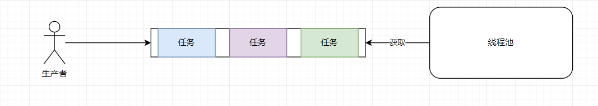
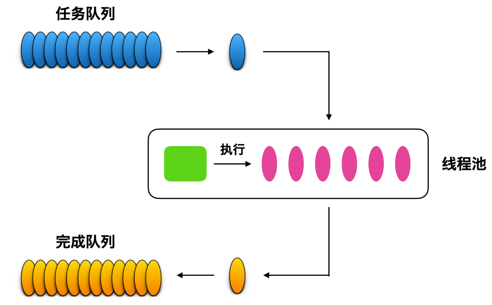

---

---


## 一、概述

在Java之中，我们通过`new Thread() `很轻松的创建一个线程，但是在底层却是需要去调用操作系统内核的API，由操作系统为线程分配一系列资源。所以创建他的成本很高，应该避免去重复的进行创建和销毁。

对于这种需要频繁的创建和销毁的东西，最为常见的思想就是：进行池化。对于一般意义上的池化资源，都是在需要的时候调用`acquire`进行资源的申请，使用完成之后，调用`release`进行资源的释放。不过在线程池的设计之上，并没有采用这样的池化思想的设计，而是采用了 **生产-消费者模型**，如图所示：



我们将线程池的使用者作为生产者向队列之中，不断推送需要进行异步执行的任务，而线程池不断从队列之中，获取任务来执行。

```java
/**
 * @project: Study-JUC
 * @description:
 * @author: haolong
 * @data: 2023/6/11 16:57
 */
public class MyThreadPool {
    // 利用阻塞队列实现生产者消费者模型
    BlockingQueue<Runnable> workQueue;
    // 保存内部的工作线程
    List<WorkThread> threads;
    /**
     * 自定义线程池的构造方法
     * @param poolSize 内部工作线程的数量
     * @param workQueue 阻塞队列
     */
    MyThreadPool(int poolSize,BlockingQueue<Runnable> workQueue) {
        this.workQueue = workQueue;
        threads = new ArrayList<>(poolSize);
        for (int i = 0; i < poolSize; i++) {
            WorkThread workThread = new WorkThread();
            workThread.start();
            threads.add(workThread);
        }
    }
    /**
     * 提交任务
     * @param command
     */
    void execute(Runnable command) throws InterruptedException {
        workQueue.put(command);
    }
    /**
     * @project: Study-JUC
     * @description: 工作线程，负责消费任务，并执行任务
     * @author: haolong
     * @data: 2023/6/11 16:58
     */
    class WorkThread extends Thread{
        @Override
        public void run() {
            while (true) {
                try {
                    Runnable task = workQueue.take();
                    task.run();
                } catch (InterruptedException e) {
                    e.printStackTrace();
                }
            }
        }
    }
}
```

在我们执行了上述代码之后，其实感觉并不难！


线程池做的工作：只要是控制运行的线程数量，处理过程中将任务放入队列，然后在线程创建后启动这些任务，如果线程数量超过最大数量，超过数量的线程排队等待，等其他线程执行完毕之后，再从队列中取出任务来执行
特点

- 提高线程的利用率
- 提高线程的响应速度
- 便于统一管理线程对象
- 可以控制最大并发数


## 二、类图详解

### 2.1 Executor

在这个接口之中，只有一个方法，接受一个`Runnable`的实例，他用来执行一个任务，注意只能是Runnable。他创建线程是异步执行的，也就是说，不用等待每个任务执行完毕后在执行下一个任务。
`executor`方法代替了显示创建线程的方式，通过这种方式创建的线程是异步执行的，也就是说，你不用等待每个任务执行完成之后在执行下一个任务。
```java
class Task implements Runnable{
    @Override
    public void run() {
        System.out.println("Task.run");
    }
}
public class ExecutorTest {
    public static void main(String[] args) {
        Executor executor = Executors.newSingleThreadExecutor();
        executor.execute(new Task());
    }
}
```
这样的代码会一直不会停止
Executor只需要关心发布命令，并且说线程不需要回报，所以说我们需要认识其他管家，管他这个线程的其他事务，比如什么时候终止，什么时候暂停，当前的状态等
### 2.2 ExecutorService
`Executor`接口的实现类，提供了一些`Executor`中没有的方法，在这个方法列表之中，我们发现，在这个类中，还可以接受`Callable`对象


`shutdown()`

1. 调用之后，**会有序关闭正在执行的任务，没有执行的任务会被中断，正在执行的任务会继续执行下去，但是不接受新任务**。如果任务已经关闭，该方法不会产生任何影响
2. 只是将线程池的状态设置为`SHUTDOWN`

`shutdownNow()`

1. **会尝试停止关闭所有正在执行的任务，停止正在等待的任务，并返回正在等待执行的任务列表**
2. 只是将线程池的状态设置为`STOP`，正在执行和等待的任务就会被停止，返回等待执行的任务列表

`isShutdown()`

1. 执行器是否已经关闭，如果关闭了，返回true，否则，返回false

`isTerminated()`

1. 所有任务在关闭后是否已经完成，如果完成了返回false
2. 除非调用`shutdown`或者`shutdownNow`方法，否则，永远返回false

`awaitTermination()`

1. 阻塞，直到发出`shutdown`请求后所有的任务已经完成执行后才会解除

`submit()`：注意这里返回值是正对于`Callable`才有意义的，如果说返回`Integer`，返回值最终就是`Future<Integer>`


6. `invokeAll`：执行给定的任务列表，执行完成后会返回一个任务列表
7. `invokeAny`：获取最先完成任务的结果
### 2.3 AbstractExecutorService 
抽象类，会分析`ExecutorService`这个类的工作，正对要求做一些规划，然后找他的得力助手，`ThreadPoolExecutor`来完成目标
实现了ExecutorService中`invokeAll`和`invokeAny`方法
### 2.4 ScheduledExecutorService
接口，他就是一个定时执行器，可以安排命令在一定延迟时间只有运行或者定期执行

1. 这两个方法就是两个重载方法，能够延迟一定时间之后执行任务，并且只会执行一次，返回值表示了异步延迟处理的结果


2. 表示任务会按照固定的频率在时间`initialDelay`之后不断执行


```java
Runnable command = () -> {
    long start = System.currentTimeMillis();
    System.out.println("current Time:\t"+start);
    try {
        TimeUnit.MILLISECONDS.sleep(new Random().nextInt(100));
    } catch (InterruptedException e) {
        e.printStackTrace();
    }
    System.out.println("time speed = "+(System.currentTimeMillis() - start));
};
ScheduledExecutorService se = Executors.newScheduledThreadPool(10);
System.out.println(System.currentTimeMillis());
se.scheduleAtFixedRate(command,100,1000,TimeUnit.MILLISECONDS);
```


3. 表示以固定延迟时间的方式来执行任务


## 三、 Executors
创建线程的工具类，可以使用静态工厂方法来创建线程池

这些线程池的底层实现都是有`ThreadPoolExecutor`来提供支持的

1. 对于`FixedThreadPool`，核心线程数和最大线程数是一样的，选取的是LinkedBlockingQueue，如果说我们处理任务的速度比较慢，随着请求的增加，队列中积压的任务就会越来越多，最终大量积压的任务就会占用大量的内存，发生OOM
2. 对于`SingleThreadExecutor`，使用唯一的线程去执行任务，选取的是LinkedBlockingQueue，任务积压，发生OOM
3. 对于`CachedThreadPool`，线程数几乎可以无限增加，当线程闲置的时候，还可以对线程进行回收。选取的是`SynchronousQueue`，并不会控制线程的数量，就会导致创建非常多的线程，最终超过操作系统的上限而无法创建新的线程，或者导致内存不足
4. 对于`newWorkStealingPool`，基于Java的Fork-Join进行实现
> 为什么不推荐使用上述的方式

提供的很多方法默认使用的都是无界的`LinkedBlockingQueue`，高负荷情况之下，无界队列很容易导致 OOM，而OOM会导致所有的请求都无法处理。
> **线程池如何实现线程的复用？**

线程池中采用一个生产者消费者的模式，
> **线程池如何知道一个线程的任务已经完成？**

通过同步调用run方法，并且
## 四、ThreadPoolExecutor
问题：

- 自身有哪些状态？如何维护这些状态
- 如何维护内部的工作线程
- 处理任务的整体流程是怎样的？
### 4.1 构造函数

虽然说提供了四种构造函数，但是本质上还是调用最后一个构造函数。所以直接学习最后一个构造函数即可
```java
new ThreadPoolExecutor()

    corePoolSize, // 线程池的基本大小

    maximumPoolSize, // 最大线程数量

    keepAliveTime, // 线程的存活时间

    millseconds, // 时间单位

    threadFactory,// 线程工厂，用来创建线程

    runnableTaskQueue,// 等待队列

    handler // 拒绝策略
;
```

1. `corePoolSize`：核心线程池的容量大小。可以被看做成稳定的工作线程数


2. `maximumPoolSize`
3. `keepAliveTime`：线程池的保活机制，**表示线程在没有任务执行的情况之下保持多久会被终止**，在默认情况之下，这个参数只有在线程数量大于corePoolSize时才会生效。
4. `millseconds`
5. `threadFactory`：线程工厂，用于创建线程
6. `workQueue`
   1. 等待队列，如果说任务线程 > corePoolSize的时候，就会把任务放入到阻塞队列中
   2. `SynchronousQueue`
   3. `LinkedBlockingQueue`
   4. `ArrayBoockingQueue`
7. `handler`：拒绝策略


- `AbortPolicy`：丢弃任务并抛出 RejectedExecutionException 异常，让你感知到任务被拒绝了，越是你可以根据业务逻辑选择重试或者放弃提交等策略
- `DiscardPolicy`: 直接丢弃任务，但是不抛出异常，相对而言处在一定的风险，因为我们提交之后根本不知道这个任务被丢弃了，可能造成数据的丢失
- `DiscardOldestPolicy`：如果线程池没有被关闭，并且没有能力执行，则直接丢弃队列最前面的任务，然后重新尝试执行任务（重复此过程）。
- `CallerRunsPolicy`：这种机制相对而言比较完善，当有新的任务提交的时候，如果说线程池没有被关闭且没有能力执行，则由调用线程处理该任务，也就是说谁提交的，谁负责执行任务
### 4.2 状态


通过对这几个值的二进制表示进行打印，发现**线程的状态只用了高3位，而工作线程数使用了低29位进行表示**
我们通过一个原子操作类来包含**线程池的状态以及池中工作线程池数**，线程池状态位于高位
线程的状态

- `running`：接受新任务，也能处理阻塞队列中的任务
- `shutdown`：不接受新任务，但是处理阻塞队列中的任务
- `stop`：不接受新任务，不处理阻塞队列中的任务，中断处理过程中的任务
- `tidying`：所有任务执行完成，并且线程池中没有工作线程，并且将要调用`terminated`方法
- `triminated`：线程池彻底结束


ctl ，就是组合了线程池的状态和池中工作线程数两个信息的变量，初始化的时候调用了ctlof方法，将工作线程标记为了`RUNNING`状态，并且工作线程数为0，结果如下：

### 4.3 内部类

继承`AQS`，说明了这个类的内部有同步需求，实现Runnable接口，说明这个类本身就是一个异步的任务调动者。
### 4.4 变量


- 构造函数传入之后，会赋值给该变量


- 状态锁，如果说对线程池的状态进行改变都需要用到


- 线程工厂，所有的线程都会使用该工厂进行创建，调用`addWorker()`创建
### 4.5 处理


- 如果说线程池的核心数量小于`corePoolSize`，就会通过`addWorker`创建新的线程，如果说成功了，直接返回


## 五、实战案例

> 多线程实现文件的导出


> 线程池 + GRPC 实现日清功能