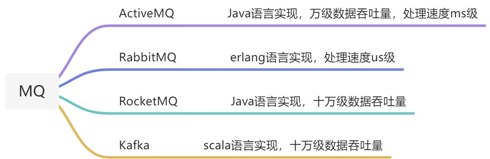
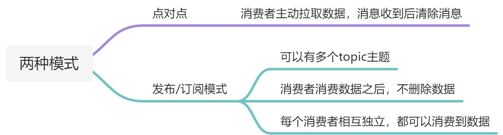

# 第1节 前言

MQ 全称为 Message Queue，是在消息的传输过程中保存消息的容器。多用于分布式系统之间进行通信。

## 一、概念

通过的典型的`生产者`和`消费者`模型，生产者不断向消息队列中生产消息，消费者不断的从队列中获取消息。因为消息的生产和消费都是异步的，而且只关心消息的发送和接收，没有业务逻辑的侵入，轻松的实现系统间解耦。别名为`消息中间件`，通过利用高效可靠的消息传递机制进行平台无关的数据交流，并给予数据通信来进行分布式系统的集成。

## 二、优点

1）**应用解耦**：消费者存活与否不影响生产者

2）**异步提速**：生产者发送完消息之后，可以继续进行下一步的操作

3）**削峰填谷**：使用MQ之后，可以限制消费者消费消息的速度，这样一来，高峰期产生的数据势必会被积压在MQ之中，高峰就被“削”了，但是因为消息积压，在高峰期过后的一段之间内，消费者的速度还会维持不变，直到消费完成积压的消息，这就叫做“填谷”，进一步提高系统的稳定性

## 三、缺点

1）**系统可用性降低**：系统引入的外部依赖越多，系统稳定性越差。一旦MQ宕机，就会对业务造成影响。

2）**系统复杂度提高**：MQ的加入大大增加了系统的复杂度，以前系统间是同步的远程调用，现在是通过MQ进行异步调用。并且如何去保证消息没有被重复消费，怎么处理消息丢失的问题？

3）**一致性问题**：通过MQ向多个系统发消息数据，如果其中一个系统失败了，如何保证消息数据处理的一致性？

## 四、常见的MQ

## 五、两种模式

