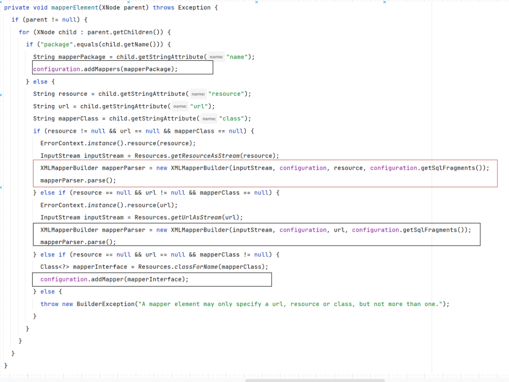

# 第3节 核心运行源码

对于MyBatis，是一个ORM类型的框架，解决了数据库访问和操作的问题，对现有的JDBC技术进行了封装，使用SqlSession对相关的技术进行了封装。

在 Mybatis 开发过程中，有着两种配置文件：主配置文件和Mapper文件（对应于DAO层接口）。那么这文件最终是如何进行解析的？

配置文件中的那些标签是否都对应于Java对象？

也从这个章节开始，逐步开始分析Mybatis的源码！

## 一、基础回顾

### 1.1 主配置文件

首先，在开发过程中的主配置文件，在里面我们会做以下几件事情：

- 配置数据库连接环境
- 注册Mapper文件
- 配置信息
- 设置别名

```xml
<?xml version="1.0" encoding="UTF-8" ?>
<!--约束文件-->
<!DOCTYPE configuration
        PUBLIC "-//mybatis.org//DTD Config 3.0//EN"
        "http://mybatis.org/dtd/mybatis-3-config.dtd">
<configuration>
    <!--配置信息，比如日志-->
    <settings>
        <setting name="logImpl" value="STDOUT_LOGGING"/>
    </settings>
    <!--设置别名-->
    <typeAliases>
        <typeAlias type="com.haolong.User"></typeAlias>
    </typeAliases>
    <!--配置Mybatis的运行环境 default是从多个数据源中选一个，选的哪一个的id与这个的defalut的值是一样的-->
    <environments default="development">
        <!--一个数据源，id值唯一-->
        <environment id="development">
            <!--配置事务管理-->
            <transactionManager type="JDBC"/>
            <!--配置连接池-->
            <dataSource type="POOLED">
                <!--连接数据库的四个要素-->
                <property name="driver" value="com.mysql.cj.jdbc.Driver"/>
                <property name="url" value="jdbc:mysql://localhost:3306 /jdbc?serverTimezone=GMT%2B8"/>
                <property name="username" value="root"/>
                <property name="password" value="123456"/>
            </dataSource>
        </environment>
    </environments>
    <mappers>
        <mapper resource="mapper/UserMapper.xml"/>
    </mappers>
</configuration>
```

既然说环境可以配置多个，我们是否不同的方法，选择不同的数据库进行操作？

解答：可以，在标签之中，是有一个属性，叫做`databaseId`，可以通过这个进行指定

```xml
<insert id="save" parameterType="User" databaseId="">
    insert into user(name) values(#{name})
</insert>
```

既然可以使用多个数据源，那么在一个Service之中，多次进行Dao层操作（操作不同的数据源），那么这个的事务如何进行控制？

解答：只能通过分布式事务进行控制

同样，注意到主配置文件的根标签是`configuration`标签

### 1.2 两种开发方式

#### 01 通过原生的接口

```java
InputStream resourceAsStream = Resources.getResourceAsStream("config.xml");

SqlSessionFactory build = new SqlSessionFactoryBuilder().build(resourceAsStream);

SqlSession sqlSession = build.openSession();

String url = "com.haolong.dao.UserDao.save";

User user = new User("haolong");

sqlSession.update(url, user);

sqlSession.commit();
```

#### 02 通过代理的方式

```java
InputStream resourceAsStream = Resources.getResourceAsStream("config.xml");

SqlSessionFactory build = new SqlSessionFactoryBuilder().build(resourceAsStream);

SqlSession sqlSession = build.openSession();

UserDao mapper = sqlSession.getMapper(UserDao.class);

mapper.save(new User("haolong"));

sqlSession.commit();

```

在这种开发方式之下，我们并没有开发过对应UserDao的实现类，这里就是多态的体现，那么就能够间接性的得出通过getMapper方法，获取出来的是对应的代理对象。那么这个代理对象在哪里？

这实际上就是一个动态字节码技术，在JVM运行时创建，当JVM消失之后，就消失

那么这个动态代理对象是如何创建出来的？里面的方法又是如何实现的？

- 既然说`SqlSession`之中有原生的实现，我们就可以在代理对象之中，直接使用原生的方式就能实现
- 而对于这个对象的创建来说，实际上就是一个代理模式

```markdown
# 什么时候使用代理模式？

- 为原始对象添加额外功能

- 远程代理（网络通信，数据传输）

- 无中生有，开发过程之中只定义了接口，我们看不见实实在在的实现类文件，但是在运行的时候能够感知的到
```

这里，我们首先来模拟一下，代理开发过程，为了操作的方便（避免在代理过程之中要进行特殊判断），这里Dao层之中，只保留一个方法

```java
public interface UserDao {
    public List<User> selectList();
}
```

开发代理类

- 传入SqlSession，是为了使用原生接口的方式
- 传入Class，是为了获取接口的全限定名称。

```java
public class UserDaoProxy implements InvocationHandler {
    private SqlSession sqlSession;
    private Class aClass;
    public UserDaoProxy(SqlSession sqlSession,Class aClass) {
        this.sqlSession = sqlSession;
        this.aClass = aClass;
    }
    @Override
    public Object invoke(Object proxy, Method method, Object[] args) throws Throwable {
        String namespace = aClass.getName();
        String id = method.getName();
        List<User> res = sqlSession.selectList(namespace + "."+ id);
        return res;
    }
}

```

测试一下

```java
InputStream resourceAsStream = Resources.getResourceAsStream("config.xml");
SqlSessionFactory sqlSessionFactory = new SqlSessionFactoryBuilder().build(resourceAsStream);
SqlSession sqlSession = sqlSessionFactory.openSession();

UserDao userDao = (UserDao) Proxy.newProxyInstance(
        TestProxy.class.getClassLoader(),
        new Class[]{UserDao.class},
        new UserDaoProxy(sqlSession,UserDao.class)
	);
List<User> users = userDao.selectList();
users.forEach(System.out::println);
```

这样做也是可以的，这个时候我们就可以来测试一下MyBatis之中，是如何做的，通过getMapper方式，我们首先就能够找到下面这个调用链条

1、首先，是调用下面的这个方法，在这个方法之中，会创建MapperProxy，最终就交给了上面这个方法，而上面这个方法之中的代码，就如同我们所做的这个代理，所以也能够明白，这个MapperProxy 对象，就是核心做代理的


2、 而在创建这个代理类MapperProxy的时候，同样传入了SqlSession和对应的接口，既然这个一个代理类，我们只需要核心分析一下，里面的invoke方法，就行了


这个时候，问题就有了，为什么将原来的Method对象变为了MapperMethod对象呢？带来了哪些好处？

从里面的构造方法，也能够明白，其实就是封装了两个核心对象，一个就是SqlCommand对象，另一个就是MethodSignature对象


分析完成这个对象之后，我们来看一下核心的执行方法


而这个方法，实际上就是通过判断不同的方法类型，调用不同的SqlSession原生接口方式

#### 03 两种方式的对比 

1. 使用Mapper代理这种方式相比而言更加好，主要在于可读性更加好，概念更加清晰。
2. 并且Mapper代理方式，实际上就是使用**代理设计模式**对原生接口进行封装

```java
// 如果说使用这种方式，表示一个name含义的时候，我们并不清楚，这个name表示的是人名还是狗名
String name = "peiki";

// 通过这种方式，我们就很容易能够知道，这个name就是一个人名
public class User {
    private String name = "peiki";
}
```

## 二、数据存储类对象

在MyBatis之中，其实有两类对象，一类就是数据存储类对象，一类就是执行类对象，这里首先对数据存储类对象进行分析

在Java之中，对MyBatis的配置信息进行存储，在MyBatis的开发过程之中，主要有两种配置文件

- 一种叫做：主配置文件，被封装成为了`Configuration`对象
- 一种叫做：XXXMapper.xml，被封装成为了`MappedStatement`对象（并不是很准确）

### 2.1 Configuration

作用：主要用来封装Mybatis主配置文件中的信息

#### 01 封装 environment 标签

```java
protected Environment environment;
```

#### 02 封装 settings 标签

因为这里面就是一些配置信息，也就说只用关注这些配置是否开启就行了，对应于boolean类型的值

```java
protected boolean safeRowBoundsEnabled;

protected boolean safeResultHandlerEnabled;

protected boolean mapUnderscoreToCamelCase;

protected boolean aggressiveLazyLoading;

protected boolean multipleResultSetsEnabled;

protected boolean useGeneratedKeys;

protected boolean useColumnLabel;

protected boolean cacheEnabled;

protected boolean callSettersOnNulls;

protected boolean useActualParamName;

protected boolean returnInstanceForEmptyRow;
```

#### 03 封装 typeAlias 标签

```java
protected final TypeAliasRegistry typeAliasRegistry;
```

#### 04 封装 mappers 标签

在 Configuration 对象中，封装为一个Set集合，保证元素不会进行重复

```java
protected final Set<String> loadedResources;
```

#### 05 封装 Mapper 文件信息

在之前的分析过程之中，对于Mapper文件，我们把它封装为了MapperStatement对象，但其实这并不是准确的，正确的应该是将我们所写的CRUD的标签封装为了MapperStatement对象

> 在主配置文件中，保存mapper文件中的信息
>
> 这里的Key都是 key = namespace + id

```java
protected final Map<String, MappedStatement> mappedStatements;

protected final Map<String, Cache> caches;

// 会将所有Mapper文件的ResultMap都会存储到Configuration对象里面
protected final Map<String, ResultMap> resultMaps;

protected final Map<String, ParameterMap> parameterMaps;


protected final Map<String, KeyGenerator> keyGenerators;
```

#### 06 创建核心对象

在这个类之中，同样涉及到一下核心对象的创建工作


### 2.2 MappedStatement

mapper文件中的标签被封装成了一个`MappedStatement`对象，所以说一个Mybatis应用中就会有N个`MappedStatement`对象

这里看看我们所熟悉的东西，**这些其实都是标签中的属性**

```java
public final class MappedStatement {
    
    private String resource;
    
    // 主配置文件解析之后的对象
    private Configuration configuration;
    
    // id值，唯一：namespace + id
    private String id;
    
    // 使用Statement的具体类型，默认就是PrepareStatement
    // statementType="CALLABLE | PREPARED | STATEMENT"
    private StatementType statementType;
    
    // 结果类型
    private ResultSetType resultSetType;
    
    private SqlSource sqlSource;
}
```

不过这里我们并没有发现SQL语句在哪里?只是发现了SqlSource

```java
public interface SqlSource {
    BoundSql getBoundSql(Object var1);
}
```

发现这是一个接口，是获取BoundSql的对象，而这个对象里面才真正封装了SQL语句，在这里面不仅仅是封装了一个基础的SQL语句，还包含了对应的参数信息

```java
public class BoundSql {
    private final String sql;
    private final List<ParameterMapping> parameterMappings;
    private final Object parameterObject;
    private final Map<String, Object> additionalParameters;
    private final MetaObject metaParameters;
}
```

到这里，配置文件对应的对象就分析完成了，但是MyBatis又是如何将配置文件转为这个两大对象的呢？

## 三、解析XML

在MyBatis的开发过程之中，对于第一行，虽然说我们只写了主配置文件的路径，但是实际上，他也会将Mapper文件读取到这个输入流之中

```java
InputStream resourceAsStream = Resources.getResourceAsStream("config.xml");
```

在读取完成之后，MyBatis又是如何做的呢？他又是如何将XML文件解析为对象的呢？

对于XML的解析方式，主要有三种方式：DOM，SAX，XPath。

在Mybatis中，解析XMl中用到的是XPathParser，在Spring中用到的是SAX。

在XPathParser之中，又是将整个标签组划分为了对象

### 3.1 手写模拟

首先，新建一个xml文件，我们来模拟一下，比方说，我下面建立的这个文件，并且已经表明了整个文件的结构


明确了结构之后，可以看看下面的代码：

```java
@Test
public void test() throws IOException {
    
    InputStream resourceAsStream = Resources.getResourceAsStream("user.xml");
    
    // 在构建过程之中，将输入流作为XPathparser的构造参数传入，进行读取分析
    XPathParser xPathParser = new XPathParser(resourceAsStream);
    
    // 解析users标签及其子标签
    List<XNode> list = xPathParser.evalNodes("/users/*");
    
    // 通过Node的方式，获取子标签
    for (XNode xNode : list) {
        log.info("xNode:{}",xNode);
        List<XNode> children = xNode.getChildren();
        User user = new User();
        user.setId(children.get(0).getIntBody());
        user.setName(children.get(1).getStringBody());
        log.info("user:{}",user);
    }
}
```


通过执行结果，和我们分析的一致，这里，我们手动模拟了一下XML的解析，接下来，就来看看Mybatis中是如何做的

### 3.2 源码分析

在我们手写过程中，我们会首先获取主配置文件的输入流，然后传入到`XPathParser`中，而在Mybatis的开发过程，我们是将这个输入流传入到`SqlSessionFactoryBuilder`的build方法里面，**所以可以猜出，build方法中会出现`XPathParser`的解析过程**，我们来通过阅读源码来验证一下我们的猜想：

#### 01 原来的代码

```java
InputStream resourceAsStream = Resources.getResourceAsStream("config.xml");

SqlSessionFactoryBuilder factoryBuilder = new SqlSessionFactoryBuilder();

// 解析了配置文件，并创建了默认的SqlSessionFactory方法
SqlSessionFactory factory = factoryBuilder.build(resourceAsStream);

SqlSession sqlSession = factory.openSession();
```

#### 02 build 方法

接下来，分析一下，build方法，忽略重载，直接看最后的方法

```java
public SqlSessionFactory build(InputStream inputStream, String environment, Properties properties) {
    SqlSessionFactory var5;
    try {
        XMLConfigBuilder parser = new XMLConfigBuilder(inputStream, environment, properties);
        var5 = this.build(parser.parse());
    } catch (Exception var14) {
        throw ExceptionFactory.wrapException("Error building SqlSession.", var14);
    } finally {
        ErrorContext.instance().reset();

        try {
            inputStream.close();
        } catch (IOException var13) {
        }
    }
    return var5;
}
```

在这个方法之中，首先是进行`XMLConfigBuilder`对象的创建，通过查看源码，我们能够分析出，这里面封装了XPathParser，而对于这个build方法来说

```java
public SqlSessionFactory build(Configuration config) {
    return new DefaultSqlSessionFactory(config);
}
```

他的参数是Configuration对象，所以能够得出对于`parser.parse()`的返回值是Configuration对象，并在这个方法之中，完成了对应的解析工作

#### 03 parse()

所以，接下来，就来分析一下`parser.parse()`

```java
public Configuration parse() {
	if (this.parsed) {
		throw new BuilderException("Each XMLConfigBuilder can only be used once.");
	} else {
		this.parsed = true;
		// 主配置文件中的子标签 都被封装成了 XNode 传给了 parseConfiguration
		this.parseConfiguration(this.parser.evalNode("/configuration"));
		return this.configuration;
	}
}
```

在这个方法之中，我们看到了和我们首先过程之中一样的代码，就是`this.parser.evalNode("/configuration")`，说明这个时候，已经将主配置文件中的内容封装为了XNode节点。将这个XNode传入下面的方法之中，进行对应的标签解析

#### 04 主配置文件解析


不过在这个方法之中，也请注意，Mapper文件的解析也是在这个方法之中`mapperElement(root.evalNode("mappers"))`，从这里面就能够发现，这里解析的就是Mapper文件在主配置文件注册的标签

#### 05 mapper文件解析



这里面的if else 判断，其实就对应于mappers标签的不同写法，但是在每个分支之中，最后的一步，其实是可以分为两组，其实也对应于两种方式

```xml
<mappers>
    <package name=""/>
    <mapper resource=""/>
</mappers>
```

1）第一组

```java
configuration.addMappers(mapperPackage);
```

最终也将会转化为Mapper文件的解析

2）第二组

```java
XMLMapperBuilder mapperParser = new XMLMapperBuilder(
    inputStream, 
    configuration, 
    resource, 
    configuration.getSqlFragments()
);
mapperParser.parse();
```

我们来看这解析的方法：

```java
public void parse() {
    // 如果说当前xml资源还没有被加载过
    if (!configuration.isResourceLoaded(resource)) {
        // 解析mapper元素
        configurationElement(parser.evalNode("/mapper"));
        configuration.addLoadedResource(resource);
        // 解析和绑定命名空间
        bindMapperForNamespace();
    }
	// 解析 resultMap
    parsePendingResultMaps();
    // 解析 cache-ref
    parsePendingCacheRefs();
    // 解析声明的Statement
    parsePendingStatements();
}
```

这里只关心：解析mapper元素

```java
private void configurationElement(XNode context) {
    try {
        // 提取命名空间
        String namespace = context.getStringAttribute("namespace");
        if (namespace == null || namespace.equals("")) {
            throw new BuilderException("Mapper's namespace cannot be empty");
        }
        builderAssistant.setCurrentNamespace(namespace);
        // 解析 cache-ref 标签
        cacheRefElement(context.evalNode("cache-ref"));
        // 解析 cache 标签
        cacheElement(context.evalNode("cache"));
        // 废弃
        parameterMapElement(context.evalNodes("/mapper/parameterMap"));
        // 解析 resultMap 标签
        resultMapElements(context.evalNodes("/mapper/resultMap"));
        // 解析 sql 标签
        sqlElement(context.evalNodes("/mapper/sql"));
        // 构建 Statement
        buildStatementFromContext(context.evalNodes("select|insert|update|delete"));
    } catch (Exception e) {
        throw new BuilderException("Error parsing Mapper XML. The XML location is '" + resource + "'. Cause: " + e, e);
    }
}
```

## 三、操作类对象

对于这些操作类型的对象，是在Configuration对象之中进行创建的，在分析Configuration对象的时候，也是看到了对应的创建方法.

对于MyBatis的两种开发方式，通过getMapper的开发方式，最终能够转换为了原生接口的开发方式，但是原生接口底层又是如何实现的呢？

这就涉及到了底层的操作类对象

### 3.1 Executor

> 是MyBatis中处理功能的核心


对于CRUD而言，如果是增删改，对应于update方法，如果是查询，对应于query

不过Executor这是一个接口，之所以定义为接口，是因为这里牵扯到设计原则相关的，在我们定义操作相关的功能的时候，都定义为接口。

而对于接口实现类，有如下几个：

- `BatchExecutor`
  
    - 作用：JDBC批处理操作（一次连接之上，进行多次SQL）
    
- `ReuseExecutor`
  
    - 作用：当SQL语句一样的时候，复用Statement对象。<font style='color:red'>注意：Statement对象和SQL语句相关的</font>
    
- `SimpleExecutor`
  
    - 默认执行器，在源码中用的体现，主要是体现在MyBatis的Configuration对象之中
    
    ```java
    protected ExecutorType defaultExecutorType = ExecutorType.SIMPLE;
    ```

### 3.2 StatementHandler

> 作用：Mybatis中封装`JDBC Statement`对象的核心，是执行`CRUD`的核心


既然StatementHandler才是封装JDBC的核心，为什么还要提供Executor？

解答：StatementHandler仅仅完成你的是Executor核心功能中一个部分，也只做这一部分功能，Executor再此基础之上，对这个类型进行了包装，添加额外功能

再此之前，我们分析数据存储类对象的时候，提到过，对于SQL的封装，封装为了`BoundSql`对象

这个类型，仍然是接口，同样来看看他的接口实现类：

- `SimpleStatementHandler`
- `PreparedStatementHandler`
- `CallableStatementHandler`

这里我们查看`SimpleStatementHandler`中的query方法，发现他其实就是JDBC执行的过程，最后封装结果集返回，这里也是能够体会出就是对JDBC的封装，才是数据库访问操作的核心


### 3.3 ParameterHandler

我们所写的SQL都是带有参数的，如何将MyBatis中的参数，替换为JDBC相关的参数，也就是将@Param--> #{} ---> ? 的过程

```sql
 <insert id="save" parameterType="User">
        insert into user(name) values(#{name})
 </insert>
```

> 作用：Mybatis参数 -----> JDBC参数


### 3.4 ResultSetHandler

> 作用：对JDBC中的 ResultSet 结果集的进行封装

```java
public interface ResultSetHandler {
    <E> List<E> handleResultSets(Statement var1) throws SQLException;

    <E> Cursor<E> handleCursorResultSets(Statement var1) throws SQLException;

    void handleOutputParameters(CallableStatement var1) throws SQLException;
}
```

这个接口中方法中传入的为什么是Statement？

解答：在JDBC之中，有了Statement才能够获取ResultSet

### 3.5 TypeHandler

>  作用：Java对象属性类型和MySQL类型的相互映射

主要体现就是两点：在执行SQL的时候，Java类型转为数据库类型；查询出结果，数据库类型转为Java类型

```java
public interface TypeHandler<T> {
    void setParameter(PreparedStatement var1, int var2, T var3, JdbcType var4) throws SQLException;

    T getResult(ResultSet var1, String var2) throws SQLException;

    T getResult(ResultSet var1, int var2) throws SQLException;

    T getResult(CallableStatement var1, int var2) throws SQLException;
}
```

## 四、与 SqlSession 建立联系


首先，来回顾一下，原生Mybatis中的写法：

```java
InputStream resourceAsStream = Resources.getResourceAsStream("config.xml");

SqlSessionFactory build = new SqlSessionFactoryBuilder().build(resourceAsStream);

SqlSession sqlSession = build.openSession();

String url = "com.hoalong.dao.UserDao.save" ;

User user = new User("haolong");

sqlSession.update(url, user);

sqlSession.commit();
```

通过代理对象的方式，执行对应的操作，最终都是转为原生的这种写法，所以，这个时候，我们只需要关心原生写法即可

这里，通过Debug过程，来走一遍这个流程：

- 首先：DefaultSqlSession，这里发现这里调用的是`update`方法
    - 这个的statement的就是`namespace + id`

```java
public int insert(String statement, Object parameter) {
    return this.update(statement, parameter);
}
```

```java
public int update(String statement, Object parameter) {
    int var4;
    try {
        this.dirty = true;
        // 1. 获取了MapperStatement对象，也就是之前所说的Mapper文件中的一个标签对应于一个MappedStaatement
        MappedStatement ms = this.configuration.getMappedStatement(statement);
        // 2. 调用 Executor 对象的 update方法
        var4 = this.executor.update(ms, this.wrapCollection(parameter));
    } catch (Exception var8) {
        throw ExceptionFactory.wrapException("Error updating database.  Cause: " + var8, var8);
    } finally {
        ErrorContext.instance().reset();
    }

    return var4;
}
```

而在`Executor`中:

```java
public int update(MappedStatement ms, Object parameter) throws SQLException {
    ErrorContext.instance().resource(ms.getResource()).activity("executing an update").object(ms.getId());
    if (this.closed) {
        throw new ExecutorException("Executor was closed.");
    } else {
        this.clearLocalCache();
        return this.doUpdate(ms, parameter);
    }
}
```

我们发现，最终是调用`StatementHandler`中的方法来实现的

```java
 public int doUpdate(MappedStatement ms, Object parameter) throws SQLException {
        Statement stmt = null;
        int var6;
        try {
            Configuration configuration = ms.getConfiguration();
            StatementHandler handler = configuration.newStatementHandler
                (this, ms, parameter, RowBounds.DEFAULT, (ResultHandler)null, (BoundSql)null);
            stmt = this.prepareStatement(handler, ms.getStatementLog());
            var6 = handler.update(stmt);
        } finally {
            this.closeStatement(stmt);
        }
        return var6;
    }
```

值得注意的是，这里在执行 update 方法的时候，传入了一个Statement对象，我们首先来看看这个对象是如何进行获取的

```java
private Statement prepareStatement(StatementHandler handler, Log statementLog) throws SQLException {
    Connection connection = this.getConnection(statementLog);
    Statement stmt = handler.prepare(connection, this.transaction.getTimeout());
    handler.parameterize(stmt);
    return stmt;
}
```

这里又是调用了**StatementHandler中的prepare**方法，所以在这个时候，我们明白：**在执行update方法之前，我们需要先执行StatementHandler中的prepare方法，为update方法准备Statement对象**，不过请注意：不仅仅是update操作，select操作也同样会先准备Statement对象。

分析完成之后，我们继续看这个update方法：最后都是原生JDBC的操作

```java
@Override
public int update(Statement statement) throws SQLException {
    PreparedStatement ps = (PreparedStatement) statement;
    ps.execute();
    int rows = ps.getUpdateCount();
    Object parameterObject = boundSql.getParameterObject();
    KeyGenerator keyGenerator = mappedStatement.getKeyGenerator();
    keyGenerator.processAfter(executor, mappedStatement, ps, parameterObject);
    return rows;
}
```

