# 第4节 缓存

## 一、思路分析

数据库和程序直接的交互，永远是瓶颈。主要体现在三个方面

- 网络通信和网络之间的数据传输，无法干预
- 硬件存储大量的数据，也不利于查询。从数据库方面进行优化
- Java对象的复用问题（JDBC），如连接池，Statement对象的复用。

这个时候，可以通过加入缓存来进行优化，缓存最核心的价值，就是程序和数据库之间加了一个桥梁，能够把数据存储在内存之中，提高用户的查询效率，尽量避免数据库的查询操作，其实就是空间换时间，但是考虑到安全问题，并不会去存储数据库中全部的数据，而是将经常性访问的数据，放在缓存之中。程序的结构就发生了变化

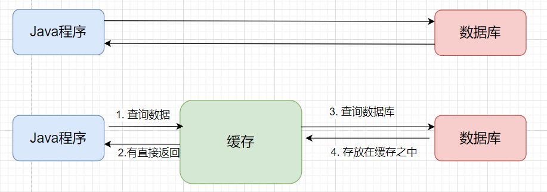


虽然说这是一个空间换时间的方式，但是这个空间也不可能无限制的大，如果说缓存满了呢，就需要将一部分数据换出到硬盘之中，换出方式可以使用Java的序列化机制，也可以使用JSON的形式，但是后者的占用空间更大，所以更加建议使用前者。而对于换出算法来说，最为常见的有两种方式：LRU（最近最少使用）和 FIFO（相当于队列，先进队列的先被淘汰）。

## 二、缓存的分析

### 2.1 分析

主要有两种：

- ORM框架集成缓存，缓存主要是在访问数据库的时候起作用。在MVC开发过程之中，Dao层主要负责的就是数据库相关的操作，所以缓存这一部分的操作主要是交给Dao层进行开发，但是这种方式，就必须要求Service和Dao层的代码必须在同一台虚拟机之下，也正是因为这种方式，就会导致缓存分配的内存可能较少，但是执行效率会较高
- 使用中间件充当缓存，如Redis，Memcache，这一部分是独立的内存空间，并不归属于JVM，内存没有限制，但是会带来网络开销

如果说我们使用方式一，会为我们提供解决方案，也就是说我们可以直接用呢？但是对于方式二呢？并没有一种很好的解决方案，就需要自己去设计，比如说，我原来的Dao层操作，就会修改成这样：

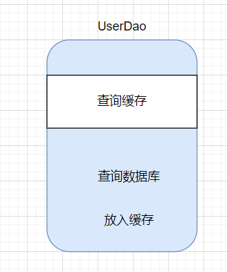

但是这种方式，是将缓存这一部分代码写死在原来的代码之中，但是如果说后续如果说不想使用缓存或者说缓存的中间件发生了变化呢，再者说，一个Dao层之中，有多个查询方法呢，这一部分的代码就造成了冗余，所以这种方式就可以使用代理设计模式

1）我们可以编写一个注解，用来辨识那些方法需要走缓存

```java
@Target(ElementType.METHOD)
@Retention(RetentionPolicy.RUNTIME)
public @interface Cache {
}
```

2）将这个注解添加在对应的Dao层接口方法之上，比如说现在我就写两个方法，用来验证没有加注解的方法是否会走缓存

```java
public interface  ProductDao {
    public void save();
    @Cache
    public Product queryProductById(String id);
}
```

3）编写代理代码

```java
@Test
public void test() {
    ProductDao productDao = new ProductDaoImpl();
    ProductDao o = (ProductDao) Proxy.newProxyInstance(
        TestProxy.class.getClassLoader(), 
        new Class[]{ProductDao.class}, 
        new InvocationHandler() {
            @Override
            public Object invoke(Object proxy, Method method, Object[] args) throws Throwable {
                if (method.getAnnotation(Cache.class) != null) {
                    System.out.println("调用第三方接口,查询缓存");
                    return method.invoke(productDao, args);
                }
                return method.invoke(productDao, args);
            }
    });
    o.queryProductById("1");
}
```

通过这种方式，我们也是将原来的需要加缓存的方法，成功的用上了

### 2.2 MyBatis 集成缓存

对于 MyBatis 集成缓存的这种方式，主要是提供了Cache接口，我们可以通过这种方式实现我们自己定义的缓存，在这个接口主要提供了如下的几个方法：

```java
public class MyMyBatisCache implements Cache {
	// 获取唯一标识
    @Override
    public String getId() {
        return null;
    }
	// 向缓存之中添加对象
    @Override
    public void putObject(Object key, Object value) {

    }
    // 从缓存之中取出对象
    @Override
    public Object getObject(Object key) {
        return null;
    }
	
    // 删除指定的缓存对象
    @Override
    public Object removeObject(Object key) {
        return null;
    }
	// 删除缓存
    @Override
    public void clear() {

    }
    // 获取缓存中存放对象的数量
    @Override
    public int getSize() {
        return 0;
    }
	// 基本不会实现
    @Override
    public ReadWriteLock getReadWriteLock() {
        return Cache.super.getReadWriteLock();
    }
}
```

### 2.3 Cache的实现方式

MyBatis 之中提供了Cache作为整个缓存体系的总接口，我们通过IDEA查看了一下，整个Cache的继承体系

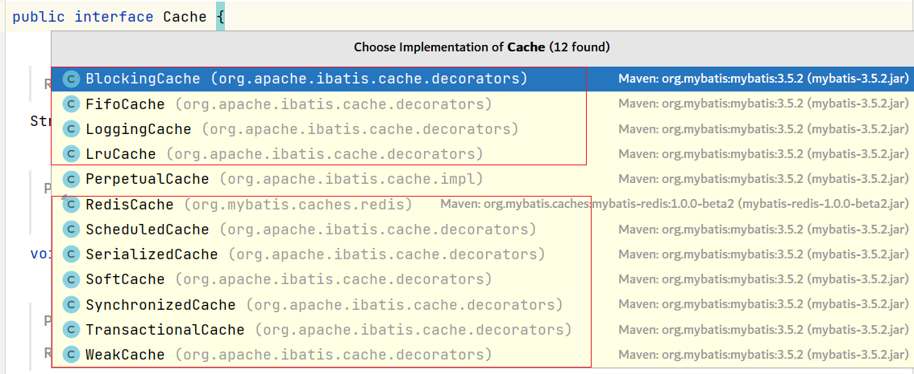

从整体的包接口能够看出，这是一个具体的实现类 + 一组装饰器的方式。在分析的过程之中，我们提到了对于第三方的缓存集成，我们是用到了代理设计模式，那为什么这里会使用装饰器设计模式呢？这里也对两种设计模式进行对比

> 装饰器设计模式和代理设计模式的区别

1. 装饰器模式：为目标 扩展功能 （本职工作 核心功能） 
2. 代理设计模式：为目标（原始对象）添加功能
3. 区别
    - 装饰器增加核心功能，和被装饰器对象做的是同一件事
    - 代理设计模式增加额外功能，和被代理对象做的是不同的事情

分析完成这些之后，我们可以来看一下，缓存体系之中的具体的实现类（`PerpetuaCache`），里面究竟是如何做的

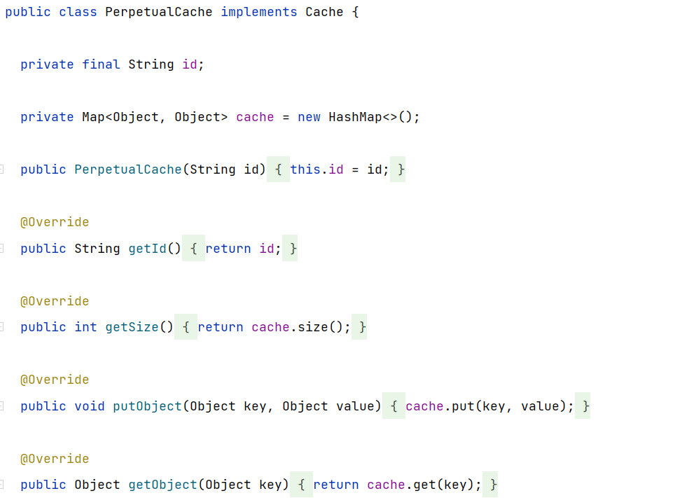

从这里面来看，能够看出，这里面是通过Map结构来实现的，所做的功能也仅仅是将信息放在这个Map结构之中，为提供更为复杂的功能，也就用到了原来所说的这些这一组装饰器，这里也对一些核心的装饰器进行说明

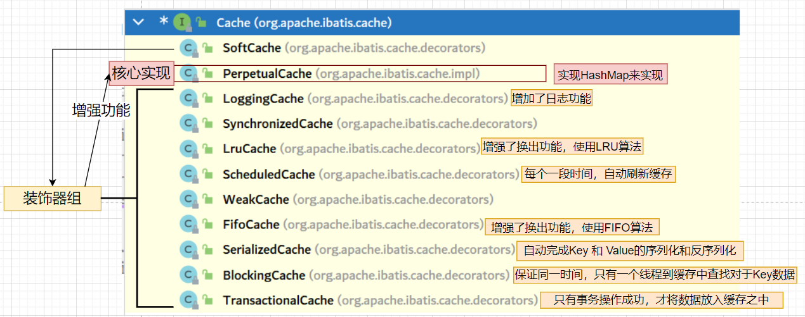

## 三、MyBatis的缓存体系

对于MyBatis的缓存体系来讲，是有两级缓存的，主要有两级缓存：一级缓存 和 二级缓存（也可以称之为全局缓存）

### 3.1  一级缓存

一级缓存是默认开启的，只对 本SqlSession 有效 ，换SqlSession ，不能在利用原有sqlSession对应的一级缓存。

我们在同一个SqlSession之下，执行同样的Sql查询，执行效果是如何的？

```java
InputStream inputStream = Resources.getResourceAsStream("config.xml");
SqlSessionFactoryBuilder builder = new SqlSessionFactoryBuilder();
SqlSessionFactory factory = builder.build(inputStream);
SqlSession sqlSession = factory.openSession();

ManagerDao managerDao = (ManagerDao) sqlSession.getMapper(ManagerDao.class);
List<User> user_01 = managerDao.queryUserByPage();
for (User user : user_01) {
    System.out.println("user = " + user);
}
System.out.println("-------------------------------");
List<User> user_02 = managerDao.queryUserByPage();
for (User user : user_02) {
    System.out.println("user = " + user);
}
```

观察结果

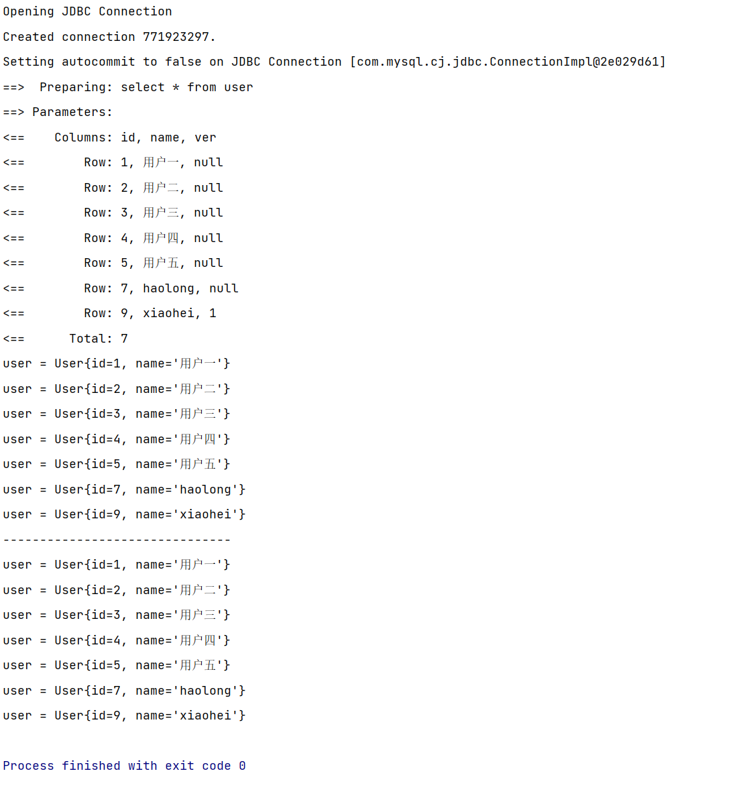

执行 `main` 方法，观察控制台的打印，会发现第一次执行`queryUserByPage`方法时，它会开启一个 jdbc 的连接，并且发送 SQL 语句到数据库，但第二次再调用时，它没有再次发送 SQL ：（控制台没有打印，完事后直接关闭 jdbc 连接了），说明第二次查询直接从缓存之中拿到执行结果。

但是如果说，在不同的SqlSession之下呢？

```java
InputStream inputStream = Resources.getResourceAsStream("config.xml");
SqlSessionFactoryBuilder builder = new SqlSessionFactoryBuilder();
SqlSessionFactory factory = builder.build(inputStream);
SqlSession sqlSession1 = factory.openSession();
SqlSession sqlSession2 = factory.openSession();

ManagerDao managerDao = (ManagerDao) sqlSession1.getMapper(ManagerDao.class);
List<User> user_01 = managerDao.queryUserByPage();
for (User user : user_01) {
    System.out.println("user = " + user);
}
System.out.println("-------------------------------");
ManagerDao managerDao2 = (ManagerDao) sqlSession2.getMapper(ManagerDao.class);
List<User> user_02 = managerDao2.queryUserByPage();
for (User user : user_02) {
    System.out.println("user = " + user);
}
```

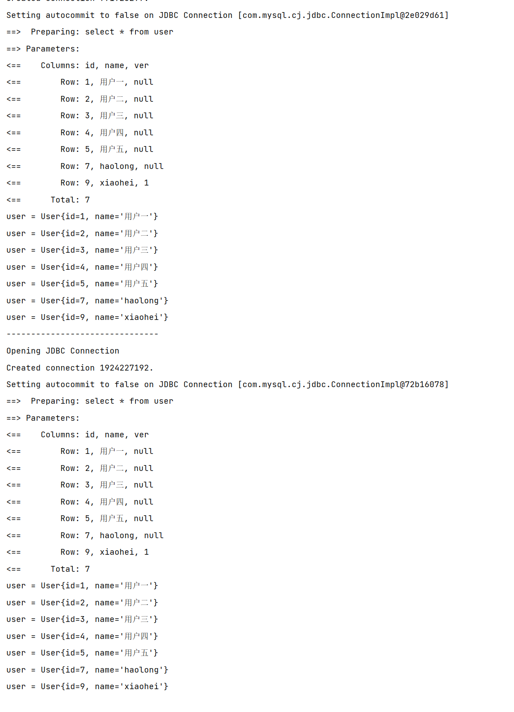

发现每次都是要连接数据库，进行操作。这也是一级缓存的基本使用。这里也对一级缓存失效的场景进行总结

第一种方式，就是在不同的SqlSesson之下，一级缓存不会生效。并且在日常的开发过程之中，换SqlSession的情况，这种情况还是比较多的

第二种方式，就是通过在Mapper文件之中，在标签之中，添加`flushCache="true/false"`属性，也可以让一级缓存失效，这个属性在Select标签之中， 是false，但是在更新，删除，修改标签之中，这个属性默认就是true，也就是说在执行更新，删除，修改操作的时候，就会自动删除一级缓存。除了删除一级缓存之外，他还会清空它所属的 namespace 下的二级缓存，这点在说明二级缓存的时候进行说明。

第三种方式，就是手动的方式，`sqlSession.clearCache();`

虽然说，一级缓存很好用，但是这也是一个比较危险的东西，比如说下面这种场景：

```java
ManagerDao managerDao = (ManagerDao) sqlSession.getMapper(ManagerDao.class);

List<User> userList_01 = managerDao.queryUserByPage();
User user01 = userList_01.get(0);
System.out.println("user01 = " + user01);
user01.setName("haolong");

List<User> userList_02 = managerDao.queryUserByPage();
User user02 = userList_02.get(0);
System.out.println("user02 = " + user02);
```

执行结果如下

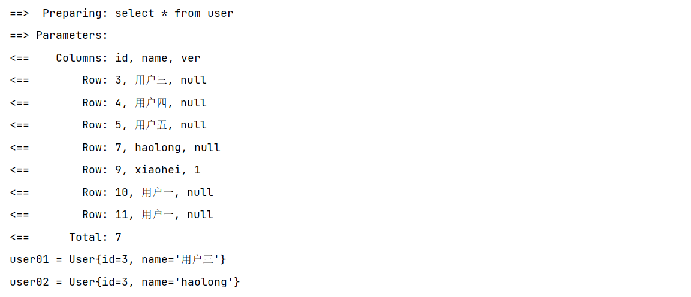

一级缓存是存放在SqlSession之中，但是如果我们在查询到数据之后，直接在数据对象上做操作，修改之后又重新查找相同的数据，虽然此时一级缓存仍然可以生效，但是查询到的数据，则是我们刚修改的数据，所以，一级缓存中存放的数据其实就是对象的引用。

为了能够避免这种错误，就必须让一级缓存失效，则可以通过更换SqlSession的方式或者手动清空缓存

既然说一级缓存是适用于同一个SqlSession之下的，那么他是如何运行的？在哪里运行的呢?

在上一节分析核心对象的时候，已经说明了，底层具体的执行对象有哪些，而缓存所在的位置就是在Executor之中，首先可以看看他的继承体系

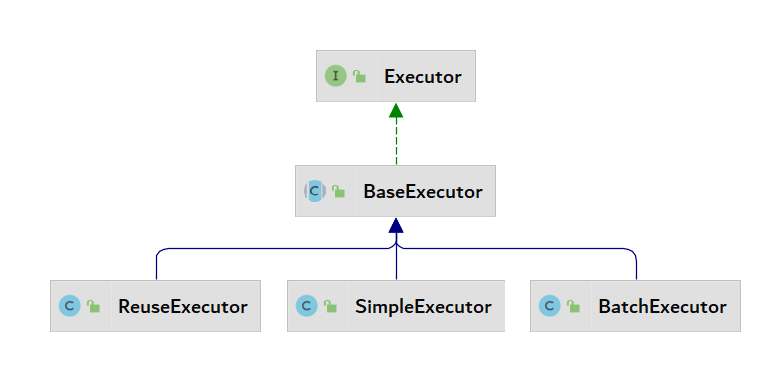

在执行器的继承体系过程之中，这里其实是一个**适配器设计模式**，在Executor之中，其实定义了很多的方法，但是最下面的类其实并没有都去实现，而是在BaseExecutor（抽象类）之中，去实现了部分方法，然后让最为底层的实现类去继承这个抽象类，就能够很巧妙的避免整个问题，就比如说如下的方式：

```java
interface A {
    public void a();
    public void b();
}
abstract class B implements A{
    @Override
    public void a() {

    }
    public abstract void b();
}
class C extends B{

    @Override
    public void b() {
        
    }
}
```

就能够让类C只需要去实现b方法就可，这里就是适配器设计模式的体现。而在缓存设计过程之中，同样是这样的方式

在`BaseExecutor`之中,首先会发现他的成员属性，就有一个上述提到的MyBatis缓存的核心实现类

```java
protected PerpetualCache localCache;
```

在来观察一下，里面的方法

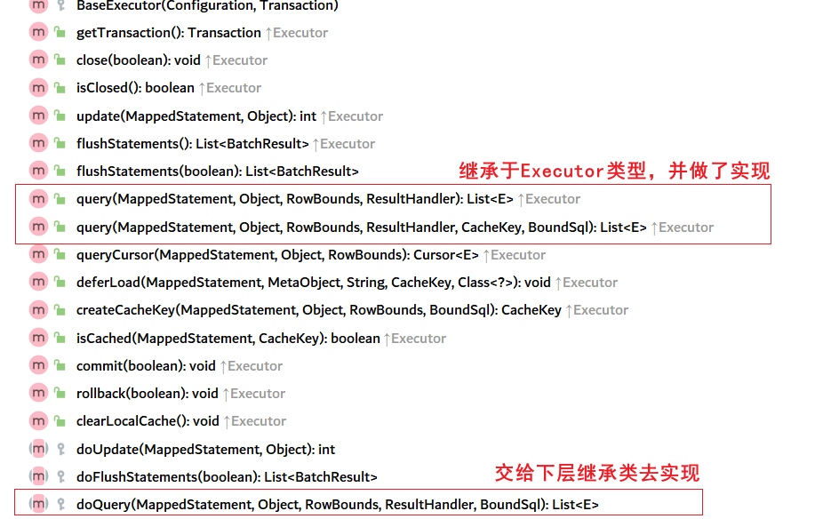

这里首先观察依赖里面的query方法

```java
@Override
  public <E> List<E> query(MappedStatement ms, Object parameter, RowBounds rowBounds, ResultHandler resultHandler, CacheKey key, BoundSql boundSql) throws SQLException {
    ErrorContext.instance().resource(ms.getResource()).activity("executing a query").object(ms.getId());
    if (closed) {
      throw new ExecutorException("Executor was closed.");
    }
    // 如果 statement 指定了需要刷新缓存，则清空一级缓存 
    if (queryStack == 0 && ms.isFlushCacheRequired()) {
      clearLocalCache();
    }
    List<E> list;
    try {
      queryStack++;
      // 最终获取结果的 List 会首先从缓存中去取
      list = resultHandler == null ? (List<E>) localCache.getObject(key) : null;
      // 如果说最终获取到的结果是空，就会从数据库中去查询
      if (list != null) {
        handleLocallyCachedOutputParameters(ms, key, parameter, boundSql);
      } else {
        list = queryFromDatabase(ms, parameter, rowBounds, resultHandler, key, boundSql);
      }
    } finally {
      queryStack--;
    }
    if (queryStack == 0) {
      for (DeferredLoad deferredLoad : deferredLoads) {
        deferredLoad.load();
      }
      // issue #601
      deferredLoads.clear();
      if (configuration.getLocalCacheScope() == LocalCacheScope.STATEMENT) {
        // issue #482
        clearLocalCache();
      }
    }
    return list;
  }
```

而对于上述方法之中，从数据库之中，查询的方法，他会调用子类中实现的doQuery方法，然后将查询结果放在缓存之中

```java
private <E> List<E> queryFromDatabase(MappedStatement ms, Object parameter, RowBounds rowBounds, ResultHandler resultHandler, CacheKey key, BoundSql boundSql) throws SQLException {
    List<E> list;
    localCache.putObject(key, EXECUTION_PLACEHOLDER);
    try {
        list = doQuery(ms, parameter, rowBounds, resultHandler, boundSql);
    } finally {
        localCache.removeObject(key);
    }
    localCache.putObject(key, list);
    if (ms.getStatementType() == StatementType.CALLABLE) {
        localOutputParameterCache.putObject(key, parameter);
    }
    return list;
}
```

至此，一级缓存的分析就完成了。

### 3.2 二级缓存

#### 01 使用

首先，需要在主配置文件之中，添加配置

```xml
<settings>
    <setting name="cacheEnabled" value="true"/>
</settings>
```

其次，在Mapper文件中，添加`<cache/>`，并在需要开启缓存的select之中，添加`userCache`属性

```xml
<cache/>
<select id="queryUserByPage" resultType="User" useCache="true">
    select * from user
</select>
```

最后，对应的实体类要实现序列化接口

这里，创建测试类进行测试

```java
InputStream inputStream = Resources.getResourceAsStream("config.xml");
SqlSessionFactoryBuilder builder = new SqlSessionFactoryBuilder();
SqlSessionFactory factory = builder.build(inputStream);
SqlSession sqlSession1 = factory.openSession();
SqlSession sqlSession2 = factory.openSession();

ManagerDao managerDao = (ManagerDao) sqlSession1.getMapper(ManagerDao.class);
List<User> user_01 = managerDao.queryUserByPage();
for (User user : user_01) {
    System.out.println("user = " + user);
}
sqlSession1.commit();
System.out.println("-------------------------------");
ManagerDao managerDao2 = (ManagerDao) sqlSession2.getMapper(ManagerDao.class);
List<User> user_02 = managerDao2.queryUserByPage();
for (User user : user_02) {
    System.out.println("user = " + user);
}
sqlSession2.commit();
```

在这个过程之中，我们在执行完成之后，会有SqlSession的提交动作，这是因为，MyBatis 的二级缓存**需要在 `SqlSession` 关闭时，一级缓存中的数据才能写入二级缓存**

下面是具体的执行结果：

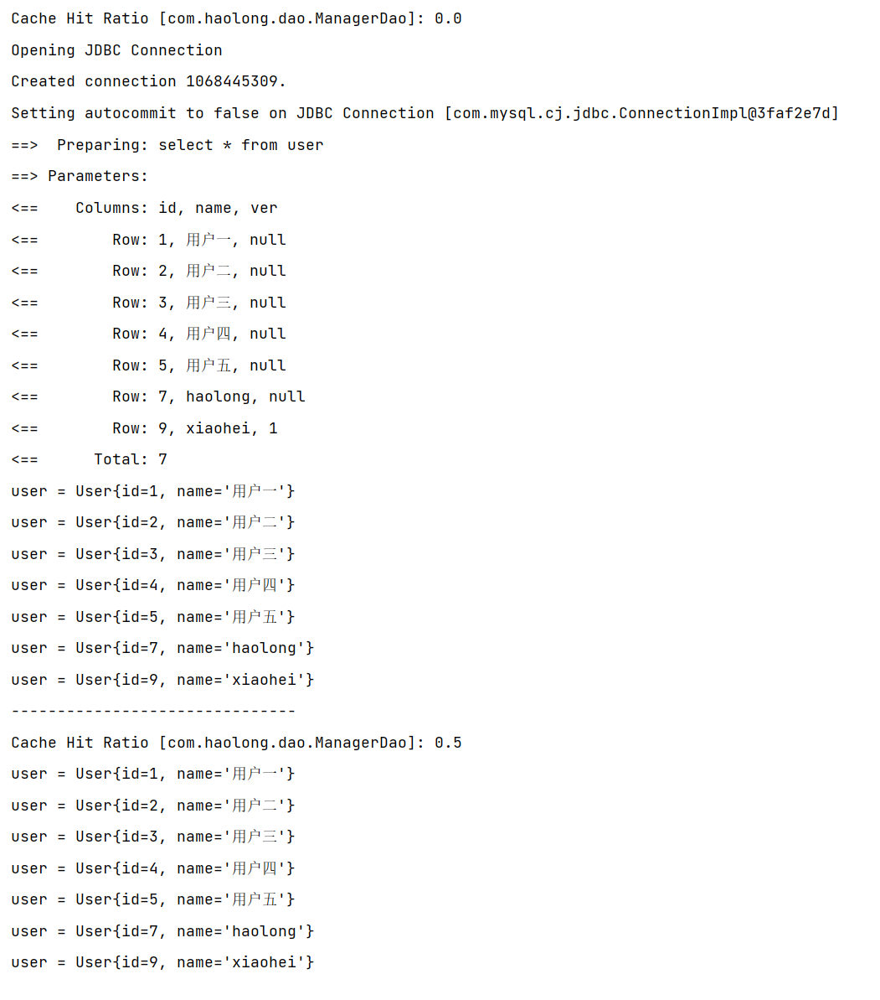

注意，`Cache Hit Ratio [com.haolong.dao.ManagerDao]: 0.5`,表示

#### 02 配置

这里也对cache标签的属性进行说明

1）eviction：缓存的回收策略

- LRU 算法，默认的算法，最近最少使用，移除最长时间不被使用的对象。
- FIFO 算法，先进先出：按对象进入缓存的顺序来移除它们。
- SOFT 算法，弱引用：更积极地基于垃圾收集器状态和弱引用规则移除对象。
- WEAK 算法，软引用：基于垃圾回收器状态和软引用规则移除对象。

2）type：二级缓存的实现

- 默认 `org.apache.ibatis.cache.impl.PerpetualCache` ，即本地内存的二级缓存。
- 这里也可以写我们自己写的缓存，这里替换为对应的全限定名称即可

3）size：缓存引用数量。默认是 1024

4）flushInterval：缓存刷新间隔（定时清除时间间隔）。默认无，即没有刷新间隔

5）readOnly：缓存是否只读。默认 false ，需要二级缓存对应的实体模型类需要实现 `Serializable` 接口

6）blocking：阻塞获取缓存数据。若缓存中找不到对应的 key ，是否会一直 blocking ，直到有对应的数据进入缓存。默认 false

#### 03 底层实现

那么在二级缓存又是如何进行实现的呢？和一级缓存的设计都是一样的，是在Executor里面来做相关的操作

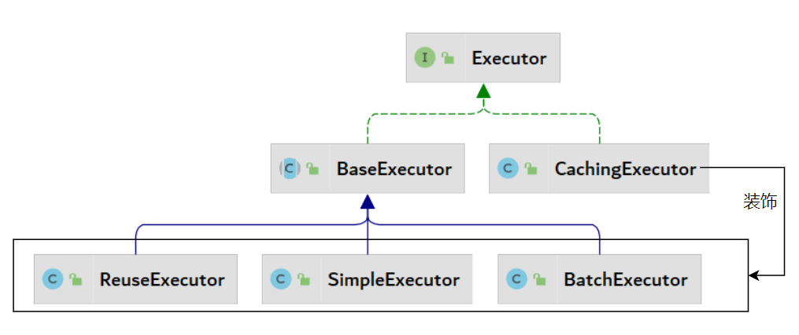

实际上，就是在原来的XXXExecutor之上，通过**装饰器设计模式**，在上面添加了缓存的功能。

我们这里查看一下`CachingExecutor`中的`query`方法

```java
@Override
public <E> List<E> query(MappedStatement ms, Object parameterObject, RowBounds rowBounds, ResultHandler resultHandler, CacheKey key, BoundSql boundSql)
    throws SQLException {
   // 1. 从MappedStatement对象之中，获取Cache对象
  Cache cache = ms.getCache();
  // 2. 如果说这个Cache不是空，也就是说明，这个Mapper文件之中，写了Cache标签
  if (cache != null) {
    // 2.1 判断是否需要清空缓存，主要体现在标签之中配置 flushCache="true" 属性
    flushCacheIfRequired(ms);
    // 2.2 如果说这里使用缓存了
    if (ms.isUseCache() && resultHandler == null) {
      ensureNoOutParams(ms, boundSql);
      @SuppressWarnings("unchecked")
      // 尝试从缓存之中获取数据
      List<E> list = (List<E>) tcm.getObject(cache, key);
      // 如果说查到的结果是null，那么就从从数据库中进行查询，查询完成之后并将结果放入到缓存之中
      if (list == null) {
        list = delegate.query(ms, parameterObject, rowBounds, resultHandler, key, boundSql);
        tcm.putObject(cache, key, list); // issue #578 and #116
      }
      return list;
    }
  }
  // 3. 如果说配置文件之中，没有写Cache标签
  return delegate.query(ms, parameterObject, rowBounds, resultHandler, key, boundSql);
}
```

在里面涉及到了一个点，就是tcm，在这个方法之中，获取 和 存储 都是调用这个对象的方法，在方法参数之中，并没有传递过来，这个时候，我们可以查看一下对应的成员属性

```java
private final TransactionalCacheManager tcm = new TransactionalCacheManager();
```

这个时候，我们查看一下对应的对象源码

```java
public class TransactionalCacheManager {

    private final Map<Cache, TransactionalCache> transactionalCaches = new HashMap<>();

    public void clear(Cache cache) {
        getTransactionalCache(cache).clear();
    }

    public Object getObject(Cache cache, CacheKey key) {
        return getTransactionalCache(cache).getObject(key);
    }

    public void putObject(Cache cache, CacheKey key, Object value) {
        getTransactionalCache(cache).putObject(key, value);
    }

    public void commit() {
        for (TransactionalCache txCache : transactionalCaches.values()) {
            txCache.commit();
        }
    }

    public void rollback() {
        for (TransactionalCache txCache : transactionalCaches.values()) {
            txCache.rollback();
        }
    }

    private TransactionalCache getTransactionalCache(Cache cache) {
        return transactionalCaches.computeIfAbsent(cache, TransactionalCache::new);
    }

}
```

这里，我们只需要关心里面的put和get方法，我们可以发现，在执行对应的方法之前，是通过这个类之中的一个私有方法，返回对应的对象`TransactionalCache`，这个对象实际上也是继承Cache接口，那么也就有一个疑问，为什么不直接使用这个对象呢，而是在外面套一层呢？

二级缓存是跨 `SqlSession` 的，也就是跨 `Connection` 的，那既然是跨连接，就必须要考虑到事务了，否则会出现一些意外情况。就比如下面这种情况

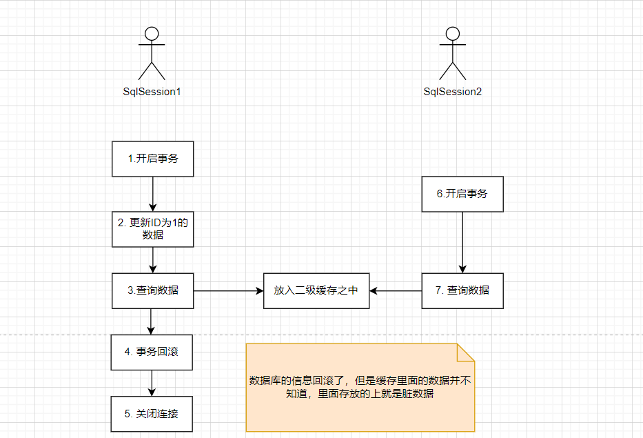

由此我们就应该清楚，二级缓存应该是**基于事务提交**的，**只有事务提交后，数据库的数据确定没有问题，这个时候 `SqlSession` 中的一级缓存数据也是准确的，这样才能把一级缓存的数据写入到二级缓存中**，这也就是 `TransactionalCacheManager` 设计的意义。

而在它提交的时候，则是将里面的缓存都取出来，进行提交

```java
public void commit() {
    for (TransactionalCache txCache : transactionalCaches.values()) {
        txCache.commit();
    }
}
```

虽然说，这个query方法，能够证明，确实是从缓存之中获取数据，但是这个Executor是对原来的执行器的装饰，具体的体现在哪呢？

解答：主要体现就在于MyBatis 的核心对象`Configuration`之中，具体的代码如下：

```java
public Executor newExecutor(Transaction transaction, ExecutorType executorType) {
    executorType = executorType == null ? defaultExecutorType : executorType;
    executorType = executorType == null ? ExecutorType.SIMPLE : executorType;
    Executor executor;
    if (ExecutorType.BATCH == executorType) {
        executor = new BatchExecutor(this, transaction);
    } else if (ExecutorType.REUSE == executorType) {
        executor = new ReuseExecutor(this, transaction);
    } else {
        executor = new SimpleExecutor(this, transaction);
    }
    if (cacheEnabled) {
        executor = new CachingExecutor(executor);
    }
    executor = (Executor) interceptorChain.pluginAll(executor);
    return executor;
}
```

如果说主配置文件之中，开启了缓存，则会在通过`executor = new CachingExecutor(executor);`进行功能的扩充

缓存类是如何创建的？什么时候创建的呢？

MyBatis在解析XML配置文件的时候，首先解析主配置文件，接下来会去解析Mapper文件，在解析Mapper文件的时候，当碰到`<cache/> `标签的时候，进行创建，这里就是典型的**建造者设计模式**，通过这个链式调用，可以发现`<cache>`标签中的属性，在这里全部都用到了，但是从外面看，每一行调用都有可能外挂这一个装饰者

```java
public Cache useNewCache(Class<? extends Cache> typeClass,
                         Class<? extends Cache> evictionClass,
                         Long flushInterval,
                         Integer size,
                         boolean readWrite,
                         boolean blocking,
                         Properties props) {
    Cache cache = new CacheBuilder(currentNamespace)
        .implementation(valueOrDefault(typeClass, PerpetualCache.class))
        .addDecorator(valueOrDefault(evictionClass, LruCache.class))
        .clearInterval(flushInterval)
        .size(size)
        .readWrite(readWrite)
        .blocking(blocking)
        .properties(props)
        .build();
    configuration.addCache(cache);
    currentCache = cache;
    return cache;
}
```

这里，能够发现最终返回的是一个CacheBuilder对象，我们首先来看一下这个对象的结构，这里首先看一下这个对象的属性

```java
public class CacheBuilder {
  private final String id;
  private Class<? extends Cache> implementation;
  private final List<Class<? extends Cache>> decorators;
  private Integer size;
  private Long clearInterval;
  private boolean readWrite;
  private Properties properties;
  private boolean blocking;
}
```

可以发现，这里面也是包含了 `<cache>` 标签的所有必备要素，这里也对必要的属性进行说明：

- `implementation` 属性对应的是 `Cache` 接口的落地实现
- `decorators` 代表要外挂的装饰者组；
- `properties` 属性意味着 `<cache>` 标签也有 `<property>` 子标签，可以传入配置。

这里对里面所涉及到的方法进行说明：

1) 添加默认实现

```java
public CacheBuilder implementation(Class<? extends Cache> implementation) {
    this.implementation = implementation;
    return this;
}
```

调用过程之中，通过这种 方式`implementation(valueOrDefault(typeClass, PerpetualCache.class))`，也能够明白在MyBatis开发过程之中，将`PerpetualCache`作为了默认的实现

2）添加装饰器

```java
public CacheBuilder addDecorator(Class<? extends Cache> decorator) {
    if (decorator != null) {
        this.decorators.add(decorator);
    }
    return this;
}
```

调用过程之中，`addDecorator(valueOrDefault(evictionClass, LruCache.class))`只添加了一个LRU的实现

3）创建方法

```java
public Cache build() {
    // 步骤一:创建缓存，默认的就是 PerpetualCache + LruCache
    // 如果想使用FIFO算法，就在标签之上添加 eviction="FIFO"
    setDefaultImplementations();
    // 步骤二:创建新的实现
    Cache cache = newBaseCacheInstance(implementation, id);
    // 步骤三：读取整合Cache中的Property表情（主要用于用户自定义的）
    setCacheProperties(cache);
    // 步骤四：添加装饰器，根据在Cache标签之中，添加其他的属性，如 <cache blocking="" flushInterval="" size=""/>
    if (PerpetualCache.class.equals(cache.getClass())) {
        for (Class<? extends Cache> decorator : decorators) {
            cache = newCacheDecoratorInstance(decorator, cache);
            setCacheProperties(cache);
        }
        // 设置标准的装饰器
        cache = setStandardDecorators(cache);
    } else if (!LoggingCache.class.isAssignableFrom(cache.getClass())) {
        cache = new LoggingCache(cache);
    }
    return cache;
}
```

既然这个对象创建好了，那么这个创建好的Cache最终存储在什么位置？

 解答：最终存储在了MappedStatement之中，并且只会创建一个Cache对象，每一个MappedStatement对象里面都会存一份引用。

> 构建者设计模式 和 工厂设计模式的区别

1.  命名形式：
    - 构建者设计模式的典型形式：`XXXBuilder.build()` 
    - 工厂设计模式的典型形式：`XXXFactory`
2.  工厂设计模式只注重最终的结果
3.  构建者设计模式注重创建过程之中的各个零件

如果说先多个Mapper共享一个Cache对象呢？则可以通过下面这种方式：

```java
<cache-ref namespace="com.haolong.dao.UserDao"></cache-ref>
```

MyBatis之中，既然有一级缓存和二级缓存，那么在实际开发过程之中，首先从二级缓存之中查找，接下来从一级缓存之中查找

## 四、整合第三方缓存

### 4.1 使用ehcache

1）导入依赖

```xml
<dependency>
    <groupId>org.mybatis.caches</groupId>
    <artifactId>mybatis-ehcache</artifactId>
    <version>1.2.1</version>
</dependency>
```

2）配置Ehache

```xml
<?xml version="1.0" encoding="UTF-8" ?>
<ehcache xmlns:xsi="http://www.w3.org/2001/XMLSchema-instance"
         xsi:noNamespaceSchemaLocation="http://ehcache.org/ehcache.xsd">
    <!--
        磁盘存储:将缓存中暂时不使用的对象,转移到硬盘,类似于Windows系统的虚拟内存
        path:指定在硬盘上存储对象的路径
     -->
    <diskStore path="F:\ehcache"/>

    <!--
        defaultCache:默认的缓存配置信息,如果不加特殊说明,则所有对象按照此配置项处理
        maxElementsInMemory:设置内存缓存的上限，最多存储多少个记录对象
        maxElementsOnDisk:设置硬盘缓存的上限，内存放不下时会向硬盘中缓存(0表示无上限)
        eternal:代表对象是否永不过期
        timeToIdleSeconds:最大的空闲时间(秒)(对象在多长时间没有被访问就会失效)
        timeToLiveSeconds:最大的存活时间(秒)(对象从创建到失效所需要的时间)
        overflowToDisk:是否允许对象被写入到磁盘
        memoryStoreEvictionPolicy:缓存清空策略
            * FIFO:先进先出
            * LFU:最少使用的清空
            * LRU:最近最少使用(即未被使用的时间最长)
     -->
    <defaultCache
                  maxElementsInMemory="100"
                  maxElementsOnDisk="10000"
                  eternal="false"
                  timeToIdleSeconds="120"
                  timeToLiveSeconds="120"
                  overflowToDisk="true"
                  diskExpiryThreadIntervalSeconds="120"
                  memoryStoreEvictionPolicy="LRU"
                  />
</ehcache>
```

3）添加缓存

```xml
<cache type="org.mybatis.caches.ehcache.EhcacheCache"></cache>
```

4）验证

```java
InputStream inputStream = Resources.getResourceAsStream("config.xml");
SqlSessionFactoryBuilder builder = new SqlSessionFactoryBuilder();
SqlSessionFactory factory = builder.build(inputStream);
SqlSession sqlSession1 = factory.openSession();
SqlSession sqlSession2 = factory.openSession();

ManagerDao managerDao = (ManagerDao) sqlSession1.getMapper(ManagerDao.class);
List<User> user_01 = managerDao.queryUserByPage();
for (User user : user_01) {
    System.out.println("user = " + user);
}
sqlSession1.commit();
System.out.println("-------------------------------");
ManagerDao managerDao2 = (ManagerDao) sqlSession2.getMapper(ManagerDao.class);
List<User> user_02 = managerDao2.queryUserByPage();
for (User user : user_02) {
    System.out.println("user = " + user);
}
sqlSession2.commit();
```

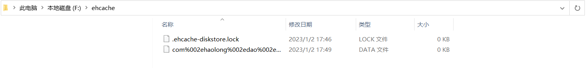

### 4.2 使用 Redis

```java
package com.haolong.dao;

import com.haolong.utils.JedisUtils;
import org.apache.commons.lang3.SerializationUtils;
import org.apache.ibatis.cache.Cache;
import redis.clients.jedis.Jedis;

import javax.xml.crypto.Data;
import java.io.Serializable;
import java.util.Date;
import java.util.HashMap;
import java.util.Map;
import java.util.concurrent.locks.ReadWriteLock;

/**
 * @project: MyBatisSource
 * @description:
 * @author: haolong
 * @data: 2022/12/23 22:00
 */
public class MyMyBatisCache implements Cache {

    private Map<Object,Object> cache = new HashMap<>();

    @Override
    public String getId() {
        return MyMyBatisCache.class.getName()+new Date();
    }

    @Override
    public void putObject(Object key, Object value) {
        Jedis jedis = JedisUtils.openJedis();
        byte[] byteKey = SerializationUtils.serialize((Serializable) key);
        byte[] byteValue = SerializationUtils.serialize((Serializable) value);
        jedis.set(byteKey,byteValue);
    }

    @Override
    public Object getObject(Object key) {
        if(key == null) return null;
        Jedis jedis = JedisUtils.openJedis();
        byte[] byteKey = SerializationUtils.serialize((Serializable) key);
        if (byteKey == null) return null;
        Object value = SerializationUtils.deserialize(jedis.get(byteKey));
        return value;
    }
    @Override
    public Object removeObject(Object key) {
        if(key == null) return null;
        Jedis jedis = JedisUtils.openJedis();
        byte[] k = SerializationUtils.serialize((Serializable) key);
        byte[] v = SerializationUtils.deserialize(jedis.get(k));
        jedis.del(k);
        if (v == null) return null;
        return v;
    }
    @Override
    public void clear() {
        JedisUtils.openJedis().flushDB();
    }

    @Override
    public int getSize() {
        return JedisUtils.openJedis().dbSize().intValue();
    }

    @Override
    public ReadWriteLock getReadWriteLock() {
        return Cache.super.getReadWriteLock();
    }
}

```


