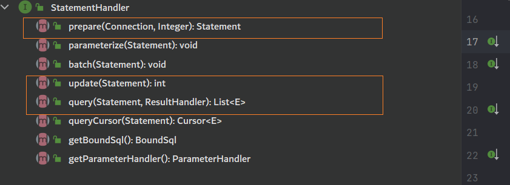
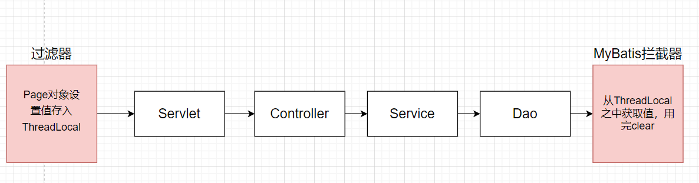

# 第5节 拦截器开发

Mybatis 对数据库操作和连接进行了深度的封装，虽然说可以快速开发，但是，如果说我们在进行特殊需求开发的时候，就会导致灵活度降低。比如说通过代码来获取我们的SQL语句。

为此，我们可以使用拦截器进行开发，那么这个时候就要去想，拦截哪一个方法？如何进行拦截？

这里，首先来看第一个问题，拦截那个方法？

## 一、拦截方法的确认

 在之前的学习过程之中，也对MyBatis之中的核心对象进行了说明，同样这几个核心对象也是MyBatis的核心拦截点：

- 拦截`Executor`：意味着要干扰、增强底层执行的CRUD等方法
- 拦截`StatementHandler`：意味着干扰、增强Statement的创建和执行的动作
- 拦截器`ParameterHander`：意味着干扰、增强SQL参数注入、读取的动作
- 拦截`ResultSetHandler`：意味着干扰、增强封装结果集的动作

通过拦截器，拦截用户对Dao方法的调用，加入一些通用的功能，而这些方法实际上都是由`SqlSession`来进行提供的，而Sqlsession底层又是通过`Executor`、`StatementHandler`、`ParameterHandler`、`ResultSetHandler`提供的，所以说我们拦截的目标本质上就是他们中所提供的方法。

在之前的源码分析中，我们发现`Executor`中定义了大部分操作，而对于核心的CRUD方法，是交给`StatementHandler`进行实现的，所以说我们要拦截的一般都是`StatementHandler`。那么具体拦截那个方法呢？


这样，我们看到了`StatementHandler`中的全部方法，我们来分析一下update方法

```java
public int update(Statement statement) throws SQLException {
    return this.delegate.update(statement);
}
```

发现这里实际上调用的是`StatementHanler`中的方法，那么这个对象又是什么？这个update方法中的statement是哪里传过来的？

首先看一个这个delegate：他会根据MappedStatement的不同类型，创造出不同的StatementHandler


这里实际上用到了装饰器模式

> 装饰器模式：指在不改变现有对象结构的情况下，动态地给该对象增加一些职责（即增加其额外功能），它属于对象结构型模式

那么这个时候，就要去考虑着statement对象是从哪里来的？

```java
public Statement prepare(Connection connection, Integer transactionTimeout) throws SQLException {
    ErrorContext.instance().sql(this.boundSql.getSql());
    Statement statement = null;

    try {
        statement = this.instantiateStatement(connection);
        this.setStatementTimeout(statement, transactionTimeout);
        this.setFetchSize(statement);
        return statement;
    } catch (SQLException var5) {
        this.closeStatement(statement);
        throw var5;
    } catch (Exception var6) {
        this.closeStatement(statement);
        throw new ExecutorException("Error preparing statement.  Cause: " + var6, var6);
    }
}
```

在之前分析核心对象的那一章节，已经分析过了，在执行update/insert方法之前，会先执行prepare方法，提供statement对象
所以，相比于拦截`update`和`query`方法，我们实际上可以直接去拦截这个方法，就能获得更大的收益，

因为拦截了这个方法，我们就能获取到对应的`Connection`。

至此，我们就分析完成了，去拦截 StatementHandler 类的  prepare 方法

## 二、拦截器

> 什么时候考虑去使用拦截器

- 需要干预SQL语句
- 需要统一处理多个Mapper文件

首先我们，来开发一个拦截器

```java
@Intercepts({
        @Signature(
            type = StatementHandler.class, // 具体的类型
            method = "prepare" , // 拦截的方法
            args = {Connection.class,Integer.class} // 方法的参数
        )
})
public class MyMybatisInterceptor implements Interceptor {
   private static final Logger log = Logger.getLogger(MyMybatisInterceptor.class);
    /**
     * 加入的拦截功能放入该方法中,处理完成之后，进行放行
     * */
    @Override
    public Object intercept(Invocation invocation) throws Throwable {
        // 放行
        return invocation.proceed();
    }
    /**
     * 这个拦截器传递给下一个拦截器
     * */
    @Override
    public Object plugin(Object target) {
        return Plugin.wrap(target,this);
    }
    /**
     * 获取拦截器相关参数
     * */
    @Override
    public void setProperties(Properties properties) {

    }
}
```

在主配置文件之中，做相关的配置

```java
<plugins>
   <plugin interceptor="com.haolong.plugins.MyMybatisInterceptor"></plugin>
</plugins>
```

我们首先打个断点进行调试，我们就发现我们不仅拿到了`delegate`对象还拿到了SQL

我们就可以一层层去获取，就有了这样的代码

```java
@Override
public Object intercept(Invocation invocation) throws Throwable {
    RoutingStatementHandler statementHandler = 
        (RoutingStatementHandler) invocation.getTarget();
    BoundSql boundSql = statementHandler.getBoundSql();
    String sql = boundSql.getSql();
    if(log.isDebugEnabled()) {
        log.debug("-------------SQL---------------"+sql);
    }
    return invocation.proceed();
}
```

但是这种方式很麻烦 ，Mybatis为我们提供了`MetaObject`，用于反射封装的对象

```java
MetaObject metaObject = SystemMetaObject.forObject(invocation);
String sql = (String) metaObject.getValue("target.delegate.boundSql.sql");
```

通过这样的方式，我们就能够很容易开发出一个拦截器了

## 三、开发分页拦截器

> Page对象的获取和封装位置？

从Web前端传递分页信息传递过来，在Controller之中，进行封装配置，逐层传递，最终交给Dao完成分页操作，但是现在在拦截器之中，如何获取Dao中获取到的Page对象呢？

**方式一**：既然可以传递过来，我们可以将这个对象加在Dao的方法参数之中，在拦截器之中尝试获取。

```java
public List<User> queryUserPageByPage(Page page);
```

```java
Page page = (Page) metaObject.getValue("target.delegate.parameterHandler.parameterObject");
```

虽然说这种方式能够获取到对应的Page对象，但是如果说后续开发过程之中，在方法中设置多个对象，就会很麻烦。

在分层开发过程之中，每一层都需要携带page参数传递，直到Dao层

**方式二**：通过线程绑定，使用ThreadLocal

在整个分层结构之中，用户的一个请求，相当于一个线程，完成的就是一个操作，响应完成之后，Tomcat就会将整个线程放在线程池之中。在Controller之中进行封装Page，通过ThreadLocal之中，存储在线程之中。如果说多个Controller都需要这样，就会造成代码的冗余，所以，我们可以将这部分操作放在过滤器之中



## 四、基于 Plugins 做乐观锁

并发：同一时间，多个请求，同时访问操作同一数据

悲观锁：数据库底层为我们提供的，引入悲观锁，解决数据并发访问的安全问题。他是一种最安全的，保证数据库并发的方式，但是并发效率低

- 通过insert，update，delete操作，数据库就会自动加入悲观锁（行锁）
- 通过Select 语句之后，加上for update 就会自动加上悲观锁

乐观锁：应用锁，这把锁和数据库并没有关系，通过程序来开发。并不涉及到数据库底层真的为数据加锁，所以并发度会提高，但是安全性较低

- 实现原理：版本的比对。在需要设置乐观锁的库表之上，添加一列Version，初始值为0，每次操作，都将这个值做加一操作
- 每一次更新数据的时候，如果说版本一致，说明没有其他事务进行操作；如果说版本不一致，则说明有其他事务进行操作
- MyBatis 原生不支持，需要我们自己封装，而封装的思路就是：在实体和库表之中，添加对应的Version字段，并且保证初始值为0，在操作之前，比较Version，如果说值一致，则进行操作，并将Version的值做加一，如果说不一致，则抛出异常
- 并不能保证并发的绝对安全，只能够将这种可能性降到最低

## 五、自定义插件的解析流程

 在开发拦截器的过程之中，我们会在主配置文件之中，对拦截器进行进行配置，在解析主配置文件的代码之中，我们找到了下面这行代码：

```java
pluginElement(root.evalNode("plugins"));
```

这就是核心方法：

```java
private void pluginElement(XNode parent) throws Exception {
    if (parent != null) {
        for (XNode child : parent.getChildren()) {
            String interceptor = child.getStringAttribute("interceptor");
            Properties properties = child.getChildrenAsProperties();
            // 直接创建了拦截器对象
            Interceptor interceptorInstance = (Interceptor) resolveClass(interceptor).newInstance();
            // 为拦截器对象的属性进行赋值
            interceptorInstance.setProperties(properties);
            // 将创建好的拦截器对象，添加在 Configuration 对象之中
            configuration.addInterceptor(interceptorInstance);
        }
    }
}
```


