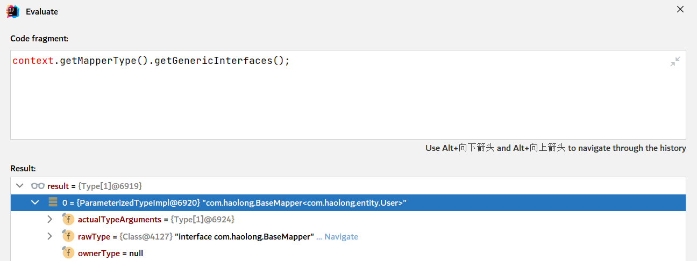

# 第6节 二次封装

用最为简单的东西，封装出一套可以自动单表增删改查的底层。并且将上一小节，拦截器开发过程之中，所提到的两个点：分页和乐观锁进行更为完善的实现

1）获取接口的泛型，也就是获取实体类的Class对象



2）

开发通用的单表CRUD

- 查询全部数据
- 查询部分数据

```sql
select * from 表名

select * from 表名 where 条件 and ? and ? 

select 列名 from 表名

select * from 表名 where 条件
```

开发分页插件

- 在拦截器之中数据的存储

开发缓存模块

- 集成缓存

