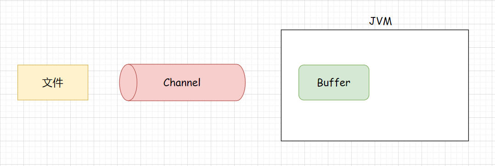
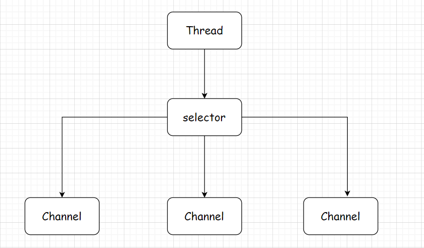
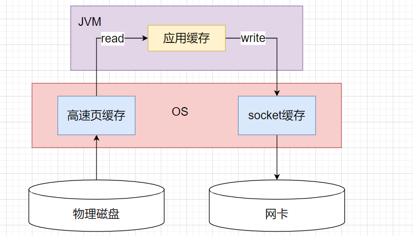
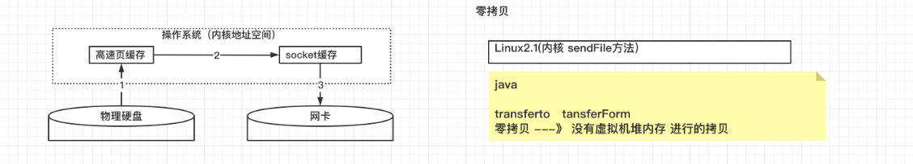

## 一、概述

在本专题之中，将会开始《孙哥说分布式系列》的学习笔记的梳理，第一个专题就是`Netty`，因为`Netty` 是对 NIO 的优化，我们首先会对 NIO 做一个讲解，学习完成 NIO 之后，在来学习 Netty！

在开始之前，我们首先看一下网络通信的过程

1. 客户端产生数据，存放在客户端应用的内存之宗，然后调用接口将自己的内存之中的数据发送/拷贝给操作系统内存
2. 客户端操作系统收到数据之后，按照客户端应用指定的规则(协议)，调用网卡并发送数据
3. 网络传输
4. 服务端应用调用系统接口，想要将数据从操作系统内存拷贝到自己的内存之中
5. 服务端操作系统收到指令之后，使用和客户端相同的规则从网卡之中读取数据，然后拷贝给服务端应用

这其实就比较详细了，但是如果说抽象一点来讲，服务端和客户端在通信过程之中的三件事，无非就是：

1. 连接：客户端连接服务器，服务器等待和接受连接
2. 读取网络数据
3. 写网络数据


NIO，全称为 `None Blocking IO`，在JDK1.4 的时候引入，`弥补了原来BIO的不足，是一种同步非阻塞的IO模型`。那么什么是 `BIO`？

> BIO，意味着Blocking IO，也就是阻塞IO。并且BIO是面向流的。他的阻塞主要体现在：
>
> - 如果说一个服务器启动就绪，那么主线程就一直等待客户端的连接，这个等待过程中，主线程就一直阻塞
> - 在连接建立之后，在读取到Socket信息之前，线程也是一直等待，一直处于阻塞状态，不能做其他的事情

Java NIO 系统的核心就在于：通道和缓冲区。通道负责传输，而缓冲区是负责存储。相比于BIO，NIO是面向流的，并且是非阻塞的


> 网络编程中的Socket是什么？

`Socket`，是应用层与TCP/IP 协议簇通信的中间软件抽象层，它是一组接口，其实就是一个门面模式，他把复杂的TCP/IP 协议处理和通信缓存管理等等都隐藏在Socket接口里面。

两个主机的应用程序要能够进行通信，必须要通过Socket建立连接。客户端连接上一个服务端，就会在客户端产生一个Socket接口实例，**服务端每接受一个客户端连接，就会产生一个Socket接口实例和客户端的Socket进行通信，有多个客户的话，就会有多个Socket接口实例。**


> 什么是BIO

BIO，意味着Blocking IO，也就是阻塞IO。并且BIO是面向流的。他的阻塞主要体现在：

- 如果说一个服务器启动就绪，那么主线程就一直等待客户端的连接，这个等待过程中，主线程就一直阻塞
- 在连接建立之后，在读取到Socket信息之前，线程也是一直等待，一直处于阻塞状态，不能做其他的事情

> 什么是NIO

`NIO弥补了原来BIO的不足，是一种同步非阻塞的IO模型`，Java NIO 系统的核心就在于：通道和缓冲区。通道负责传输，而缓冲区是负责存储。相比于BIO，NIO是面向流的，并且是非阻塞的

> NIO 之 Reactor 模式

反应器模式，具体的事件处理程序不再调用反应器，而向反应器中注册一个事件处理器，表示自己对某些事件感兴趣，有事件来了之后，具体事件处理程序通过事件处理器对某个指定的事件发生做出反应。

注册感兴趣的事件----->扫描是否有感兴趣的事件------->事件发生之后做出相应的处理



### 1.1 Channel

IO通信的通道，类似于 InputStream，OutputStream，注意Channel没有方向性。常见的Channel有以下几种，其中FileChannel主要用于文件的传输，其余三种用于网络的操作。

> 常见Channel

~~~markdown
1. 文件操作

   FileChannel，读写文件中的数据。
   
2. 网络操作

   SocketChannel，通过TCP读写网络中的数据。
   
   ServerSockectChannel，监听新进来的TCP连接，像Web服务器那样。对每一个新进来的连接都会创建一个SocketChannel。
   
   DatagramChannel，通过UDP读写网络中的数据。
~~~

>  获得方式

~~~markdown
1. FileInputStream/FileOutputStream

2. RandomAccessFile

3. Socket

4. ServerSocket

5. DatagramSocket
~~~

### 1.2 Buffer

Channel 读取或者写入的数据，都要写到Buffer中，才可以被程序操作，但是**因为Channel没有方向性，所以Buffer为了区分读写，引入了读模式，写模式的区分。**

> 如何进行读写模式的区分？

新创建的就是写模式，通过`clear`方法

通过`flip`方法，完成读模式的切换，从Buffer中获取数据

> 常见Buffer

虽然说，常见的有这几种，但是最为常用的就是ByteBuffer

~~~markdown
1. ByteBuffer

2. CharBuffer

3. DoubleBuffer

4. FloatBuffer

5. IntBuffer

6. LongBuffer

7. ShortBuffer

8. MappedByteBuffer
~~~

> 获得方式

~~~markdown
 1. ByteBuffer.allocate(10);
 
 # ByteBuffer buffer = ByteBuffer.allocate(10);
 
 2. encode()
 
 # ByteBuffer buffer = Charset.defaultCharset().encode("haolong\nhello\n");
~~~

### 1.3 Selector

#### 01 多线程

为每一个连接分别开辟一个线程，分别去处理对应的socket连接：


对于这种方式，所出现的问题：

- 内存的占用很高
- 线程上下文的切换成本高
- 只适合连接数少的场景

#### 02 线程池

由于在多线程的场景之下，一个连接对应于一个线程，导致线程数量过多，这个时候，就可以就可以采用池化的思想


但是，如果说一个客户端占用了 线程池中的一个线程

- 在 阻塞模式之下，线程仅仅能够处理一个连接
- 适合于短连接的情况，发送请求并响应后之后，立马断开连接，使得线程池中的线程可以快速的处理其他连接

#### 03 Selector

>selector 的作用就是配合一个线程来管理多个Channel，获取这些Channel上发生的所有事件
>
>这些channel工作在非阻塞模式之下，不会让线程吊死在一个channel之上，适合连接数特别多的时候



如果说一个channel中没有执行任务的时候，可以执行其他channel中的任务。

## 二、基本开发方式

首先，来写一个程序，来梳理下整体的流程

```java
// 1. 通过输入流获取到 Channel
FileInputStream fileInputStream = new FileInputStream("F:\\码农会所\\Netty\\date.txt");
FileChannel channel = fileInputStream.getChannel();

// 2. 创建缓冲区
ByteBuffer buffer = ByteBuffer.allocate(100);

// 3. 借用通道，将数据放在缓冲区中
int read = 0;
while ((read = channel.read(buffer)) != -1) {

    // 4. 通过程序，读取缓冲区中的内容
    // 4.1  设置Buffer的模式为读模式
    buffer.flip();

    // 4.2 循环读取缓冲区中的数据
    while (buffer.hasRemaining()) {
        byte b = buffer.get();
        System.out.println((char)b);
    }

    // 5. 重新设置buffer为写模式
    buffer.clear();
}
```

## 三、ByteBuffer详解

### 3.1 概述

ByteBuffer 是一个抽象类，主要实现类：

- `HeapByteBuffer`：使用的是JVM中的堆内存，读写操作效率低 会收到GC影响 
- `MappedByteBuffer`：使用的是操作系统的内存，读写操作 效率高 不会收到GC影响 。 不主动析构，会造成内存的泄露  

 对于他的获取方式，主要有以下两种方式：

- 方式一：一旦分配空间，不可以动态的调整

```java
ByteBuffer.allocate(10);
```

- 方式二：

```java
encode()
```

### 3.2 核心结构

ByteBuffer 是一个类似于数组的结构，整个结构中包含三个主要的状态：

- `Capacity`：buffer的容量，类似于数组的length
- `Posation`：buffer当前缓存的下标，在读取操作的时候记录读到了哪一个位置，在写操作的时候写到了哪一个位置，从0开始，每次读取到一次，下标就会+1
- `Limit`：读写限制，在读操作的时候，设置你能够读取多少个字节的数据，在写操作的时候，设置还能够写多少个字节的数据

所谓的读写模式的切换，本质上就是这几个状态的变化，

```java
    System.out.println("----------------------------start------------------------------");
    ByteBuffer buffer = ByteBuffer.allocate(10);
    System.out.println("buffer.capacity() = " + buffer.capacity()); // 10
    System.out.println("buffer.limit() = " + buffer.limit()); //10
    System.out.println("buffer.position() = " + buffer.position()); //0


    System.out.println("----------------------------写模式------------------------------");
    buffer.put(new byte[]{'a','b','c','d'});
    System.out.println("buffer.capacity() = " + buffer.capacity()); // 10
    System.out.println("buffer.limit() = " + buffer.limit()); //10
    System.out.println("buffer.position() = " + buffer.position()); // 4


    System.out.println("----------------------------读模式------------------------------");
    buffer.flip();
    System.out.println("buffer.capacity() = " + buffer.capacity()); // 10
    System.out.println("buffer.limit() = " + buffer.limit()); // 4
    System.out.println("buffer.position() = " + buffer.position()); // 0
    System.out.println("buffer = " + (char)buffer.get());
    System.out.println("buffer = " + (char)buffer.get());

    System.out.println("----------------------------读之后变为写------------------------------");
    buffer.compact();
    System.out.println("buffer.capacity() = " + buffer.capacity()); // 10
    System.out.println("buffer.limit() = " + buffer.limit()); // 10
    System.out.println("buffer.position() = " + buffer.position()); // 4
```

这里，来总结一下：

1. 写入Buffer数据之前要设置写模式
    - 新创建的Buffer自动就是写模式
    - 调用clear方法，compact方法
2. 读取Buffer数据之前要设置读模式
    - 调用 flip方法

### 3.3 核心API

> 向Buffer中写数据

方式一：channel的read方法，从channel中读取数据

```java
channel.read(buffer)
```

方式二：buffer的put方法

```markdowon
buffer.put(byte)   

buffer.put((byte)'a')

buffer.put(byte[])
```

>  从buffer中读取数据

```java
1. channel的write方法

2. buffer的get方法 //每调用一次get方法会影响，position的位置。

3. rewind方法(手风琴)，可以将postion重置成0 ，用于复读数据。

4. mark&reset方法，通过mark方法进行标记（position），通过reset方法跳回标记，从新执行.

5. get(i) 方法，获取特定position上的数据，但是不会对position的位置产生影响。
```

### 3.4 字符串的操作

```java
String str = "郝龙";

// 1. encode会自动把字符串按照字符集编码之后，存储在ByteBuffer中
// 2. 自动把ByteBuffer设置为读模式，且不能手工调用flip方法

ByteBuffer buffer = Charset.forName("UTF-8").encode(str);

// ByteBuffer buffer1 = StandardCharsets.UTF_8.encode(str);

// buffer.flip();// 写了之后获取不到数据，这里会把limit设置为0

CharBuffer decode = StandardCharsets.UTF_8.decode(buffer);
System.out.println(decode.toString());


/* 
	while (buffer.hasRemaining()) 
	{
       System.out.println("(char)buffer.get() = " + (char) buffer.get());
	}
*/
buffer.clear();
```

### 3.5 粘包与半包

网络中有多条数据发送到服务端，数据之间使用\n进行分割，那么这个Buffer的大小如何设置？

- 想法一：让Buffer的大小超级大，一次性将数据全部存储起来，不可取！
- 想法二：不用将数据一次性存储起来，每次读取一部分，可取

但是由于某种原因，这些数据在接受的时候，被进行了重新组合，就有了如下的问题:

1. **粘包**：发送方在发送数据的时候，并不是一条一条的发送数据，而是将数据整合在一个，当数据量达到一定的数量之后在一起发送，这就会导致多条信息被放在一个缓冲区中被一起发送出去
2. **半包**：接受方的缓冲区的大小是有限的，当接受方的缓冲区满了之后，就会将新信息截断，等缓冲区空了之后继续放入数据。

> 示例如下

```markdown
Hello,world\n

I'm haolong\n

Netty go go go\n
```

比如说上面这三个字符串，在发送过程中变为了

```markdown
Hello,world\nI'm haolong\nNe

tty go go go\n
```

```java
public class Main {
    // 分割方法
    private static void split(ByteBuffer source) {
        // 1. 切换到写模式
        source.flip();
        for(int i = 0; i < source.limit(); i++) {
            
            // 2. 找到一条完成的消息
            if (source.get(i) == '\n') {
                
                // 3. 把这个完成的消息存入新的ByteBuffer中
                int len = i + 1 - source.position();
                ByteBuffer target = ByteBuffer.allocate(len);
                for(int j = 0; j < len; j++) {
                    target.put(source.get());
                }
                target.flip();
                System.out.println("StandardCharsets.UTF_8.decode(target) = " +                                                               StandardCharsets.UTF_8.decode(target));
            }
        }
        source.compact();
    }
    
    public static void main(String[] args) {
        
        ByteBuffer buffer = ByteBuffer.allocate(32);
        
        buffer.put("Hello,world\nI'm haolong\nNe".getBytes());
        split(buffer);
        buffer.put("tty go go go\n".getBytes());
        split(buffer);
    }
}

```

但是这一段代码中，也是有问题的

- 如果说我发送的数据没有 \n 呢？
- 发送方的 ByteBuffer 的大小没有办法处理，到底设置为多大？

## 四、文件编程

之前在介绍Channel的时候，介绍过四种Channel，用于文件传输的时候，使用FileChannel

###  4.1 FileChannel

> FileChannel 只能够工作在阻塞模式之下，所以说无法搭配Selector

#### 01 获取

不能够直接打开FileChannel，必须通过FileInputStream，FileOutputStream或者是通过RandomAccessFile来获取FileChannel

```java
// 只能进行读
FileChannel from = new FileInputStream("F:\\码农会所\\Netty\\date.txt").getChannel();
             
// 只能进行写
FileChannel to = new FileOutputStream("F:\\码农会所\\Netty\\to.txt").getChannel();

// 指定是读还是写
FileCahannel channel = new RandomAccessFile("F:\\码农会所\\Netty\\date.txt","r").getChannel();
```

#### 02 读取

> 从Channel读取数据到Buffer

返回值表示读取到了多少字节，如果说读取到文件的尾部，就返回-1

```java
int read =  channel.read(buffer));
```

所以，读取操作的完成代码就是这样：

```java
int read = 0;
while ((read = channel.read(buffer)) != -1) {

    // 设置Buffer的模式为读模式
    buffer.flip();

    // 循环读取缓冲区中的数据
    while (buffer.hasRemaining()) {
        byte b = buffer.get();
        System.out.println((char)b);
    }

    // 重新设置buffer为写模式
    buffer.clear();
}
```

#### 03 写入

> 将Buffer中的数据，写入到Channel中

由于Channel也是有大小的，所以write方法并不能够一次将buffer中的内容全部写入到channel中，所以说必须按照如下规则进行写入：

```java
while (buffer.hasRemaining()) {
    channel.write(buffer);
}
```

#### 04 关闭

通道使用完成之后，需要进行关闭，我们可以使用`try with resource`进行关闭 

### 4.2 两个Channel传输数据

```java
try (
    FileChannel from = new FileInputStream("F:\\码农会所\\Netty\\date.txt").getChannel();
    FileChannel to = new FileOutputStream("F:\\码农会所\\Netty\\to.txt").getChannel()
)
{
    // 这种方式的效率高，底层会使用操作系统的零拷贝进行优化，最多是2G的数据
    // int var8 = (int)Math.min(var3, 2147483647L);
    from.transferTo(0,from.size(),to);
} catch (IOException e) {
    e.printStackTrace();
}
```

这种方式的效率高，底层会使用操作系统的零拷贝进行优化，**最多是2G的数据**，当传输的数据大于2G的时候，需要使用如下的方式

```java
@Test
public void test10() {
    try (
        FileChannel from = new FileInputStream("F:\\码农会所\\Netty\\date.txt").getChannel();
        FileChannel to = new FileOutputStream("F:\\码农会所\\Netty\\to.txt").getChannel()
    )
    {
        long left = from.size(); // 表示剩余量
        long size = from.size();
        while(left > 0) {
            left = left - from.transferTo(size - left,left,to);
        }
    } catch (IOException e) {
        e.printStackTrace();
    }
}
```

### 4.3 Path 和 Paths

使用Path 用来表示文件的路径，而Paths是一个工具类，用来获取Path的实例

```java
Path path = Paths.get("data.txt");
```

### 4.4 Files

> 检查文件是否存在

```java

```


>  遍历

```java
AtomicInteger dirCount = new AtomicInteger();
AtomicInteger fileCount = new AtomicInteger();
Files.walkFileTree(Paths.get("F:\\博客"),new SimpleFileVisitor<Path>() {
    @Override
    public FileVisitResult preVisitDirectory(Path dir, BasicFileAttributes attrs) throws IOException {
        dirCount.incrementAndGet();
        System.out.println("====>"+dir);
        return super.preVisitDirectory(dir, attrs);
    }

    @Override
    public FileVisitResult visitFile(Path file, BasicFileAttributes attrs) throws IOException {
        fileCount.incrementAndGet();
        System.out.println(file);
        return super.visitFile(file, attrs);
    }
});
System.out.println("fileCount = " + fileCount);
System.out.println("dirCount = " + dirCount);
```


## 五、网络编程

### 5.1 客户端

客户端的代码基本上是不变的

```java
public class Client {
    public static void main(String[] args) throws IOException {
        // 1. 创建 ServerSocketChannel
        SocketChannel socket = SocketChannel.open();
        // 2. 设置服务器的监听端口
        socket.connect(new InetSocketAddress("localhost",8080));
        ByteBuffer buffer = ByteBuffer.allocate(3);
        buffer.put("hao".getBytes());
        buffer.flip();
        while (buffer.hasRemaining()) {
            socket.write(buffer);
        }
        socket.write(buffer);
        buffer.clear();
        System.in.read();
    }
}
```

### 5.2 服务端写模式

#### 版本一

发生阻塞的情况

- `accept()`：如果说没有连接建立，ServerSocketChannel线程就会一直阻塞
- `read()`：如果说连接建立了，没有读取到数据，ServerSocket就会阻塞

```java
@Slf4j
public class ServerVersion_1 {
    public static void main(String[] args) throws IOException {
        // 1. 创建 ServerSocketChannel
        ServerSocketChannel ssc = ServerSocketChannel.open();
        // 2. 设置服务器的监听端口
        ssc.bind(new InetSocketAddress("localhost",8080));
		// 3. 定义连接集合，因为有多个客户端连接
        List<SocketChannel> channels = new ArrayList<>();
	    // 一致循环，接受连接
        while(true) {
            log.debug("connecting.....");
            // 4. 接受客户端的连接，SocketChannel表示服务端和客户端连接的一个通道
            SocketChannel sc = ssc.accept();
            log.debug("connected。。。");
            channels.add(sc);
            // 5. 客户端与服务端的通信过程
            for (SocketChannel channel : channels) {

                log.debug("before Read...");
                ByteBuffer buffer = ByteBuffer.allocate(10);
                int len = 0;
                while((len = channel.read(buffer)) != -1) {
                    buffer.flip();
                    while (buffer.hasRemaining()) {
                        System.out.println("buffer = " + buffer.get());
                    }
                    System.out.println();
                    log.debug("after Read.....");
                    buffer.clear();
                }
            }
        }
    }
}

```

#### 版本二

> 解决第一版代码的阻塞

```java
@Slf4j
public class ServerVersion_2 {
    public static void main(String[] args) throws IOException {
        ServerSocketChannel ssc = ServerSocketChannel.open();
        ssc.configureBlocking(false);// 切换为非阻塞模式
        ssc.bind(new InetSocketAddress("localhost",8080));
        List<SocketChannel> channels = new ArrayList<>();
        while(true) {
            SocketChannel sc = ssc.accept();// 如果说没有连接建立，就会返回一个 null
            if(sc != null) {
                log.debug("connected。。。");
                sc.configureBlocking(false); // 设置为非阻塞模式
                channels.add(sc);
            }
            for (SocketChannel channel : channels) {
                log.debug("before Read...");
                ByteBuffer buffer = ByteBuffer.allocate(10);
                int len = 0;
                int size = channel.read(buffer);
                if(size > 0) {
                    buffer.flip();
                    while((len = channel.read(buffer)) != -1) {
                        while (buffer.hasRemaining()) {
                            System.out.println("buffer = " + buffer.get());
                        }
                        buffer.clear();
                    }
                    log.debug("after Read.....");
                }
            }
        }
    }
}
```

#### 版本三

> 解决第二版代码死循环空转的问题

第二版中虽然没有了阻塞，但是一直空转

这个时候就需要有个管理者，来监控；这个管理者就是Selector

Selector 只能在非阻塞模式下执行

事件的类型

- accept：接受连接事件
- connect：连接事件
- read：可读事件
- write：可写事件

Selector中有一个属性是keys，类型是HashSet，当我们注册之后，就会存放在这个Keys中;

一旦发生了事件，就存放在 selectedKeys中，类型是HashSet

```java
@Slf4j
public class ServerVersion_3 {
    public static void main(String[] args) throws IOException {
        // 1. 创建Selector
        Selector selector = Selector.open();

        // 2. 创建服务端的Channel,并设置为非阻塞模式
        ServerSocketChannel serverSocketChannel = ServerSocketChannel.open();
        serverSocketChannel.socket().bind(new InetSocketAddress("localhost",8080));
        serverSocketChannel.configureBlocking(false);

        // 3. 建立 selector 和 channel的联系
        // 通过这个返回值，就能知道是哪个事件和哪一个Channel的时间
        SelectionKey serverSocketChannel_key = serverSocketChannel.register(selector, 0, null);
        log.debug("key:{}",serverSocketChannel_key);

        // 4. 只关注 accept 事件
        serverSocketChannel_key.interestOps(SelectionKey.OP_ACCEPT);

        while (true) {
            // 5. select 方法,没有事件发生，线程阻塞;在事件未处理的时候，他不会阻塞
            selector.select();

            // 6. 处理事件，selector.selectedKeys(); 包含了所有发生的事件
            Set<SelectionKey> selectionKeys = selector.selectedKeys();
            Iterator<SelectionKey> iterator = selectionKeys.iterator();
            while (iterator.hasNext()) {
                SelectionKey selectionKey = iterator.next();
                // 进行移除
                iterator.remove();
                if(selectionKey.isAcceptable()) {
                    ServerSocketChannel ssc = (ServerSocketChannel) selectionKey.channel();
                    SocketChannel sc = ssc.accept();
                    sc.configureBlocking(false);
                    SelectionKey sc_key = sc.register(selector, 0, null);
                    sc_key.interestOps(SelectionKey.OP_READ);
                } else if(selectionKey.isReadable()) {
                    SocketChannel sc = (SocketChannel) selectionKey.channel();
                    ByteBuffer buffer = ByteBuffer.allocate(1024);
                    sc.read(buffer);
                    buffer.flip();
                    System.out.println("Charset.defaultCharset().decode(buffer).toString() = " 
                                       + Charset.defaultCharset().decode(buffer).toString());
                }
            }
        }
    }

}
```

#### 版本四

>  问题：如果说接受数据的缓冲区比较小呢？select方法会被执行几次？客户端发送的数据是几次过来的？

结论：内核缓冲区，当客户端连接服务器，发送操作后，服务器必须全部处理完成，整个交互才算完成，如果说没有全部处理完成，那么这个select方法就会被一直调用

>  select方法一致调用的情况

- 如果说数据没有被处理完成前，就会被调用多次

- 在某些特殊的情况之下，服务端无法处理，那么select方法就会被频繁调用，可以调用`cancle`方法，等同于处理了客户端的事件


```java
public class ServerVersion_4 {
    public static void main(String[] args) throws IOException {
        Selector selector = Selector.open();

        ServerSocketChannel ssc = ServerSocketChannel.open();
        ssc.configureBlocking(false);
        SelectionKey register = ssc.register(selector, 0, null);
        register.interestOps(SelectionKey.OP_ACCEPT);

        while (true) {
            selector.select();
            Iterator<SelectionKey> iterator = selector.selectedKeys().iterator();
            while (iterator.hasNext()) {
                SelectionKey key =  iterator.next();
                iterator.remove();
                if(key.isAcceptable()) {
                    ServerSocketChannel channel = (ServerSocketChannel) key.channel();
                    SocketChannel sc = channel.accept();
                    sc.configureBlocking(false);
                    SelectionKey selectionKey = sc.register(selector, 0, null);
                    selectionKey.interestOps(SelectionKey.OP_READ);
                } else if(key.isReadable()) {
                    try {
                        SocketChannel sc = (SocketChannel) key.channel();
                        ByteBuffer buffer = ByteBuffer.allocate(3);
                        int read = sc.read(buffer);
                        if(read == -1) {
                            key.channel();
                        } else {
                            buffer.flip();
                            System.out.println("Charset.defaultCharset().decode(buffer).toString() = " 
                                               + Charset.defaultCharset().decode(buffer).toString());
                        }
                    } catch (Exception e) {
                        e.printStackTrace();
                        key.channel();
                    }
                }

            }
        }
    }
}

```

#### 版本五

> 处理半包和黏包

这里我们首先引入了之前所写的处理半包和黏包的代码

```java
public class ServerVersion_5 {
    private static void split(ByteBuffer source) {
        // 1. 切换到写模式
        source.flip();
        for(int i = 0; i < source.limit(); i++) {
            // 找到一条完成的消息
            if (source.get(i) == '\n') {
                // 把这个完成的消息存入新的ByteBuffer中
                int len = i + 1 - source.position();
                ByteBuffer target = ByteBuffer.allocate(len);
                for(int j = 0; j < len; j++) {
                    target.put(source.get());
                }
                target.flip();
                System.out.println("StandardCharsets.UTF_8.decode(target) = " +                                                               StandardCharsets.UTF_8.decode(target));
            }
        }
        source.compact();
    }
    public static void main(String[] args) throws IOException {
        Selector selector = Selector.open();

        ServerSocketChannel ssc = ServerSocketChannel.open();
        ssc.bind(new InetSocketAddress("localhost",8080));
        ssc.configureBlocking(false);
        SelectionKey register = ssc.register(selector, 0, null);
        register.interestOps(SelectionKey.OP_ACCEPT);

        while (true) {
            selector.select();
            Iterator<SelectionKey> iterator = selector.selectedKeys().iterator();
            while (iterator.hasNext()) {
                SelectionKey key =  iterator.next();
                iterator.remove();
                if(key.isAcceptable()) {
                    ServerSocketChannel channel = (ServerSocketChannel) key.channel();
                    SocketChannel sc = channel.accept();
                    sc.configureBlocking(false);
                    SelectionKey selectionKey = sc.register(selector, 0, null);
                    selectionKey.interestOps(SelectionKey.OP_READ);
                } else if(key.isReadable()) {
                    try {
                        SocketChannel sc = (SocketChannel) key.channel();
                        ByteBuffer buffer = ByteBuffer.allocate(20);
                        int read = sc.read(buffer);
                        if(read == -1) {
                            key.channel();
                        } else {
                            split(buffer);
                        }
                    } catch (Exception e) {
                        e.printStackTrace();
                        key.channel();
                    }
                }

            }
        }

    }
}

```

这里我们将Buffer的缓冲区设置为20，能够一次性接受到客户端的请求，如果说这里的长度比较小呢？还有效果吗？

答案：无效，第二次创建了一个新的buffer，compact无效了

那么如何实现前两次操作的ByteBuffer是同一个呢？请注意ByteBuffer是和Channel相关的，如果将ByteBuffer和Channel进行绑定，问题就解决了

解决：

#### 版本六

那么如何实现前两次操作的ByteBuffer是同一个呢？请注意ByteBuffer是和Channel相关的，如果将ByteBuffer和Channel进行绑定，问题就解决了

解决：

```JAVA
ByteBuffer buffer = ByteBuffer.allocate(4);
SelectionKey selectionKey = sc.register(selector, 0, buffer);
```

```java
public class ServerVersion_6 {
    private static void split(ByteBuffer source) {
        // 1. 切换到写模式
        source.flip();
        for(int i = 0; i < source.limit(); i++) {
            // 找到一条完成的消息
            if (source.get(i) == '\n') {
                // 把这个完成的消息存入新的ByteBuffer中
                int len = i + 1 - source.position();
                ByteBuffer target = ByteBuffer.allocate(len);
                for(int j = 0; j < len; j++) {
                    target.put(source.get());
                }
                target.flip();
                System.out.println("StandardCharsets.UTF_8.decode(target) = " +                                                               StandardCharsets.UTF_8.decode(target));
            }
        }
        source.compact();
    }
    public static void main(String[] args) throws IOException {
        Selector selector = Selector.open();

        ServerSocketChannel ssc = ServerSocketChannel.open();
        ssc.bind(new InetSocketAddress("localhost",8080));
        ssc.configureBlocking(false);
        SelectionKey register = ssc.register(selector, 0, null);
        register.interestOps(SelectionKey.OP_ACCEPT);

        while (true) {
            selector.select();
            Iterator<SelectionKey> iterator = selector.selectedKeys().iterator();
            while (iterator.hasNext()) {
                SelectionKey key =  iterator.next();
                iterator.remove();
                if(key.isAcceptable()) {
                    ServerSocketChannel channel = (ServerSocketChannel) key.channel();
                    SocketChannel sc = channel.accept();
                    sc.configureBlocking(false);
                    ByteBuffer buffer = ByteBuffer.allocate(9);
                    SelectionKey selectionKey = sc.register(selector, 0, buffer);
                    selectionKey.interestOps(SelectionKey.OP_READ);
                } else if(key.isReadable()) {
                    try {
                        SocketChannel sc = (SocketChannel) key.channel();
                        ByteBuffer buffer = (ByteBuffer) key.attachment();
                        int read = sc.read(buffer);
                        if(read == -1) {
                            key.channel();
                        } else {
                            split(buffer);
                        }
                    } catch (Exception e) {
                        e.printStackTrace();
                        key.channel();
                    }
                }
            }
        }

    }
}

```

但是如果说我发送的数据中没有包含`\n`呢？一条数据都拆不出,如何解决?

答案：对缓冲区进行扩容

如何进行扩容？什么时候扩容

#### 版本七

```java
public class ServerVersion_7 {
    private static void split(ByteBuffer source) {
        // 1. 切换到写模式
        source.flip();
        for(int i = 0; i < source.limit(); i++) {
            // 找到一条完成的消息
            if (source.get(i) == '\n') {
                // 把这个完成的消息存入新的ByteBuffer中
                int len = i + 1 - source.position();
                ByteBuffer target = ByteBuffer.allocate(len);
                for(int j = 0; j < len; j++) {
                    target.put(source.get());
                }
                target.flip();
                System.out.println("StandardCharsets.UTF_8.decode(target) = " +                                                               StandardCharsets.UTF_8.decode(target));
            }
        }
        source.compact();
    }
    public static void main(String[] args) throws IOException {
        Selector selector = Selector.open();

        ServerSocketChannel ssc = ServerSocketChannel.open();
        ssc.bind(new InetSocketAddress("localhost",8080));
        ssc.configureBlocking(false);
        SelectionKey register = ssc.register(selector, 0, null);
        register.interestOps(SelectionKey.OP_ACCEPT);

        while (true) {
            selector.select();
            Iterator<SelectionKey> iterator = selector.selectedKeys().iterator();
            while (iterator.hasNext()) {
                SelectionKey key =  iterator.next();
                iterator.remove();
                if(key.isAcceptable()) {
                    ServerSocketChannel channel = (ServerSocketChannel) key.channel();
                    SocketChannel sc = channel.accept();
                    sc.configureBlocking(false);
                    ByteBuffer buffer = ByteBuffer.allocate(7);
                    SelectionKey selectionKey = sc.register(selector, 0, buffer);
                    selectionKey.interestOps(SelectionKey.OP_READ);
                } else if(key.isReadable()) {
                    try {
                        SocketChannel sc = (SocketChannel) key.channel();
                        ByteBuffer buffer = (ByteBuffer) key.attachment();
                        int read = sc.read(buffer);
                        if(read == -1) {
                            key.channel();
                        } else {
                            split(buffer);
                            if(buffer.position() == buffer.limit()) {
                                ByteBuffer newBuffer = ByteBuffer.allocate(buffer.capacity() * 2);
                                buffer.flip();
                                newBuffer.put(buffer);
                                // 进行替换
                                key.attach(newBuffer);
                            }
                        }
                    } catch (Exception e) {
                        e.printStackTrace();
                        key.channel();
                    }
                }
            }
        }

    }
}

```

正对于目前这段代码的问题，byteBuffer不够了，进行了扩容，那么如果说以后发送的数据少了，如果进行解决？

### 5.3 服务端的读模式

对于发送0数据的这种操作，服务器做事了，但是这种事情是没有意义的

内核缓冲区

结论：当客户端连接服务器，发送操作后，服务器必须全部处理完成，整个交互才算完成，如果说没有全部处理完成，那么这个select方法就会被一直调用
如果说数据没有被处理完成前，就会被调用多次

在某些特殊的情况之下，服务端无法处理，那么select方法就会被频繁调用，可以调用cancle方法，等同于处理了客户端的事件

注册

key.attack方法，进行ByteBuffer的替换

### 5.4 Reactor

反向代理：出现在服务端，进入服务端先进入代理

## 六、零拷贝

### 6.1 基本信息

Java 本身并不具备 IO 读写能力，需要借助于操作系统来完成，在数据读取的时候，会发生两次数据拷贝：

- 操作系统硬盘中的数据，拷贝到高速页缓存中
- 操作系统将高速页缓存拷贝到 JVM 的 Buffer 中 

在写操作的时候，同样会经过两次拷贝：

- JVM 到操作系统
- 操作系统到网卡之中

> 这就是进行文件读写的流程，从中我们也能发现，Java 的 IO 实际不是物理设备级别的读写，而是缓存的复制，底层的真正读写是操作系统来完成的



### 6.2 优化

为了减少数据的拷贝次数，可以通过NIO的缓冲区实现内存的映射

> 方式一：内存映射，DirectByteBuffer

- ByteBuffer.allocate(1024)
    - 底层对应 HeapByteBuffer，使用的还是 Java 内存
- ByteBuffer.allocateDirect(1024)
    - 底层对应DirectByteBuffer，**使用的是操作系统内存**，通过这种方式，我们可以

> 方式二：零拷贝，是指没有虚拟机介入的拷贝方式



底层使用的是Linux系统的sendFile方法，在Java层面则对应的是transferto 和 transferForm方法
