## 一、Hello,Netty 

### 1.1 基本信息

Netty 是一个**异步的**，基于**事件驱动**的网络应用框架，用于快速开发可维护，高性能的网络服务器和客户端，是对原生JDK中NIO的封装。

事件驱动：服务器端去监控不同的事件

> NIO 存在的问题

- API复杂难用
- 可靠性无法保证，断线重连，半包黏包，网络拥塞统统需要自己考虑

> 导入依赖

```xml
<!--Netty依赖-->
<dependency>
  <groupId>io.netty</groupId>
  <artifactId>netty-all</artifactId>
  <version>4.1.45.Final</version>
</dependency>
<!--辅助开发-->
<dependency>
  <groupId>junit</groupId>
  <artifactId>junit</artifactId>
  <version>4.13.2</version>
  <scope>test</scope>
</dependency>

<dependency>
  <groupId>org.slf4j</groupId>
  <artifactId>slf4j-api</artifactId>
  <version>1.7.32</version>
</dependency>

<dependency>
  <groupId>ch.qos.logback</groupId>
  <artifactId>logback-classic</artifactId>
  <version>1.2.9</version>
</dependency>
```

### 1.2 客户端和服务端程序开发

这里首先编写一个Netty的Hello World程序，感受一下Netty的编写流程

在NIO中，信息交互的载体是ByteBuffer，在Netty中，信息交互的载体是ByteBuf

1. 编写服务端程序

```java
public class HelloServer {

    private static final Logger log = LoggerFactory.getLogger(HelloServer.class);

    public static void main(String[] args) {
        // 1. 添加服务端的启动器
        ServerBootstrap serverBootstrap = new ServerBootstrap();
        // 2. 设置服务端的Channel，是对原来的ServerSocketChannel的扩充
        serverBootstrap.channel(NioServerSocketChannel.class);
        // 3. 创建了一组线程，线程通过死循环监控状态
        // 如 accept -- Boss
        // 如 Read -- Worker
        serverBootstrap.group(new NioEventLoopGroup());
        // 4. 对 NioServerSocketChannel 进行处理，可以省略
        serverBootstrap.handler(new ChannelInitializer<NioServerSocketChannel>() {
            @Override
            protected void initChannel(NioServerSocketChannel nioServerSocketChannel) throws Exception {

            }
        });
        // 5. 专门用来处理 SocketChannel，必须有，不可以省略
        serverBootstrap.childHandler(new ChannelInitializer<NioSocketChannel>() {
            @Override
            protected void initChannel(NioSocketChannel channel) throws Exception {
                ChannelPipeline pipeline = channel.pipeline();
                pipeline.addLast(new ChannelInboundHandlerAdapter(){
                    @Override
                    public void channelRead(ChannelHandlerContext ctx, Object msg) throws Exception {
                        // 接受到的信息：PooledUnsafeDirectByteBuf(ridx: 0, widx: 13, cap: 2048)
                        log.info("接受到的信息：{}",msg);
                        // 通过这样我们就能发现，这里接受的 msg 实际上就是一个ByteBuf
                        ByteBuf byteBuf = (ByteBuf) msg;
                        String s = byteBuf.toString(StandardCharsets.UTF_8);
                        log.info("通过转换之后的信息：{}",s);
                        super.channelRead(ctx, msg);
                    }
                });
            }
        });
        serverBootstrap.bind(8001);
    }
}
```

2. 编写客户端

```java
public class HelloClient {

    private static final Logger log = LoggerFactory.getLogger(HelloClient.class);

    public static void main(String[] args) throws InterruptedException {
        Bootstrap bootstrap = new Bootstrap();

        bootstrap.channel(NioSocketChannel.class);

        bootstrap.group(new NioEventLoopGroup());

        bootstrap.handler(new ChannelInitializer<NioSocketChannel>() {
            @Override
            protected void initChannel(NioSocketChannel channel) throws Exception {
                log.info("有信息需要发送");
                ChannelPipeline pipeline = channel.pipeline();
                // pipeline.addLast(new StringEncoder());
            }
        });
        ChannelFuture channelFuture = bootstrap.connect(new InetSocketAddress(8001));
        channelFuture.sync();
        
        log.info("已经建立连接");
        Channel channel = channelFuture.channel();
        
        ByteBuf buf = ByteBufAllocator.DEFAULT.buffer();
        buf.writeBytes("hello,message".getBytes(StandardCharsets.UTF_8));
        
        channel.writeAndFlush(buf);
    }
}

```

写完之后，这里对里面的一些核心组件进行概述

服务器端

1. `ServerBootStrap` ：Netty封装的服务端类

2. 服务端需要一个Channel，Netty进行了封装了，封装为了NioServerSocketChannel

3. `EventLoopGroup`：事件循环组
    - Event：事件，ACCEPT，Read，Write
    - Loop：循环--> while(true)
    - Group：组
4. `Handler` 处理器：当我们监控读写操作之后，进行处理
    - 解码：将ByteBuffer的数据，转为字符串类型
    - 编码：将字符串类型的数据，转为ByteBuffer
    - 业务操作
5. `Pieline`：流水线，让多个Handler配合起来一起工作，每个channel中都会有一个pipline

##  二、核心组件

### 2.1 EventLoop

对于事件，主要有`Accept，READ，WRITE`，在NIO中，我们是通过一个死循环来进行监控的，在Netty中，则是使用EventLoop进行解决，所做的工作等同于Worker或者Boss，遇见谁干谁的活

> 开发过程中如何获取EventLoop

构造方法的修饰符是default，只能在同包中进行访问，所以并不建议直接通过构造方法进行创建，在实际使用过程中，通过EventLoopGroup进行创建，而对于EventLoopGroup 就是一个事件循环组，用于创建EventLoop并对其进行管理

这里的参数可以不进行传递，如果是空参， 默认创建的是 核心数 * 2，通过调用其next方法，就可以获取到对应的EventLoop

```java
EventLoopGroup eventLoopGroup1 = new NioEventLoopGroup(2);

EventLoopGroup eventLoopGroup2 = new DefaultEventLoopGroup(2);

// 通过调用其next方法，可以进行到对应的 EventLoop
```

> NioEventLoop 和 DefaultEventLoop的区别

- DefaultEventLoop：就是一个普通的线程，内容需要后续开发设置
- NioEventLoop：是一个线程，主要是负责IO相关的Read，Write，事件的监控
- 后续在Netty中进行多线程开发，推荐大家优先考虑DefaultEventLoop

> 注意事项

- EventLoop是会绑定Channel中，并且支持多个Channel访问，客户端后续连接的时候，是会去找第一次与他通信的哪一个EventLoop
- 服务端进行EventLoop的分工

> 通过 EventLoop 执行任务

```java
public class TestEventLoop {

    private static final Logger log = LoggerFactory.getLogger(TestEventLoop.class);

    public static void main(String[] args) {
        
        EventLoopGroup eventLoopGroup = new NioEventLoopGroup(2);

        EventLoop eventLoop1 = eventLoopGroup.next();

        // 1. 执行定时任务
        eventLoop1.scheduleAtFixedRate(()->{
            log.debug("定时任务");
        },0,1, TimeUnit.SECONDS); // 初始的延迟时间  间隔时间  时间单位
        log.debug("main");

        //  2. 执行普通任务
        EventLoop eventLoop2 = eventLoopGroup.next();
        eventLoop2.submit(()->{
           log.debug("普通任务");
        });
        
    }
}
```

### 2.2 异步

#### 01 前言

**问题**：什么是异步？

解答：异步就是单独开启一个新的线程去完成任务，主线程不需要等待这个线程的返回结果，通过异步操作，可以提供系统的吞吐量，但是请注意，所带来的性能提升，绝不是`1 + 1 = 2`的这样，而是`l + 1 = 1.5`这样的，并不是翻倍的这种情况 

**问题**：异步和多线程之前的关系和区别

- 异步也是多线程编程
- 多线程编程中，多个线程是平等的
- 异步编程中，有一个主要的线程

> 在我们之前所写的Netty的程序之中，有哪些是异步的？

**情况一**：客户端开启了一个新的线程，进行和服务器端的连接

```java
 ChannelFuture channelFuture = bootstrap.connect(new InetSocketAddress("localhost", 8000));
```

正应为这一步操作是异步的，所以我们的主线程不会等待这个连接建立之后，在执行下面的工作。如果说连接还没有建立，就发送数据，就会出现问题，所以，必须等到这行代码执行完成之后，才能继续后续的操作，为解决这个问题，主要有两种方式：

- 方式一：阻塞主线程

```java
channelFuture.sync();
```

- 方式二：异步监听

```java
channelFuture.addListener(new ChannelFutureListener() {
    @Override
    public void operationComplete(ChannelFuture channelFuture) throws Exception {
        Channel channel = channelFuture.channel();
        channel.writeAndFlush("hello");
    }
});
```

 **情况二**：在Netty中，只要涉及到网络，IO的相关操作，那么Netty都会涉及到异步处理，就比如以下的方法

```java
.connect

.writeAndFlush
    
.close()
```

#### 02 异步设计的内部原理

```java
1. 通过 JDK 中的 Future
 
2. 通过 Netty 中的 Future
    
3. 通过 Netty 中的 Promise
```

> 方式一：使用JDK的 `Future`

这里我们要获取异步执行的结果，所以要使用 `Callable`，不过也请注意，这里使用的是ExecutorService，而不是使用Executor，其主要原因在于 `Executor`中，只有一个方法，并且不支持`Callable`

```java
public class TestJDKFuture {

    private static final Logger log = LoggerFactory.getLogger(TestJDKFuture.class);

    public static void main(String[] args) throws ExecutionException, InterruptedException {
        ExecutorService executorService = Executors.newFixedThreadPool(3);

        Future<Integer> future = executorService.submit(() -> {
            log.info("异步线程开始执行");
            TimeUnit.SECONDS.sleep(2);
            log.info("异步线程执行完成");
            return 1;
        });
        log.info("Main");
        log.info("获取异步线程的执行结果：{}",future.get()); // 阻塞方法
        log.info("Main end");
    }
}
```

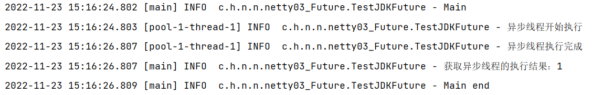

通过这里的执行结果，也能够看出，这里的get方法是一个阻塞方法

>  方式二：使用Netty的`Future`，这个Future是对JDK的扩展。

```java
public class TestNettyFuture {

    private static final Logger log = LoggerFactory.getLogger(TestNettyFuture.class);

    public static void main(String[] args) throws ExecutionException, InterruptedException {
        EventLoopGroup eventLoopGroup = new DefaultEventLoopGroup(2);

        EventLoop eventLoop = eventLoopGroup.next();

        Future<Integer> future = eventLoop.submit(() -> {
            log.info("异步线程开始执行");
            TimeUnit.SECONDS.sleep(2);
            log.info("异步线程执行完成");
            return 1;
        });

        log.info("Main");
        log.info("获取异步线程执行的结果：{}",future.get());
        log.info("Main end");
    }
}

```

从用法上来看，两者并没有什么差别，这里同样给出上述代码的执行结果

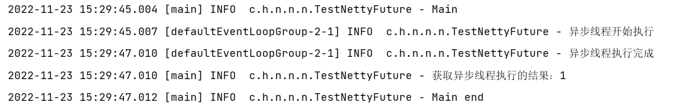

同样是通过get方法对主线程进行了阻塞，之所以说是对JDK中`Future`的扩展，是因为`Netty`的`Future`不仅仅是可以通过阻塞的方式获取执行结果，也可以通过监听的方式处理异步结果

```java
public class TestNettyFuture2 {

    private static final Logger log = LoggerFactory.getLogger(TestNettyFuture2.class);

    public static void main(String[] args) throws ExecutionException, InterruptedException {
        EventLoopGroup eventLoopGroup = new DefaultEventLoopGroup(2);

        EventLoop eventLoop = eventLoopGroup.next();

        Future<Integer> future = eventLoop.submit(() -> {
            log.info("异步线程开始执行");
            TimeUnit.SECONDS.sleep(2);
            log.info("异步线程执行完成");
            return 1;
        });
        log.info("Main");
        
        future.addListener(new GenericFutureListener<Future<? super Integer>>() {
            @Override
            public void operationComplete(Future<? super Integer> future) throws Exception {
                log.info("获取异步线程执行的结果：{}",future .get());
            }
        });
        
        log.info("Main end");
    }
}
```

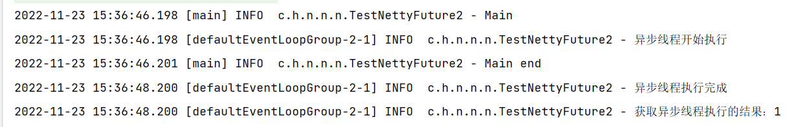

从执行结果之上，发现执行结果，不太一样了，`Main end `先与监听器中的内容执行，主要原因如下：我们所执行的这个监听器实际上是通过异步线程来执行的。所以就出现了如图所示的情况。

并且通过上述代码的演示，我们发现如果说想要获取异步执行得到结果，只能够通过Callable接口，而这个异步执行的结果是否是正确的，只能够通过Callable接口的返回值进行判断，但是这种方式并不能够准确的表达出结果，比如说我返回1是表示正确，返回0表示错误，并不准确。

> 问题提出：如果说异步线程已经执行完成，再加监听，还有用吗？

解答：有用，这里我们看一下addListener中的源码，如果说异步线程已经执行完成了，就会重新唤醒，主要是体现在如下代码：

```java
public Promise<V> addListener(GenericFutureListener<? extends Future<? super V>> listener) {
    ObjectUtil.checkNotNull(listener, "listener");
    // 加监听器，监听异步处理，在异步出来完成之后，触发特定的函数
    synchronized(this) {
        this.addListener0(listener);
    }
	// 如果说已经执行完成了，会进行唤醒
    if (this.isDone()) {
        this.notifyListeners();
    }
    return this;
}
```

**问题**：那么如果说现在不使用Callable呢？还有没有办法获取处理结果？

解决：使用Promise，这个Promise是对Future的扩展，表示一种承诺，是异步处理的结果

> 方式三：使用 Promise

```java
public class TestNettyPromise {
    private static final Logger log = LoggerFactory.getLogger(TestPromise.class);

    public static void main(String[] args) throws Exception{
        EventLoop eventLoop = new DefaultEventLoopGroup(1).next();
        Promise<Integer> promise = new DefaultPromise<>(eventLoop);
        eventLoop.submit(()->{
            try {
                TimeUnit.SECONDS.sleep(10);
            } catch (InterruptedException e) {
                e.printStackTrace();
            }
            promise.setSuccess(10);
        });
        log.info("获取异步处理的结果：{}",promise.get());
        log.info("Main end");
    }
}
```

演示结果如下：通过这个我们也能够发现，这个的get方法仍然是阻塞获取


### 2.3 Channel

在JDK 中提供了：`ServerSocketChannel `和 ` SocketChannel`两种，而Netty在JDK的基础之上进行了封装，具体原因如下：

- 统一了Channel的编程模型，通过他的封装，不在让客户区分`ServerSocketChannel`和`SocketChannel`。
- 可以更好的和Netty框架结合

封装了之后，提供的API：

- `channel.writeAndFlush("hello")`
    - 写会数据之后，会进行缓冲区的刷新
    - 在JDK中，write方法必须配合ByteBuffer使用，并且不会立即发出去，存在缓冲区之中，手动flush

- `channel.close()`
    - 关闭这个channel，这个方法是异步的，使用的时候注意

```java
ChannelFuture close = channel.close();
close.sync();
log.debug("channel close 方法之后，操作后续的一些工作。。。");
```

<font style="color:red">注意：如果说一个方法的返回值是XXXFuture，则表示是异步的</font>

但是这个close方法执行完成之后，程序并没有关闭，仍然是运行状态，为什么？如何解决？

原因：在Netty的设计过程中，维护一个线程池，可能有其他的线程中在做其他的事情，主要是为了避免隐患

解决：调用EventLoopGroup的下面这个方法，进行优雅的关闭，之所以称之为优雅，是因为当前线程组中的线程的工作都完成之后，才关闭当前客户端

```java
NioEventLoopGroup eventLoopGroup = new NioEventLoopGroup();
// 进行关闭
eventLoopGroup.shutdownGracefully();
```

### 2.4 Handler

> 非常重要，主要用于处理接受或者发送的数据，通过Pipeline把多个handler有机的整合成一个整体

- 读入数据的Handler：`ChannelInboundHandler`

- 写出数据的Handler：`ChannelOutboundHandler`


在Pipeline中，执行handler是有固定顺序的，是一个双向链表，如果说想要在多个Handler中传递数据，则需要在需要传递数据的Handler中加入`super.channelRead(ctx,msg)`，比如说A - B - C，这样的调用链，则需要在A和B中都需要加入这行，在底层中实际上是`ctx.fireChannelRead(msg)`，这两行代码都是可以的

除了我们自定义的handler之外，底层还是会为我们添加一个头和一个尾

- 如果输入的情况之下，head和tail都会执行
- 如果输出的情况之下，只会走head

```java
serverBootstrap.childHandler(new ChannelInitializer<NioSocketChannel>() {
    @Override
    protected void initChannel(NioSocketChannel channel) throws Exception {
        ChannelPipeline pipeline = channel.pipeline();
        pipeline.addLast(new StringDecoder());
        pipeline.addLast(new StringEncoder());
        pipeline.addLast("Handler1",new ChannelInboundHandlerAdapter(){
            @Override
            public void channelRead(ChannelHandlerContext ctx, Object msg) throws Exception {
                log.debug("Handler1获取到的信息：{}",msg);
                super.channelRead(ctx, msg);
            }
        });
        pipeline.addLast("Handler2",new ChannelInboundHandlerAdapter(){
            @Override
            public void channelRead(ChannelHandlerContext ctx, Object msg) throws Exception {
                log.debug("Handler2获取到的信息：{}",msg);
                ctx.fireChannelRead(msg);
            }
        });
        pipeline.addLast("Handler3",new ChannelInboundHandlerAdapter(){
            @Override
            public void channelRead(ChannelHandlerContext ctx, Object msg) throws Exception {
                log.debug("Handler3获取到的信息：{}",msg);
                log.debug("客户端的读Handler已经全部处理完成！");
                channel.writeAndFlush("hi");
            }
        });
        pipeline.addLast("Handler4",new ChannelOutboundHandlerAdapter(){
            @Override
            public void write(ChannelHandlerContext ctx, Object msg, ChannelPromise promise) throws Exception {
                log.debug("handler4，获取数据进行处理：{}",msg);
                super.write(ctx, msg, promise);
            }
        });
        pipeline.addLast("Handler5",new ChannelOutboundHandlerAdapter(){
            @Override
            public void write(ChannelHandlerContext ctx, Object msg, ChannelPromise promise) throws Exception {
                log.debug("handler5，获取数据进行处理：{}",msg);
                super.write(ctx, msg, promise);
            }
        });
        pipeline.addLast("Handler6",new ChannelOutboundHandlerAdapter(){
            @Override
            public void write(ChannelHandlerContext ctx, Object msg, ChannelPromise promise) throws Exception {
                log.debug("handler6，获取数据进行处理：{}",msg);
                super.write(ctx, msg, promise);
            }
        });
    }
});

```

对于：`ChannelOutboundHandler`，执行顺序和配置顺序相反

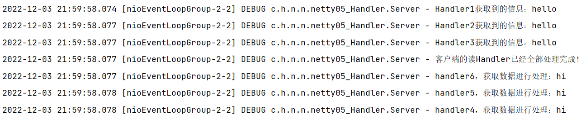

如果说使用ctx，从当前的Handler进行向上查找，比如说下面这样

```java
public class Server {
    private static final Logger log = LoggerFactory.getLogger(Server.class);

    public static void main(String[] args) {
        ServerBootstrap serverBootstrap = new ServerBootstrap();

        serverBootstrap.group(new NioEventLoopGroup());
        serverBootstrap.channel(NioServerSocketChannel.class);

        serverBootstrap.childHandler(new ChannelInitializer<NioSocketChannel>() {
            @Override
            protected void initChannel(NioSocketChannel channel) throws Exception {
                ChannelPipeline pipeline = channel.pipeline();
                pipeline.addLast(new StringDecoder());
                pipeline.addLast(new StringEncoder());
                pipeline.addLast("Handler1",new ChannelInboundHandlerAdapter(){
                    @Override
                    public void channelRead(ChannelHandlerContext ctx, Object msg) throws Exception {
                        log.debug("Handler1获取到的信息：{}",msg);
                        super.channelRead(ctx, msg);
                    }
                });
                pipeline.addLast("Handler2",new ChannelInboundHandlerAdapter(){
                    @Override
                    public void channelRead(ChannelHandlerContext ctx, Object msg) throws Exception {
                        log.debug("Handler2获取到的信息：{}",msg);
                        ctx.fireChannelRead(msg);
                    }
                });
                pipeline.addLast("Handler3",new ChannelInboundHandlerAdapter(){
                    @Override
                    public void channelRead(ChannelHandlerContext ctx, Object msg) throws Exception {
                        log.debug("Handler3获取到的信息：{}",msg);
                        log.debug("客户端的读Handler已经全部处理完成！");
                        ctx.writeAndFlush("h1");
                    }
                });
                pipeline.addLast("Handler4",new ChannelOutboundHandlerAdapter(){
                    @Override
                    public void write(ChannelHandlerContext ctx, Object msg, ChannelPromise promise) throws Exception {
                        log.debug("handler4，获取数据进行处理：{}",msg);
                        super.write(ctx, msg, promise);
                    }
                });
                pipeline.addLast("Handler5",new ChannelOutboundHandlerAdapter(){
                    @Override
                    public void write(ChannelHandlerContext ctx, Object msg, ChannelPromise promise) throws Exception {
                        log.debug("handler5，获取数据进行处理：{}",msg);
                        super.write(ctx, msg, promise);
                    }
                });
                pipeline.addLast("Handler6",new ChannelOutboundHandlerAdapter(){
                    @Override
                    public void write(ChannelHandlerContext ctx, Object msg, ChannelPromise promise) throws Exception {
                        log.debug("handler6，获取数据进行处理：{}",msg);
                        super.write(ctx, msg, promise);
                    }
                });
            }
        });
        serverBootstrap.bind(new InetSocketAddress( 8080));

    }
}
```


在Netty中，核心就是处理pipeline中的Handler，但是如今测试过程之中，都需要通过编写服务端或者客户端代码，并且启动之后，模拟发送才能够测试出效果，为了方便我们进行测试，可以使用如下方式进行测试：`EmbeddedChannel`

- 通过`writeInbound`方法，模拟读入操作，测试`ChannelInboundHandlerAdapter`
- 通过`writeOutbound`方法，模拟写出操作，测试`ChannelOutboundHandlerAdapter`

```java

ChannelInboundHandlerAdapter h1 = new ChannelInboundHandlerAdapter(){
    @Override
    public void channelRead(ChannelHandlerContext ctx, Object msg) throws Exception {
        log.debug("h1");
        super.channelRead(ctx,msg);
    }
};
ChannelInboundHandlerAdapter h2 = new ChannelInboundHandlerAdapter(){
    @Override
    public void channelRead(ChannelHandlerContext ctx, Object msg) throws Exception {
        log.debug("h2");
        super.channelRead(ctx,msg);
    }
};
ChannelInboundHandlerAdapter h3 = new ChannelInboundHandlerAdapter(){
    @Override
    public void channelRead(ChannelHandlerContext ctx, Object msg) throws Exception {
        log.debug("h3");

    }
};
ChannelOutboundHandlerAdapter h4 = new ChannelOutboundHandlerAdapter(){
    @Override
    public void write(ChannelHandlerContext ctx, Object msg, ChannelPromise promise){
        log.debug("h4");
        super.write(ctx, msg, promise);
    }
};
ChannelOutboundHandlerAdapter h5 = new ChannelOutboundHandlerAdapter(){
    @Override
    public void write(ChannelHandlerContext ctx, Object msg, ChannelPromise promise) {
        log.debug("h5");
        super.write(ctx, msg, promise);
    }
};
ChannelOutboundHandlerAdapter h6 = new ChannelOutboundHandlerAdapter(){
    @Override
    public void write(ChannelHandlerContext ctx, Object msg, ChannelPromise promise) throws Exception {
        log.debug("h6");
        super.write(ctx, msg, promise);
    }
};

EmbeddedChannel channel = new EmbeddedChannel();
channel.pipeline().addLast(h1,h2,h3,h4,h5,h6);
// 模拟读入操作
channel.writeInbound("hello");
channel.writeOutbound("haolong");
```

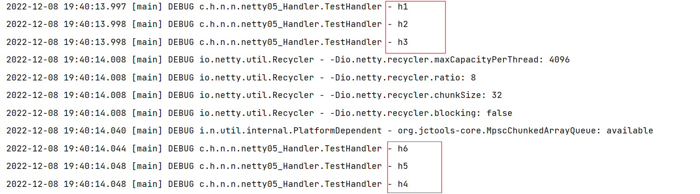

通过这种方式，能够很容易的测试对应的Handler，方便快捷

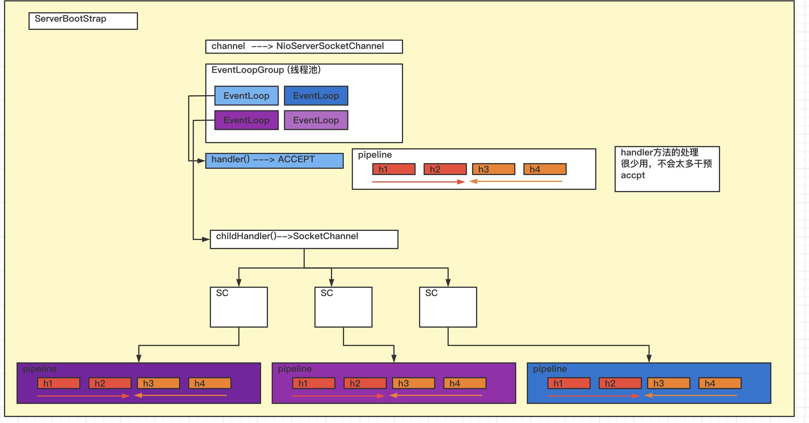

### 2.5  ByteBuf

#### 01 概述

网络通信的基本单位总是字节，NIO提供了ByteBuffer作为他的字节容器，但是这个类使用起来过于复杂，并且有些繁琐，所以Netty中提供了ByteBuf，作为对ByteBuffer的扩充，主要优势点如下：

1. 自动扩充，如果说超过容量之后，就会自动扩容
    - 具体的扩容规则是：16 ----> 64  ----> 128  ----> 原来的数据之上乘2
2. 添加了读写的指针，方便操作
3. 内存的池化
    - 池化的意义？
        - 站在调用者的角度上，提高了创建的效率
        - 合理的使用了资源
        - 减少了内存溢出的可能
4. 通过内置的复合缓冲区类型实现了透明的零拷贝，尽量少占用内存

他的内存结构图如下：

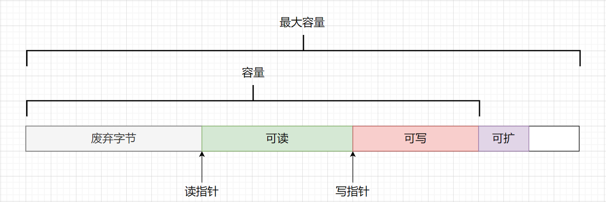

#### 02 获取

```java
// 如果说不指定，则默认值为 256，最大值是 Integer 的最大值
ByteBuf buf1 = ByteBufAllocator.DEFAULT.buffer();

ByteBuf buf2 = ByteBufAllocator.DEFAULT.buffer(10);

// 通过输出下面一行方法的输出结果，方便调试
ByteBufUtil.prettyHexDump(buf1)
```

<font style="color:red">注意：这里构造的时候给定的是初始容量，如果不够会进行自动扩容</font>

#### 03 与内存的关系

1. 堆内存：创建和销毁的代价小，读写效率低，GC压力大
2. 直接内存：创建和销毁的代价大，GC压力较小

使用直接内存

```java
ByteBuf buf0 = ByteBufAllocator.DEFAULT.buffer(10);
// buf0 = PooledUnsafeDirectByteBuf(ridx: 0, widx: 0, cap: 10)
System.out.println("buf0 = " + buf0);

ByteBuf buf1 = ByteBufAllocator.DEFAULT.directBuffer();
// buf1 = PooledUnsafeDirectByteBuf(ridx: 0, widx: 0, cap: 256)
System.out.println("buf1 = " + buf1);
```

使用堆内存

```java
ByteBuf buf = ByteBufAllocator.DEFAULT.heapBuffer();
// buf = PooledUnsafeHeapByteBuf(ridx: 0, widx: 0, cap: 256)
System.out.println("buf = " + buf);
```

从输出的名字，也能看见有池化的现象，在4.1之后，默认就是池化的，在4.1以前，关闭，可以通过设置虚拟机的参数：

`-Dio.netty.allocator.type=参数`，参数（pooled /  unpooled）设置。

#### 04 常用的API

> 容量相关

```java
ByteBuf byteBuf = ByteBufAllocator.DEFAULT.buffer(10);

int capacity = byteBuf.capacity();
log.debug("容量是：{}",capacity); // 10

int maxCapacity = byteBuf.maxCapacity();
log.debug("最大容量是：{}",maxCapacity);// 2147483647

int readableBytes = byteBuf.readableBytes();
log.debug("能够读取的字节数：{}",readableBytes); // 0

int writableBytes = byteBuf.writableBytes();
log.debug("能够写的字节数：{}",writableBytes); // 10
```

> 写入数据

```java
ByteBuf buf = ByteBufAllocator.DEFAULT.buffer(10);

buf.writeByte(1);

buf.writeInt(2);

buf.writeBytes(new byte[]{'n','e','t','t','y'});

System.out.println(ByteBufUtil.prettyHexDump(buf));
```

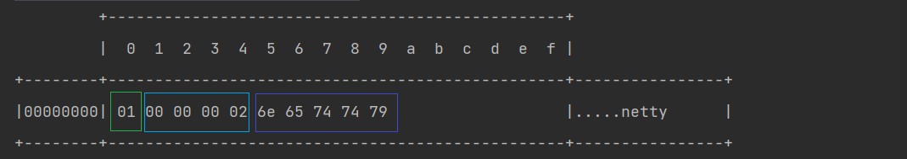

写完之后，在内存之中的布局就是这样，Byte占用一个字节，int占用4个字节

>  读取数据

```java
ByteBuf buf = ByteBufAllocator.DEFAULT.buffer(10);
for (int i = 0; i < 10; i++) buf.writeInt(i);

log.debug("读指针的位置：{}",buf.readerIndex()); // 0

log.debug("buf.readInt() = {}" , buf.readInt());
log.debug("buf.readInt() = {}" , buf.readInt());

log.debug("读指针的位置：{}",buf.readerIndex()); // 8
```

<font style="color:red">ByteBuf默认情况之下，只能读取一遍数据，但是，被废弃的数据在ByteBuf中仍然是存在的</font>

当我们使用readXXX方法或者是writeXXX方法的时候，会去改变读写指针的位置

#### 05 内存释放

> 概述

如果当前的ByteBuf是池化的，并不会进行回收，清空和销毁，而是放回ByteBuf的池子中。

如果是使用了堆外内存，不能被JVM直接管理，申请到的内存无法被垃圾回收器直接回收，所以我们需要手动回收，否则会出现内存泄漏的问题。

Netty中的ByteBuf是通过引用计数的方式管理，如果说一个ByteBuf没有地方被引用到，需要回收底层内存。默认情况之下，当创建一个ByteBuf，他的引用为1

- 调用 retail 方法，引用计数会加一
- 调用 release 方法，引用计数会减一，减完之后如果发现引用技术为0，则直接回收ByteBuf底层的内存。

<font style="color:red">在一个函数体里面，只要增加了引用计数（包括 ByteBuf 的创建和手动调用 retain() 方法），就必须调用 release() 方法</font>

>  什么时候进行释放

由于ByteBuf不能够进行传递，主要是在PipeLine中的Handler中进行使用，所以创建和销毁操作，放在Handler中完成，是最为稳妥的

- `tailContex`t 会对读到的数据进行ByteBuf释放

- `headContext` 会对写的数据进行ByteBuf的释放

所以程序员后续不需要关心 ByteBuf 的释放问题

#### 06 分片

如果说对一个ByteBuf中的一部分数据进行访问操作，一般情况之下，就是拷贝一份，进行操作

slice：从原始的 ByteBuf 中截取一段，这段数据从 读指针 到 写指针，同时，返回的新的 ByteBuf 的最大容量 为原来ByteBuf的 可读字节数量 。是对原始的ByteBuf进行切片成多个ByteBuf，切片之后的ByteBuf并没有进行内存的赋值，还是使用原始的 ByteBuf的内存

API：slice(startIndex,length)，每次使用slice，使用的是一块内存，但是有自己独立的一套读写指针

```java
ByteBuf buf = ByteBufAllocator.DEFAULT.buffer(11);
buf.writeBytes(new byte[]{'h','e','l','l','o',',','n','e','t','t','y'});
System.out.println(ByteBufUtil.prettyHexDump(buf));
/**
* slice(startIndex,length)
* 每次使用slice，使用的是一块内存，但是有自己独立的一套读写指针
* */
ByteBuf buf1 = buf.slice(0, 5);
buf1.retain();
ByteBuf buf2  = buf.slice(6, 5);
buf2.retain();

buf.release();// 如果说这里进行了release，上面不进行retail，后续代码就会出现错误
System.out.println(buf1);
System.out.println(ByteBufUtil.prettyHexDump(buf1));
System.out.println(buf2);
System.out.println(ByteBufUtil.prettyHexDump(buf2));
```

<font style="color:red">注意：使用完 slice 和 duplicate 方法的时候，千万要理清内存共享，引用计数共享，读写指针不共享</font>

## 三、半包和黏包

### 3.1 问题分析

半包和黏包实际上就是指接受数据时，数据有可能接受不完整，也可能接受过多。

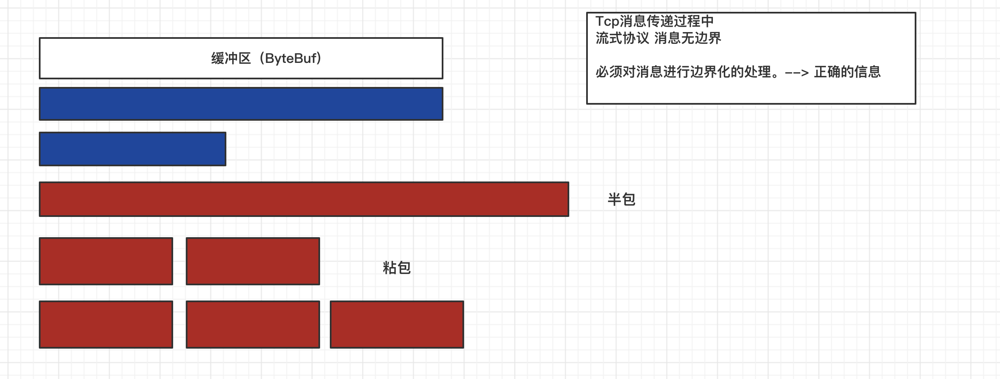


那么在网络通信过程中，什么情况可以导致接受数据不完整或者过多？

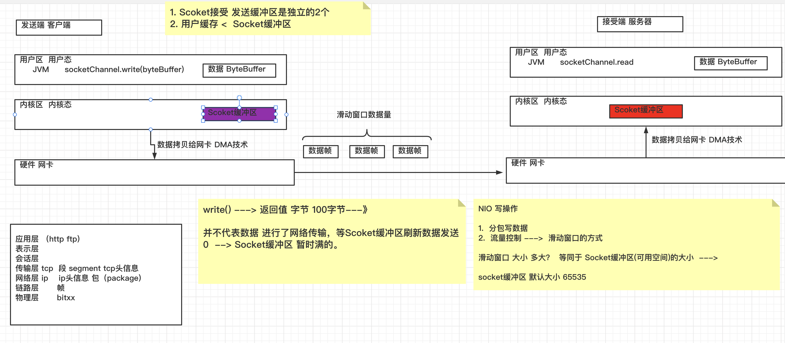

​	write 方法进行写数据，有一个返回值，表示向Socket缓冲区中写出多少个字节，并不代表数据进行了网络传输，等Socket缓冲区刷新数据发送

如果说返回0，表示Socket缓冲区满了，而Socket缓冲区默认大小是 65535

```java
serverBootstrap.option(ChannelOption.SO_RCVBUF,100);
```

​	在Netty中，用于网络通信的ByteBuf是Netty帮我们创建的，而他的获取方式，则是通过第一个非handler的nboundHandler中获取，默认大小是1024，但是这个大小则是可以指定的，比如说在服务端之中，通过如下的方式：

```java
// 三个参数的含义，依次是最小值，初始值，最大值
serverBootstrap.childOption(ChannelOption.RCVBUF_ALLOCATOR,new AdaptiveRecvByteBufAllocator(16,16,16));
```

分析完成这些问题之后，也能够明白，要想处理半包和黏包的问题，我们首先在获取到ByteBuf之后，才能进行处理，并且是在第一个非handler中进行获取

Netty中通过`ByteMessageDecoder`这个类型来完成ByteBuf到Message的转换，而对于一个具体的Message来说，不应该出现半包或者黏包的问题，而这个类型有四种实现类：

- 固定的长度消息的问题：`FixedLengthFrameDecoder`

- 通过固定的分割符：`LineBasedFrameDecoder`，如果超过最大长度还没有发现分隔符，不进行处理

- 通过自定义的分隔符：`DelimiterBasedFrameDecoder`

- 头体分离：`LengthFieldBasedFrameDecoder`

### 3.2 具体的解决方案

> 方式一：FixedLengthFrameDecoder，通过固定消息长度

```java
pipeline.addLast(new FixedLengthFrameDecoder(10));
```

如果说我现在固定的消息长度是10，但是我的消息不足10呢，这种情况必须要自己填充为长度10

```java
 channel.writeAndFlush("aaaaaaaaaabbbbbb____c_________");
```

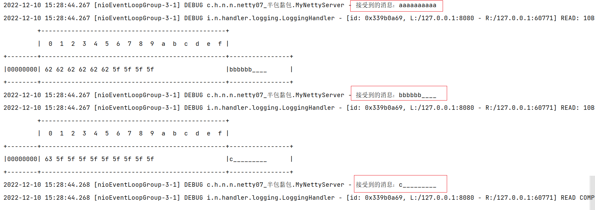

这里我们演示的是黏包的情况，如果说先演示半包问题呢？

我们通过在服务端添加如下的代码，就能演示

```java
serverBootstrap.childOption(ChannelOption.RCVBUF_ALLOCATOR,new AdaptiveRecvByteBufAllocator(8,8,8));
```

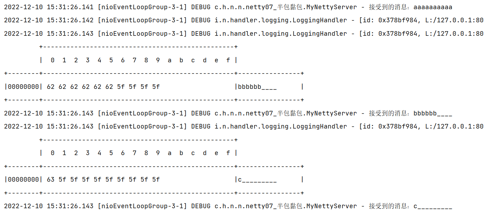

我们发现还是能够拆分出来的

> 方式二：LineBasedFrameDecoder，通过固定的分隔符，\n，或者 \r\n

```java
pipeline.addLast(new LineBasedFrameDecoder(1024));
```

这里的参数是指最大长度，如果超过最大长度，还没有发现分割符，则不处理

发送方通过下面的这种方式进行发送

```java
 channel.writeAndFlush("aaaaaaaaaa\nbbbbbb\nc\n");
```

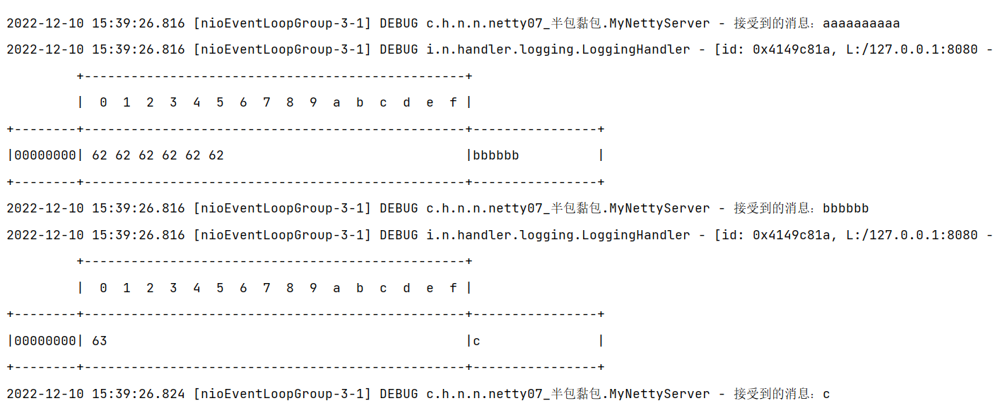

这种方式，仍然可以拆分处理

> 方式三：DelimiterBasedFrameDecoder，通过自定义的分隔符

```java
pipeline.addLast(
    new DelimiterBasedFrameDecoder(
        50, 
        ByteBufAllocator.DEFAULT.buffer(1).writeBytes("\f".getBytes(StandardCharsets.UTF_8))
    )
);
```

我们只需要在发送的时候添加即可

```java
 channel.writeAndFlush("aaaaaaaaaa\fbbbbbb\fc\f");
```

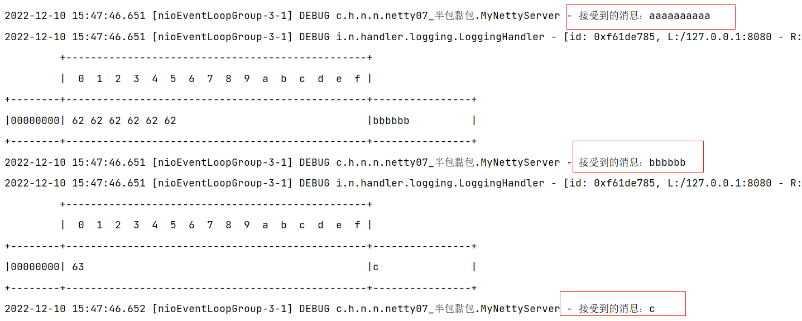

> 方式四：LengthFieldBasedFrameDecoder，通过头体分离

这种方式，不要求消息定长，也不需要使用固定的分隔符，他的解决方案就是将一条消息分为两个部分，头和体

```java
pipeline.addLast(new LengthFieldBasedFrameDecoder(1024,1,2,1,3));
```

具体参数的含义是：

```markdown
maxFrameLength      最大长度

lengthFieldOffset   从第几个字节开始找 length 位

lengthFieldLength   length位的长度

lengthAdjustment    length位后面的第几个字节是内容

initialBytesToStrip 去头
```

我们只需要关心后面4个核心参数即可

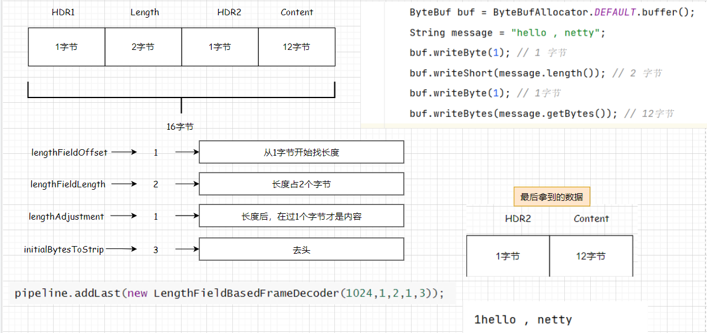

## 四、编解码器

### 4.1 基本信息

​	编码，是将Java对象转为二进制；而解码：是将二进制转为Java对象。

​	在Netty 中编解码的工作，实际上是通过Handler完成的，更准确来说是ChannelHandler，其实就是`ByteToMessageCodec`来完成，我们可以通过查看他的源码，翻译一下该类上面的注释

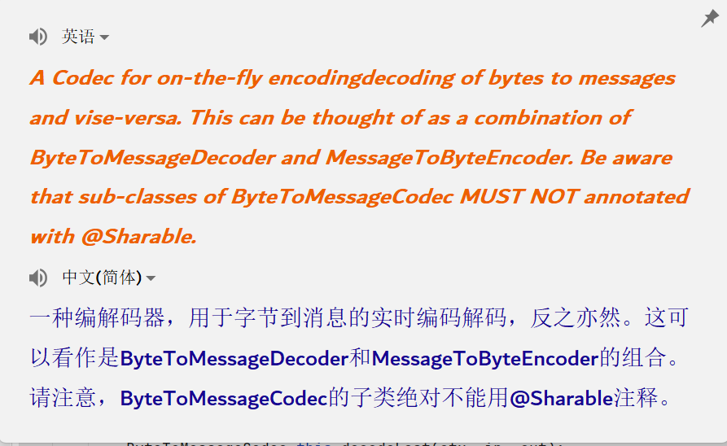

​	在这段翻译过程之中，提到了两个类型`ByteToMessageDecoder` （解码器）和 `MessageToByteEncoder`（编码器）


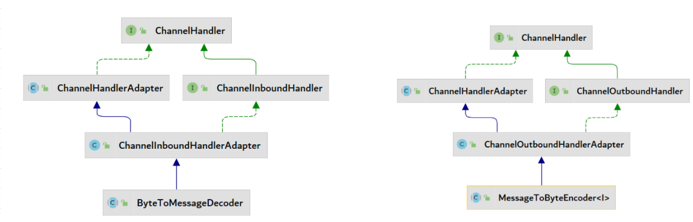

- 从解码器的类图中，能够分析出，他是继承于`ChannelInboundHandlerAdapter`
- 从编码器的类图中，能够分析出，他是继承于`ChannelOutBoundhandlerAdapter`

上述的两个编解码类型都是抽象类，这也就意味着我们不能够进行实例化，所以在实际开发过程之中，我们都需要去使用对应类型的子类。

对于编解码器在使用过程中，实际上有两个核心内容：

1. 核心点一：序列化协议（传输数据的格式）
    - Java 序列化和反序列化协议
        - 实现序列化标志性接口`Seriliazable`之后，通过`ObjectOutputStream`将对象转为文件中，将文件进行传输，之后通过`ObjectInputStream`在转为对应的对象。
        - 但是这种方式，无法跨语言，并且序列化之后太大了，序列化时间过长
    - 通过 XML 的方式
    - 通过 JSON
    - 通过 msgpack，类似于JSON，二进制传输，效率高，数据体量较小
    - 通过 protobuf ，他不将数据，转为中间语言，跨语言，更小，更快，但是可读性较差

```java
private static void transferByMsgpack() throws IOException {
    User user = new User("haolong","123");
    MessagePack messagePack = new MessagePack();
    byte[] userByte = messagePack.write(user);
    System.out.println(new String(userByte));
    User tem = messagePack.read(userByte,User.class);
    System.out.println(tem);
}

private static void transferByJson() throws JsonProcessingException {
    User user = new User("haolong","123");
    ObjectMapper objectMapper = new ObjectMapper();
    String s = objectMapper.writeValueAsString(user);
    System.out.println("s = " + s);
}

private static void transferByJava() throws IOException, ClassNotFoundException {
    User user = new User("haolong","123");
    File file = new File("F://demo.txt");
    OutputStream outputStream = new FileOutputStream(file);
    ObjectOutputStream objectOutputStream = new ObjectOutputStream(outputStream);
    objectOutputStream.writeObject(user);

    InputStream inputStream = new FileInputStream(file);
    ObjectInputStream objectInputStream = new ObjectInputStream(inputStream);
    User tem = (User) objectInputStream.readObject();
    System.out.println("tem = " + tem);
}
```

2. 核心点二：具体的编解码器
    - 在Netty的体系中，实际上都是`ChannelInboundHandlerAdapter` 和 `ChannelOutBoundhandlerAdapter`的子类型

接下来，对常见的编解码器进行学习

### 4.2 常见的编解码器

#### 01 String 相关 

> StringEncoder and  StrnigDecoder

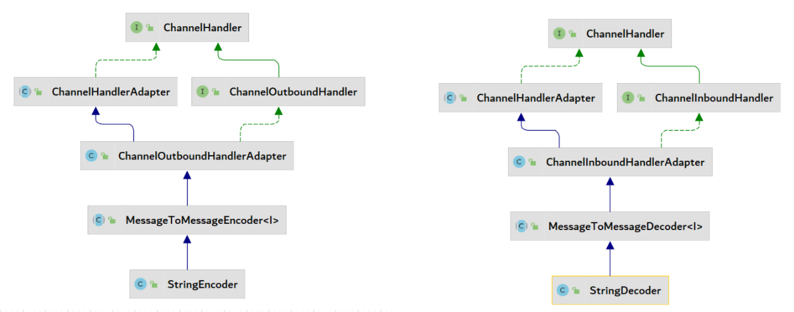


从这里的类图中，我们也能发现，他们分别继承于MessageToMessageEncoder 和 MessageToMessageDecoder，这里就涉及到了Netty的编解码体系结构，实际上是有两个体系：

- 体系一：ByteToMessage  和 MessageToByte
- 体系二：MessageToMessageDecoder 和 MessageToMessageEncoder

这两个体系区别：

- ByteToMessage 和 MessageToByte 系列的编码器更加的底层，因为这个体系之中，只能去编解码ByteBuf，而MessageToMessage这个体系中，可以通过指定泛型去完成（通过观察两个体系的decode方法参数完成）
- MessagetoMessage体系，不会自己解决封帧（半包和黏包）的问题，只有ByteToMessage系列会解决

在`StringEncoder`和`StringDecoder`这两个体系之中，泛型被指定为了ByteBuf，由于这个体系并不会自己解决封帧问题，所以在我们使用`StringDecoder`的时候，前面必须放，封帧相关的编解码器

#### 02 封帧相关

1. FixedLengthFrameDecoder
2. LineBasedrameDecoder
3. DelimiterBasedFrameDecoder
4. LengthFieldBasedFrameDecoder

#### 03 序列化相关

1. ObjectEncoder
2. ObjectDecoder

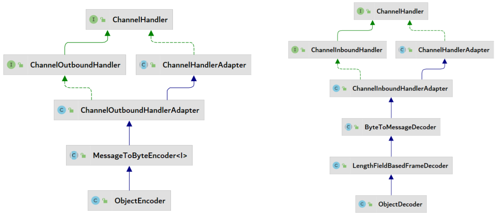

从这个继承体系上面来看，ObjectDecoder直接继承于`LengthFieldBasedFrameDecoder`，直接就解决了封帧的问题

```java
// 客户端
pipeline.addLast(new ObjectEncoder());

// 服务端
pipeline.addLast(new ObjectDecoder(ClassResolvers.cacheDisabled(null)));
pipeline.addLast(new ChannelInboundHandlerAdapter() {
    @Override
    public void channelRead(ChannelHandlerContext ctx, Object msg) throws Exception {
        User user = (User) msg;
        log.debug("接受到的信息：{}",user);
    }
});
```

#### 04 Json 相关

只提供了JSON解码器 JsonObjectDecoder，没有提供编码器，主要是因为不需要，JSON传递过来就是String

```java
pipeline.addLast(new JsonObjectDecoder()); // 解码之后，仍然是将数据放在ByteBuf之中
pipeline.addLast(new ChannelInboundHandlerAdapter() {
    @Override
    public void channelRead(ChannelHandlerContext ctx, Object msg) throws Exception {
        ByteBuf buf = (ByteBuf) msg;
        String s = buf.toString(StandardCharsets.UTF_8);
        ObjectMapper objectMapper = new ObjectMapper();
        User user =objectMapper.readValue(s,User.class);
        log.debug("接受到的信息：{}",user);
    }
});
```

既然这个解码器解码之后，仍然是将数据放在ByteBuf之中的，那么他所做的意义是？

他的作用主要是针对于Json数据做封帧操作

#### 05 Http协议相关

Netty支持对Http协议进行编解码，也就说Netty可以作为Web服务器，而SpringWebFlex底层就是基于Netty的。

对于Http请求来讲，实际上是分为两个部分，请求头和请求体

针对于Http协议来讲，编码就是将Java对象转为Http协议，解码则是将Http协议转为Java对象，而这个对象则是Netty为我们提供的HttpObject

```java
// 与Http协议相关的编解码器
pipeline.addLast(new HttpServerCodec());

pipeline.addLast(new ChannelInboundHandlerAdapter(){
    @Override
    public void channelRead(ChannelHandlerContext ctx, Object msg) throws Exception {
        log.debug("msg is {}",msg);
    }
});
```

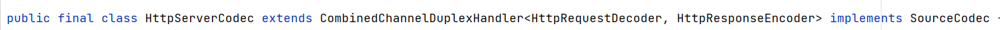

之所以称之为编解码器，是因为他组装了`HttpRequestDecoder`和`HttpResponseEncoder`，并且他是属于ByteToMessageDecoder体系的

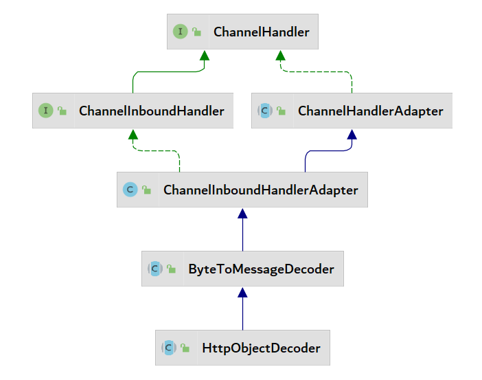

在服务端添加上面的代码之后，通过浏览器发送请求，获取到如下的内容

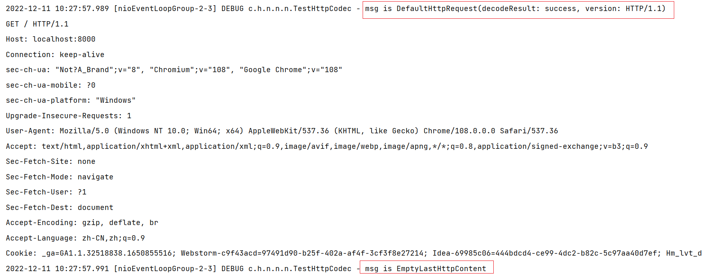

通过打印日志，我们发现，输出了两个msg， 一个是HttpRequest，一个是HttpContent，而对于ByteToMessage体系中的解码方法，里面是有一个List集合的，而这个List集合就是用来存储Message消息的

```java
protected abstract void decode(ChannelHandlerContext ctx, ByteBuf in, List<Object> out) throws Exception;
```

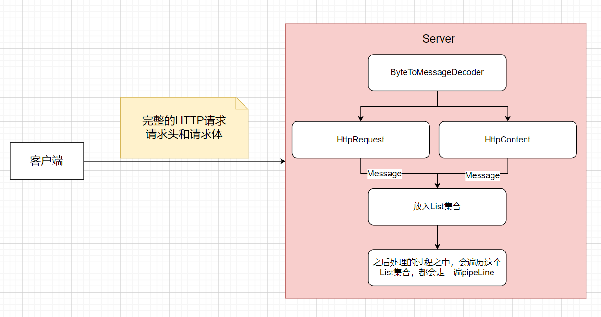

通过下述逻辑区分，并进行相应的响应设置

```java
// 与Http协议相关的编解码器
pipeline.addLast(new HttpServerCodec());

pipeline.addLast(new ChannelInboundHandlerAdapter(){
    @Override
    public void channelRead(ChannelHandlerContext ctx, Object msg) throws Exception {
        log.debug("msg is {}",msg);
        if (msg instanceof HttpRequest) {
            HttpRequest request = (HttpRequest) msg;
            // 获取请求头
            HttpHeaders headers = request.headers();
            // 获取请求行
            String uri = request.uri();
            // 获取版本
            HttpVersion httpVersion = request.protocolVersion();
            // 获取请求方法
            HttpMethod method = request.method();
            // 设置响应
            DefaultFullHttpResponse response =
                new DefaultFullHttpResponse(httpVersion, HttpResponseStatus.OK);
            byte[] bytes = "<h1>hello</h1>".getBytes(StandardCharsets.UTF_8);
            response.headers().set("content-length",bytes.length);
            response.content().writeBytes(bytes);
            ctx.writeAndFlush(response);
        } else if (msg instanceof HttpContent) {
            // 请求体
            HttpContent httpContent = (HttpContent) msg;
            // 请求体
            ByteBuf content = httpContent.content();
        }
    }
});
```

是否能够限定这个Handler只处理请求头呢？而不是通过这个`if  else`的形式，这种是有的，就是通过`SimpleChannelInboundHandler`,

```java
pipeline.addLast(new LoggingHandler());
pipeline.addLast(new HttpServerCodec());
// SimpleChannelInboundHandler 限定关注的消息类型
pipeline.addLast(new SimpleChannelInboundHandler<HttpRequest>() {
    @Override
    protected void channelRead0(ChannelHandlerContext channelHandlerContext, HttpRequest request) throws Exception {
        log.debug("httpRequest is {}",request);
        // 获取请求头
        HttpHeaders headers = request.headers();
        // 获取请求行
        String uri = request.uri();
        // 获取版本
        HttpVersion httpVersion = request.protocolVersion();
        // 获取请求方法
        HttpMethod method = request.method();
        // 设置响应
        DefaultFullHttpResponse response = new DefaultFullHttpResponse(httpVersion, HttpResponseStatus.OK);
        byte[] bytes = "<h1>hello</h1>".getBytes(StandardCharsets.UTF_8);
        response.headers().set("content-length",bytes.length);
        response.content().writeBytes(bytes);
        channelHandlerContext.writeAndFlush(response);

    }
});
```

在以前重新的方法都是`ChannelRead`，而这个里面是`ChannelRead0`，

ChannelRead 底层调用了 ChannelRead0，在ChannelRead中对msg对类型进行了转换，所以在ChannelRead0中，能够直接使用具体的类型

 通过上述方式，能够专注于某一个对象，而可以下面这种方式，就可以通过一个两个对象合二为一

```java
pipeline.addLast(new HttpObjectAggregator(1024));
pipeline.addLast(new ChannelInboundHandlerAdapter(){
    @Override
    public void channelRead(ChannelHandlerContext ctx, Object msg) throws Exception {
        DefaultFullHttpRequest request = (DefaultFullHttpRequest) msg;
        request.headers();
        request.content();
        super.channelRead(ctx, msg);
    }
});
```

<font style="color:red">注意：对于Http协议的编解码器，不会出现半包和黏包问题，Http请求中，请求头中会有content-length，不会出现 </font>

## 五、自定义编解码器

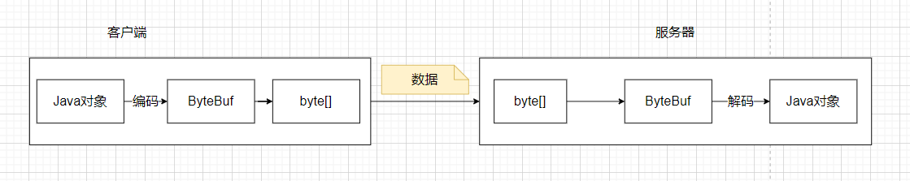

如果说我们想向客户端发送一个"10 - 20"的数据，现在的想法是将其拆分成两个Long类型的数据发送出去，服务端接收，现有的编解码器中并没有能够满足现在这个需求的，所以我们需要自定义编解码器

### 5.1 自定义编码器

```java
public class MyLongToByteEncoder extends MessageToByteEncoder<String> {
    private static final Logger log = LoggerFactory.getLogger(MyLongToByteEncoder.class);
    /**
     * @description: 自定义编码器
     * @param: channelHandlerContext 上下文
     * @param: msg 编码器接受客户端输出的数据
     * @param: byteBuf 真正往服务端写的ByteBuf的数据
     **/
    @Override
    protected void encode(ChannelHandlerContext channelHandlerContext, String msg, ByteBuf byteBuf) throws Exception 
    {
        String[] split = msg.split("-");
        for (String s : split) {
            long l = Long.parseLong(s);
            // 每个long类型的数据，在ByteBuf中占用8个字节
            byteBuf.writeLong(l);
        }
    }
}
```

### 5.2 自定义解码器

```java
public class MyByteToLongDecoder extends ByteToMessageDecoder {

    private static final Logger log = LoggerFactory.getLogger(MyByteToLongDecoder.class);

    @Override
    protected void decode(ChannelHandlerContext channelHandlerContext, ByteBuf in, List<Object> out) throws Exception {
        log.debug("decode method  invoke");
        if (in.readableBytes() >= 8) {
            long res  = in.readLong();
            out.add(res);
        }
    }
}
```

### 5.3 注意事项


对于我们发送的数据`10-20`，对于客户端发送了一次数据，为什么服务端需要调用两次解码的方法？

**解答**：如果说ByteBuf中的数据，一次没有处理完成，就会重复调用解码的方法

如果想将编码和解码的功能组合在一个类中完成，可以通过如下方式完成：

```java
public class MyLongCodec extends ByteToMessageCodec {
    @Override
    protected void encode(ChannelHandlerContext channelHandlerContext, Object o, ByteBuf byteBuf) throws Exception {
        String msg = (String) o;
        String[] split = msg.split("-");
        for (String s : split) {
            long l = Long.parseLong(s);
            // 每个long类型的数据，在ByteBuf中占用8个字节
            byteBuf.writeLong(l);
        }
    }

    @Override
    protected void decode(ChannelHandlerContext channelHandlerContext, ByteBuf in, List out) throws Exception {
        if (in.readableBytes() >= 8) {
            long res  = in.readLong();
            out.add(res);
        }
    }
}
```

在我们自定义的解码器的时候，会进行一些安全性验证，比如说上述代码中的ByteBuf中字节数量的判断

不仅仅是异常的问题，而且会改变读指针，有可能会丢失数据，这个时候我们可以对边界

```java
@Override
protected void decode(ChannelHandlerContext channelHandlerContext, ByteBuf in, List out) throws Exception {
    if (in.readableBytes() >= 8) {
        in.markReaderIndex();
        try {
            long res  = in.readLong();
            out.add(res);
        }catch (Exception e) {
            in.resetReaderIndex();
            throw new RuntimeException(e);
        }
    }
}
```

异常处理过多，判断过于复杂？

解决：使用`ReplayingDecoder`，通过这种方式就能够实现，所有安全校验的代码都不需要写了

```java
public class MyReplayingDecoder extends ReplayingDecoder {
    @Override
    protected void decode(ChannelHandlerContext channelHandlerContext, ByteBuf in, List<Object> out) throws Exception {
        long l = in.readLong();
        out.add(l);
    }
}
```

问题：这个类是如何实现的？

解答：和我们所做的一样，都是重新调整回写指针的位置

## 六、自定义系统的通信协议

### 6.1 分析

**第一部分：协议头**

- 幻数：就是一个标识，表示是否能够被当前客户端或者服务器处理
- 协议版本号：通常情况下是预留字段，用于协议升级的时候用到
- 指令类型：服务端或者客户端每收到一种指令都会有相应的处理逻辑，也就是说给你发送的消息，具体的工作是什么，
- 序列化的方式：表示如何把 Java 对象转换二进制数据以及二进制数据如何转换回 Java 对象
- 正文长度：数据的长度方法

**第二部分：协议正文**

### 6.2 编码

我们将分析阶段的所有数据都放在一个Java对象之中，然后转为Json，进行传输，但是使用这种方式，数据体量较大。如果说我们一定要使用这种方式，则将协议头设置为二进制的形式。

比如说我想传输下面的这个对象

```java
@Data
@NoArgsConstructor
@AllArgsConstructor
public class Message implements Serializable {
    private String username;
    private String password;
}
```

> 编码器

```java
public class MyMessageToByteEncoder extends MessageToByteEncoder<Message> {

    private static final Logger log = LoggerFactory.getLogger(MyMessageToByteEncoder.class);

    @Override
    protected void encode(ChannelHandlerContext channelHandlerContext, Message message, ByteBuf out) throws Exception {
        log.debug("encode method invoke");
        // 1. 魔数
        out.writeBytes(new byte[]{'h','a','o'});
        // 2. 协议版本
        out.writeByte(1);
        // 3. 序列化方式
        out.writeByte(2);
        // 4. 功能指令
        out.writeByte(3);

        ObjectMapper objectMapper = new ObjectMapper();
        String jsonContent = objectMapper.writeValueAsString(message);

        // 5. 设置正文长度
        out.writeInt(jsonContent.length());
        out.writeCharSequence(jsonContent, StandardCharsets.UTF_8);

    }
}

```

> 解码器

```java
public class MyByteToMessageDecoder extends ByteToMessageDecoder {

    private static final Logger log = LoggerFactory.getLogger(MyByteToMessageDecoder.class);

    @Override
    protected void decode(ChannelHandlerContext channelHandlerContext, ByteBuf byteBuf, List<Object> list) throws Exception {
        // 1. 读取魔数
        ByteBuf b = byteBuf.readBytes(3);
        log.debug("魔数：{}",b);
        // 2. 版本号
        byte b1 = byteBuf.readByte();
        log.debug("版本号：{}",b1);
        // 3. 序列化方式
        byte b2 = byteBuf.readByte();
        log.debug("序列化方式：{}",b2);
        // 4. 功能指令
        byte b3 = byteBuf.readByte();
        log.debug("功能指令：{}",b3);
        // 5. 正文长度
        int b4 = byteBuf.readInt();
        log.debug("正文长度：{}",b4);
        // 6. 解析正文
        ObjectMapper objectMapper = new ObjectMapper();
        Message message = objectMapper.readValue(
            byteBuf.readCharSequence(b4,StandardCharsets.UTF_8).toString(), 
            Message.class
        );
        log.debug("正文对象：{}",message);
        list.add(message);

    }
}

```

## 七、ChannelHandler总结

#### 01 总结

这里首先对前面的知识点做一个总结

**问题**：Handler的作用

解答：网络连接之后（Channel已经建立了），通过Handler进行IO相关的操作，也就是说处理IO中的数据，是Netty中最为重要的一个组件，与开发息息相关

**问题**：Pipeline的执行流程

 解答：整个就是一个责任链设计模式，底层就是一个双向链表，主要是负责两件事，针对于输入，入栈，针对于输出，出栈

如果说Pipeline中是手动添加了4个Handler，整个Pipline中并不止6个，其实是有7个，多的一个主要是`ChannelInitializer`，他本身也是一个Handler

```java
bootstrap.handler(new ChannelInitializer<NioSocketChannel>() {
    @Override
    protected void initChannel(NioSocketChannel channel) throws Exception {
        ChannelPipeline pipeline = channel.pipeline();
        pipeline.addLast(new LoggingHandler());
        pipeline.addLast(new MyMessageToByteEncoder());
    }
});
```

**问题**：Pipeline属于谁？

解答：属于NioSocketChannel，每一个里面都有一个Pipeline

**问题**：ChannelHandlerContext的作用

解答：负责Handler的运行流程

```java
pipeline.addLast(new ChannelInboundHandlerAdapter(){
    @Override
    public void channelRead(ChannelHandlerContext ctx, Object msg) throws Exception {
        super.channelRead(ctx, msg);
    }
});
pipeline.addLast(new ChannelInboundHandlerAdapter(){
    @Override
    public void channelRead(ChannelHandlerContext ctx, Object msg) throws Exception {
        super.channelRead(ctx, msg);
    }
});
```

**问题**：这两个`ChannelhandlerContext`是不是一个对象？

解答：不是，每一个Handler都有一个上下文对象，控制当前Handler的运行

<font style="color:red">补充：一个Java对象，如果说不覆盖toString方法，默认打印的是包路径@hashCode值</font>

```java
User user = new User();
// com.haolong.netty.aggrement.User@4f3f5b24
System.out.println(user);
//4f3f5b24
System.out.println(Integer.toHexString(user.hashCode()));
```

**问题**：使用Channel进行writeAndFlush和ChannelhandlerContext进行

解答：使用Channel，从整个pipeline的最后一个输出的handler开始依次执行，使用ChannelHandlerContext，从当前位置 依次查找前面

**问题**：ByteBuf的使用和释放

解答：使用完成之后一定要释放

```java
// 不建议使用
ByteBuf buf = ByteBufAllocator.DEFAULT.buffer();
// 建议使用，ctx和Handler相关
ByteBuf buffer = ctx.alloc().buffer();
```

#### 02 生命周期

```java
serverBootstrap.childHandler(new ChannelInitializer<NioSocketChannel>() {
    @Override
    protected void initChannel(NioSocketChannel channel) throws Exception {
        ChannelPipeline pipeline = channel.pipeline();
        pipeline.addLast(new ChannelInboundHandlerAdapter(){
            @Override
            public void channelRegistered(ChannelHandlerContext ctx) throws Exception {
                super.channelRegistered(ctx);
            }

            @Override
            public void channelActive(ChannelHandlerContext ctx) throws Exception {
                super.channelActive(ctx);
            }

            @Override
            public void channelRead(ChannelHandlerContext ctx, Object msg) throws Exception {
                super.channelRead(ctx, msg);
            }

            @Override
            public void channelReadComplete(ChannelHandlerContext ctx) throws Exception {
                super.channelReadComplete(ctx);
            }

            @Override
            public void channelInactive(ChannelHandlerContext ctx) throws Exception {
                super.channelInactive(ctx);
            }

            @Override
            public void channelUnregistered(ChannelHandlerContext ctx) throws Exception {
                super.channelUnregistered(ctx);
            }

            @Override
            public void handlerAdded(ChannelHandlerContext ctx) throws Exception {
                super.handlerAdded(ctx);
            }

            @Override
            public void handlerRemoved(ChannelHandlerContext ctx) throws Exception {
                super.handlerRemoved(ctx);
            }
        });
    }
});
```

```markdown
# handlerAdded

1. 最开始调用

2. 指的是当检测到新的连接之后，调用addLast方法之后的回调，表示当前Handler已经被成功添加到pipline中

3. 通常用于资源的请求上

# channelRegistered

1. 当连接上来之后，被分配到了具体的worker线程上了，才会回调这个方法

2. 有没有可能 Channel 被 accept 但是没有分配 worker，存在这个可能性，client并发多于worker的数量
	
# channelActive（常用）

1. channel 的准备工作基本完成了，所有的pipeline上面的handler添加完成，并且说已经绑定好一个NIO线程

2. 这个方法被回调，就意味着客户端和服务器端可以进行通信了

3. 应用过程中，可以通过该方法回调，向另一方写数据

# channelRead（常用）

1. 处理接受数据的操作，每一次发过来数据，都会回调这个方法

# channelReadComplete

1. 意味着读操作结束，服务端每次读取完一次完整的数据之后，回调该方法

2. 主要目的就是为了进行资源性的释放，类似于 finally

# channelInactive

1. 代表channel的连接断开，TCP连接没有了

# channelUnregistered

1. 代表对应分配给我们的Worker线程还回给 EventLoopGroup，也就是说这条连接对应的NIO线程移除掉对这条连接的处理

# handlerRemoved

1. 最后调用，表示给这条连接上额所有的业务逻辑处理器都给移除了

2. 通常用于资源的释放之上
```

所以，整体而言，流程如下图所示：

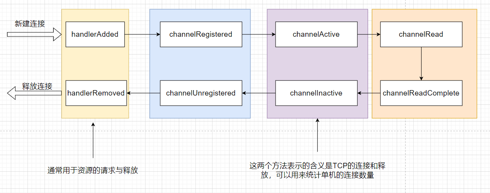

**问题**：为什么客户端关闭，会调用两次`channelReadComplete`

解答：客户端调用close方法的时候，也会向服务端发送一次数据

**问题**：如果说客户端强制关闭了，或者意外关闭了，还会回调吗？

解答：会的，但也不是百分之百

**问题**：为什么要了解回调？

解答：监控Channel相关的一些事件

**问题**：异常的处理

解答：如果说本Handler出现的异常或者本Handler之前的异常未进行处理，这个方法可以处理

## 八、空闲检测

> IdleStateHandler
>
> 作用：空闲检查

1. 客户端 与 服务器有一段时间 没有进行写操作，服务器端读空闲

2. 服务器 与 客户端有一段时间 没有进行 读操作 ，服务器端写空闲

3. 服务器端读写空闲

需要对这些空闲进行监控

```java
/**
* long readerIdleTime : 读空闲时间，时间间隔，每个这样一个时间间隔，测试是否读空闲
* long writeIdleTime : 写空闲时间，时间间隔，每隔这样一个事件间隔，测试是否写空闲
* long allIdleTime : 读写空闲
* TimeUnit unit: 时间单位
* */
pipeline.addLast(new IdleStateHandler(3,5,7, TimeUnit.SECONDS));
pipeline.addLast(new ChannelInboundHandlerAdapter(){
    /**
    * 作用：当发生特定的空闲事件之后，程序员的处理业务写在这个方法之中
    * */
    @Override
    public void userEventTriggered(ChannelHandlerContext ctx, Object evt) throws Exception {
        IdleStateEvent stateEvent = (IdleStateEvent) evt;
        if(stateEvent.state() == IdleState.READER_IDLE) {
            log.debug("写空闲。。{}",ctx.channel());
        } else if (stateEvent.state() == IdleState.WRITER_IDLE) {
            log.debug("读空闲。。{}",ctx.channel());
        } else if(stateEvent.state() == IdleState.ALL_IDLE) {
            log.debug("读写空闲。。{}",ctx.channel());
        }
        super.userEventTriggered(ctx, evt);
    }
});
```

> 使用场景：心跳
>
> 在一段时间内，如果说读写都空闲，更加能说明，网络有可能不通，所以一般去监控 读写空闲

有两种方式

- 通过`IdleStateHandler`，设置空闲时间
- 在一定的时间间隔之内，达到一定的次数，就认为挂了

注意事项

- 监控时间要进行控制，不要太小
- 监控到了空闲之后，核心是要关闭Channel。同样也要关闭业务处理的善后工作
- 如果说从客户端的角度发现channel关了，但是Channel本身没事，重试机制，添加定时任务

> Netty 中对定时任务的处理

通过`HashedWheelTimer`，不使用Java原生的方式，主要是因为效率低，任务排序麻烦

## 九、WebSocketServerProtocalHandler

> 作用：增加 Netty 处理 WebSocket 能力

**问题**：WebSocket 做什么的？

传统的HTTP1.0协议，是一种短连接协议，只能够请求-->响应，这个过程结束了，这个连接就断了,这种方式的开销就很大

传统的HTTP1.1协议，是一种有限长连接协议，主要的目的就是为了减少TCP连接握手的次数

但是，这两种，只能是请求+响应的方式，服务器端不能够主动的推送数据，并且为了保证这个连接不断开，可以客户端周期性的给服务端定期的发送，虽然能够解决问题，但是服务端的压力也就增加

**问题**：WebSocket 和 Http协议的关系是什么？

WebSocket是对Http的层次之上，做了升级，但是两者并不是互相替代。Netty通过`WebSocketServerProtocalHandler`，进行对WebSocket的支持

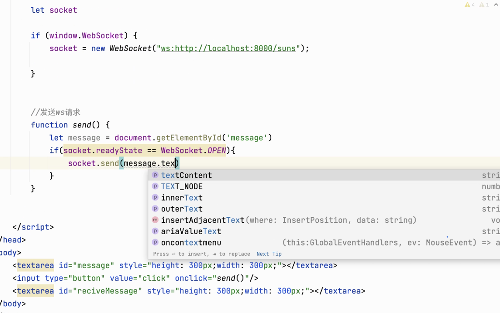


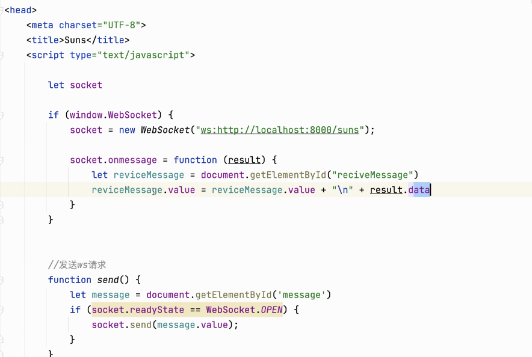


## 十、Shareable

> Handler 在 处理过程中，什么情况之下可以被多个pipeline共用

- 如果是无状态能够被共用，一般是指没有成员变量或者是成员变量是无状态的
- 如果是有状态，默认情况下，不能被共用，如果想被共享，可以通过加锁的方式
- ByteToMessageDecoder 和 MessageToByteEncoder 及其子类，不能被共用，但是MessageToMessage体系能够被多个Pipeline共用
- 能够被共享的Handler，提取出来，会通过一个注解`@Shareable`修饰，不能够添加的，就在pipline中去new

<font style="color:red">注意：这里的有状态是指，一个对象或者类，有可以写的成员变量</font>

编码器并没有这个问题，因为本来就没有这个困扰

开发建议：自定义的过程中，Handler 处理成无状态，没有成员变量，可以使用Sharable

## 十一、规范化开发

### 11.1 客户端

```java
public class MyNettyClient {

    private static final Logger log = LoggerFactory.getLogger(MyNettyClient.class);

    public static void main(String[] args) throws InterruptedException {
        // 可以被共享的 Handler
        LoggingHandler loggingHandler = new LoggingHandler();
        StringEncoder  stringEncoder  = new StringEncoder();

        // 要拿出来，最后要在 finally 中进行客户端的关闭
        EventLoopGroup eventLoopGroup = new NioEventLoopGroup();
        try {
            Bootstrap bootstrap = new Bootstrap();
            bootstrap.channel(NioSocketChannel.class);
            bootstrap.group(eventLoopGroup);
            bootstrap.handler(new ChannelInitializer<NioSocketChannel>() {
                @Override
                protected void initChannel(NioSocketChannel channel) throws Exception {
                    ChannelPipeline pipeline = channel.pipeline();
                    pipeline.addLast("logging",loggingHandler);
                    pipeline.addLast("stringEncoder",stringEncoder);
                     pipeline.addLast(new ChannelInboundHandlerAdapter(){
                        @Override
                        public void channelActive(ChannelHandlerContext ctx) throws Exception {
                            ctx.writeAndFlush("hello");
                        }
                    });
                }
            });
            Channel channel = bootstrap
                .connect(new InetSocketAddress("localhost", 8080)).sync().channel();
            // 监控 Channel 的关闭
            channel.closeFuture().sync();
        } catch (InterruptedException e) {
            log.error("client error", e);
        } finally {
            eventLoopGroup.shutdownGracefully();
        }
    }
}
```

### 11.2 服务端

```java
public class MyNettyServer {

    private static final Logger log = LoggerFactory.getLogger(MyNettyServer.class);

    public static void main(String[] args) {

        LoggingHandler loggingHandler = new LoggingHandler();

        EventLoopGroup boss = new NioEventLoopGroup(1);
        EventLoopGroup worker = new NioEventLoopGroup();

        try {
            ServerBootstrap serverBootstrap = new ServerBootstrap();
            serverBootstrap.channel(NioServerSocketChannel.class);
            serverBootstrap.group(boss,worker);
            serverBootstrap.childHandler(new ChannelInitializer<NioSocketChannel>() {
                @Override
                protected void initChannel(NioSocketChannel channel) throws Exception {
                    ChannelPipeline pipeline = channel.pipeline();
                    pipeline.addLast(loggingHandler);
                }
            });
            Channel channel = serverBootstrap.bind(new InetSocketAddress("localhost", 8080)).channel();
            channel.closeFuture().sync();
        } catch (Exception e) {
            log.error("server error", e);
        } finally {
            boss.shutdownGracefully();
            worker.shutdownGracefully();
        }
    }
}
```

## 十二、Netty相关的参数

### 01 如何修改参数

 对于客户端，

```java
Bootstrap bootstrap = new Bootstrap();

bootstrap.option();
```

对于服务器端        

```java
ServerBootstrap serverBootstrap = new ServerBootstrap();

serverBootstrap.option();
serverBootstrap.childOption();
```

对于核心配置信息，是存放在ChannelConfig中，而默认值放在了DefaultChannelConfig 中，而对于这些值的修改是通过ChannelOption进行修改

### 02 参数

1. `RCVBUF_ALLOCATOR`

只能在服务端进行设置，设置服务端 ByteBuf 缓冲区的大小，只能是直接内存

默认值最小是 64， 初始值是1024，最大值是 65535

```java
serverBootstrap.childOption(ChannelOption.RCVBUF_ALLOCATOR,new AdaptiveRecvByteBufAllocator(16,16,10));
```

2. `SO_RCVBUF  & SO_SNDBUF`

```java
SO_RCVBUF  ServerSocketChannel option  接受端 Socket缓冲区的大小

SO_SNDBUF SocketChannel  客户端 option  服务端 childOption 发送端缓冲区的大小
```

注意：目前的开发过程之中，操作系统都已经比较智能了，会为我们定义一个合理的发送或者接受Socket缓冲区的大小，如果说一个以后看见SO开头的参数，都是和操作系统底层的TCP协议相关的参数，所以这些参数，可以在Netty中通过参数设置，直接修改操作系统对应的文件

3.  `ALLOCATOR`

操作：SocketChannel.childOption()

ByteBuf 的 内存分配器

```java
serverBootstrap. childOption(ChannelOption.ALLOCATOR, PooledByteBufAllocator.DEFAULT);

serverBootstrap. childOption(ChannelOption.ALLOCATOR, UnpooledByteBufAllocator.DEFAULT);
```

4. `TCP_NODELAY`

SocketChannel

默认情况之下就是不延迟

5. `CONNECT_TIMEOUT_MILLIS`

SocketChannel 参数

连接超时时间，客户端在建立连接的时候，如果超过了参数指定的时间，抛出超时异常

6. `SO_BACKLOG`

ServerSocketChannel 参数

含义：决定三次握手之后全连接队列的大小

在系统层面上，可以通过 `/proc/sys/net/core/somaxconn`这个文件中设置

在Netty运行过程之中，全连接队列的大小，取两者的最小值

注意：对于半连接队列，没有最大值，可以不用考虑

7. `SO_REUSEADDR`

端口复用，可以重复使用，别的进程使用过的端口

为什么需要这个方式：Server非正常关闭或者正常关闭过程中出现意外，都有可能导致端口被占用，后续需要重复启动服务的时候，就会出端口被占用异常，为了解决这个问题，就需要端口复用

8. `SO_keepAlive`

既然在TCP有保活机制，为什么还有自己写呢？

理由：TCP 仅仅解决了网络的可用性问题，但是程序的可用性问题呢？无法解决， 还是需要心跳解决活跃的问题


