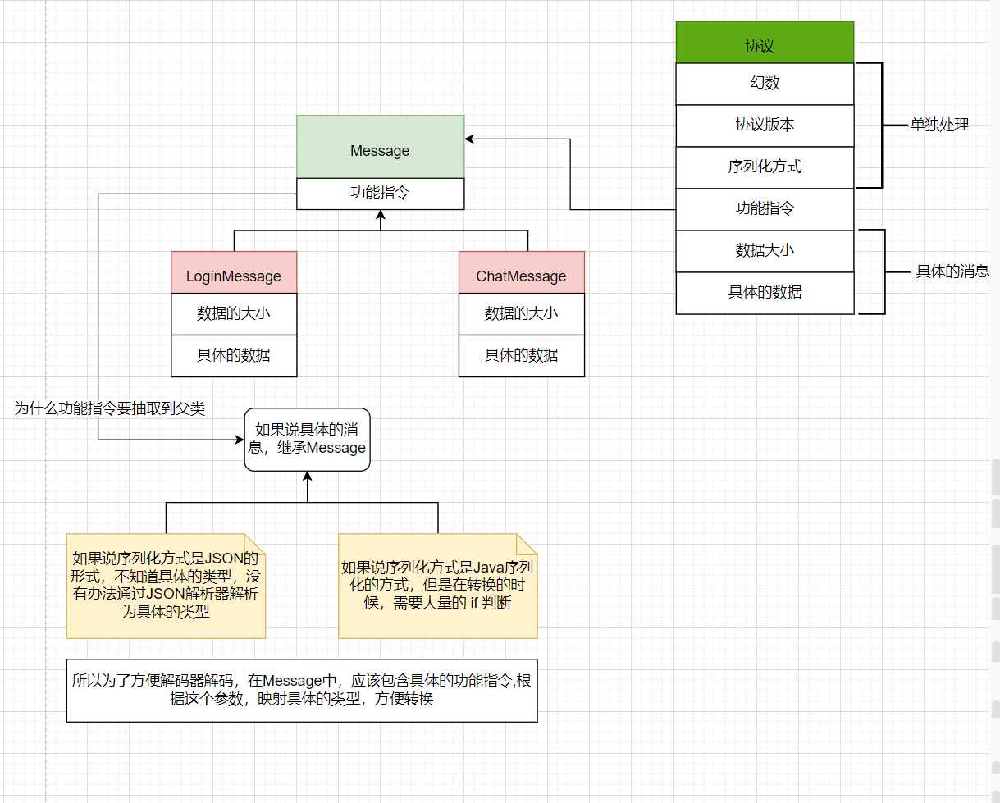

# 第三节 项目讲解

这一节将会使用Netty搭建一个简单的聊天室功能

## 一、分析

> 聊天室的功能分析

1. 登录
2. 一对一聊天
3. 建立多人聊天室
4. 消息群发

在Netty开发过程之中，核心设计思想就是通信协议，而这个协议，主要用于客户端和服务端之间进行通信，同时需要根据协议的种类进行功能的划分。比如说，我想发送登录，我就发送一个登录的消息 LoginMessage，我想聊天，我就发送一个聊天的消息 ChatMesage，并且每种消息需要特定的编解码器进行支撑，但是如果说随着消息的种类增加，编解码器的数量也是在增加，显然，为每个消息添加一个编解码器是不现实的。

但是，不管是什么类型的消息，本质上都可以抽奖为一个消息Message，其余开发的消息都是这个Message的子类，并且说这个消息父类设置为抽象类，但是这个Messge之中，应该包含哪些信息？这里面应该存储共性的东西

在之前说编写自定义协议的时候，协议中主要包含幻数，协议版本，序列化的方式，功能指令，数据的大小，数据的正文。而协议表示传输数据的格式，消息表示具有具体业务含义的数据。

所以说一个消息中只应该去包含哪些业务相关的，只应该包含数据的大小，数据的正文。而针对于幻数之类的应当独立处理

在服务器端，是使用父类还是子类呢？是具体的类型



## 二、代码

### 2.1 消息

```java

```


```java

```

