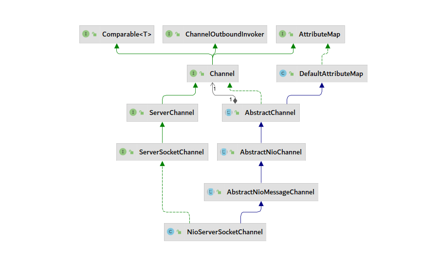

# 第四节 Netty源码分析

Netty 是基于NIO的异步通信框架

## 一、前言

> Channel

- 通过管道可以设置TCP相关的参数
- Netty中各个组件的串联者

> EventLoop

- 独立的线程
- 能够完成IO操作，普通任务，定时任务

> UnSafe

- 线程不安全的
- 负责真正的IO操作，一定是伴随着Channel来使用的

> ChannelPiepeline


> ServerBootStrap 和 Bootstrap

## 服务端的启动分析

> 对比 NIO 和 Netty 服务端

- NIO 开发方式

```java
// 1. NIO 开发方式
Selector selector = Selector.open();

ServerSocketChannel serverSocketChannel = ServerSocketChannel.open();
serverSocketChannel.configureBlocking(false);

SelectionKey selectionKey = serverSocketChannel.register(selector, 0, null);

selectionKey.interestOps(SelectionKey.OP_ACCEPT);
serverSocketChannel.bind(new InetSocketAddress(8000));
```

- Netty 服务端开发方式

```java
// 2. Netty 服务端
ServerBootstrap serverBootstrap = new ServerBootstrap();
serverBootstrap.channel(NioServerSocketChannel.class);
serverBootstrap.group(new NioEventLoopGroup());
serverBootstrap.childHandler(new ChannelInitializer<NioSocketChannel>() {
    @Override
    protected void initChannel(NioSocketChannel channel) throws Exception {
        ChannelPipeline pipeline = channel.pipeline();
        pipeline.addLast(new LoggingHandler());

    }
});
Channel channel = serverBootstrap.bind(new InetSocketAddress(8000)).sync().channel();
channel.closeFuture().sync();
```

在NIO之中，核心组件都展现出来了，但是在Netty中，NIO的核心一个都看不到，唯一相似的就是`NioServerSocketChannel` 和`NioSocketChannel`，所以大部分都被封装起来了。

在Netty首先引入了`NioServerSocketChannel`，继承于Channel，可以设置多个参数，是各个组件的串联者，并且管理Pipeline。通过**附件**把原有的NIO的AIP结合在一起。



