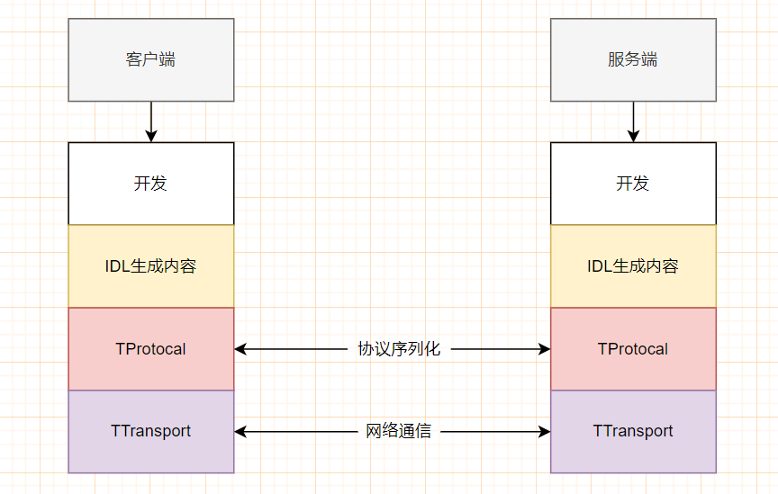
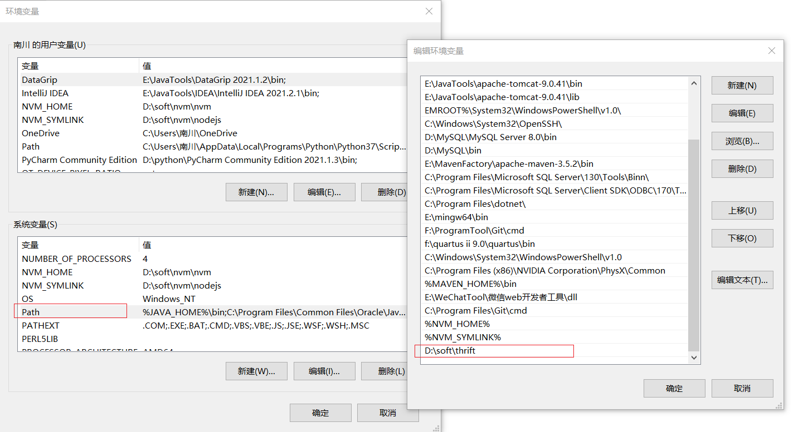
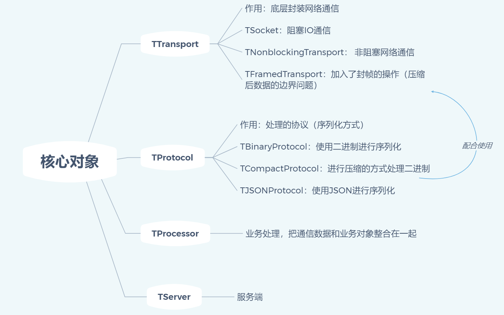

## 一、引言

### 1.1 简介

Thrift 是 Facebook 开发的一个代码生成工具库，可以帮助开发者加快和实施高效且可扩展的后端服务。

> 代码生成库：通过将每种语言中最需要自定义的部分抽象到每种语言实现的通用库之中，从而实现跨编程语言的高效，可靠的通信。

Thrift 是一个 RPC框架，可以进行异构系统的RPC调用。

>什么是异构系统？
>
>- 含义：服务的提供者 和 服务的调用者 使用不同的编程语言开发。
>- 对于这种情况出现的原因：
>    - 不同编程语言的擅长点不一样
>    - 遗留系统的整合

那么设计一个异构系统的 RPC

- 所要解决的核心问题就是：只要双方用各自的编程语言实现网络编程中的客户端和服务端，建立网络通信，进行通信即可

- 遇见的挑战：
    - 需要精通不同编程语言的网络 ，IO和线程等技术内容
    - 通信数据的格式：尤其是二进制格式，需要做统一处理

对于这个两个挑战，Thrift 框架已经帮我们解决。

对于Thrift 而言，是 apache 组织开源的一个顶级异构系统 RPC 框架，用于完成异构系统的 RPC 通信。

### 1.2 特点

- 跨语言支持
- 开发速度快
- 学习简单，IDL语言
- 稳定

### 1.3 设计思想

- 针对于不同的编程语言提供了一个库，封装了网络通信的代码，协议，序列化相关的内容
- IDL 语言，中立语言，用于服务的发布
- Thrift 命令把 IDL 语言自动转化成你需要的编程语言



## 二、安装

安装的就是把 IDL 转换成具体语言的工具

官网：`https://thrift.apache.org/download`

1）首先从官网下载 exe 文件，下载完成之后，无需点击

2）放在目录之下，修改 exe 文件名称为 `thrift.exe` 

3）配置环境变量



4）测试是否安装成功

```markdown
thrift --version
```

## 三、IDL 语法

> 安装 IDEA插件，Thrift 
>
> IDL 语法，必须写在 `thrift` 文件之中

### 3.1 注释

**1）单行注释**

```markdown
# 单行注释

// 单行注释
```

**2）多行注释**

```markdown
/**
* 多行注释
**/
```

### 3.2 namespace

- 作用：指定生成好的代码的包

```mardkown
namespace 语言 包名
```

### 3.3 基本类型

| 名称   | 含义               | 对应于 Java 类型 |
| ------ | ------------------ | ---------------- |
| i8     | 有符号的8为整数    | byte             |
| i16    | 有符号的 16 位整数 | short            |
| i32    | 有符号的 32 位整数 | int              |
| i64    | 有符号的 64 位整数 | long             |
| double | 64 位浮点数        | double           |
| bool   | 布尔值             | boolean          |
| string | 字符串             | String           |

### 3.4 集合类型

| 名称       | 含义           | 对应于 Java 类型 |
| ---------- | -------------- | ---------------- |
| `list<T>`  | 有序可以重复   | java.utils.List  |
| `set<T>`   | 无序不可以重复 | java.utils.Set   |
| `map<K,V>` | k - v 键值对   | java.utils.Map   |

### 3.5 struct

```idl
struct User {
	1: string name,
	2: i32 age,
	3: list<i32> ages = [1,2,3]
}
```

注意事项

- `struct` 不能够继承
- 成员与成员之间的分割，可以会用`,` ，也可以使用 `;`
- 结构体里面的每一个字段，都需要进行编号
- `optional`：可选的，默认会为每个成员都成为的关键字，代表这个字段在序列化中可选的
    - 如果没有默认值，则不会进行序列化
    - 如果有默认值，就进行序列化
- `required`：必须显示指定，不管这个字段没有默认值，都必须进行序列化

### 3.6 枚举

```IDL
enum SEX {
    MAN = 1,
    WOMAN = 2
}
```

### 3.7 异常

```idl
exception MyException {
    1: i32 code,
    2: string info
}
```

### 3.8 服务（Service）

- User 为 idl 中的结构体

```idl
service UserService {
	bool login(1:string name,2:string password)
	
	void register(1:User user)
}
```

注意事项：

- 异常的抛出
- `oneway`修饰表示客户端发起请求之后不等待响应的返回

```idl
service UserService {
	bool login(1:string name,2:string password) throws (1:MyException e,2 XXException e)
	
	oneway void register(1:User user)
}
```

- 继承

```idl
service BaseService {

}
service ComponentService extends BaseService  {

}
```

### 3.9 include

进行`IDL`模块化编程，就类似于Java开发那样，进行分包操作

```idl
namespace java com.haolong.entity
struct User {
    1: string username,
    2: i32 age
}
```

```idl
namespace java com.haolong.service
include "User.thrift"
service UserService {
    void register(User.User user)
}
```

生成代码

```markdown
thrift -r java UserService.thrift
```

## 四、生成代码

将 IDL 转为对应的 语言

```markdown
 thrift --gen java .\User.thrift
```

会把这个thrift文件，包含的thrift 文件，也会进行初始化

```markdown
 thrift -r --gen java .\User.thrift
```

## 五、Thrift 程序的开发

### 5.1 环境搭建

1）安装 Thrift ：在之前的小节之中，已经介绍过他的安装了，而他的作用就是，把 IDL 语言描述的接口内容，生成对应编程语言的代码，简化开发

2）引入依赖：引入 Thrift 针对于某一种编程语言的封装

- 官网之中，提供的依赖版本是18，不过在实际开发过程之中，会出现问题，所以这里建议使用 13 这个版本

```xml
<dependency>
    <groupId>org.apache.thrift</groupId>
    <artifactId>libthrift</artifactId>
    <version>0.13.0</version>
</dependency>
<dependency>
    <groupId>org.slf4j</groupId>
    <artifactId>slf4j-api</artifactId>
    <version>1.7.32</version>
</dependency>
<dependency>
    <groupId>ch.qos.logback</groupId>
    <artifactId>logback-classic</artifactId>
    <version>1.2.9</version>
</dependency>
```

### 5.2 项目结构的定义

```markdown
1. thrift-client : 代表服务的调用者

2. thrift-server : 代表服务的提供者

3. thrift-api : 代表RPC编程共有的部分（实体类型，服务接口）
```

### 5.3 Thrift 核心对象

在开始编程之前，我们首先来介绍一下 Thrift 之中的核心对象都有哪些，以及他们的作用



### 5.4 编程实现

#### 01 thrift-api 

1）编写 `rpc.thrift` 文件

```idl
namespace java com.haolong
# 公共部分
struct User {
    1: string username;
    2: string password;
}
service UserService {
    User queryUser(1: string username,2: string password);
    void save(User user);
}
```

2）执行命令

```markdown
thrift --gen java rpc.thrift
```

3) 将生成的文件，拷贝到`src\main`之下，最终生成的结构就如下图所示


#### 02 thrift-server

1）在 `pom.xml `之中，引入 `thrift-api` 模块

```xml
<dependency>
    <groupId>com.haolong</groupId>
    <artifactId>rpc-thrift-api</artifactId>
    <version>1.0-SNAPSHOT</version>
</dependency>
```

2）编写具体的服务实现类

```java
/**
 * @project: rpc-lession
 * @description: 服务实现类
 * @author: haolong
 * @data: 2023/5/30 15:56
 */
@Slf4j
public class UserServiceImpl implements UserService.Iface {
    @Override
    public User queryUser(String username, String password) throws TException {
        log.info("UserServiceImpl.queryUser,参数:Username: {},password: {}",username,password);
        return new User("haolong","123456");
    }

    @Override
    public void save(User user) throws TException {
        log.info("UserServiceImpl.save,参数:User：{}",user);
    }
}
```

3）将服务暴露出去

```java
package com.haolong.service;

import com.haolong.UserService;
import org.apache.thrift.protocol.TBinaryProtocol;
import org.apache.thrift.server.TServer;
import org.apache.thrift.server.TSimpleServer;
import org.apache.thrift.transport.TServerSocket;
import org.apache.thrift.transport.TServerTransport;
import org.apache.thrift.transport.TTransportException;
/**
 * @project: rpc-lession
 * @description:
 * @author: haolong
 * @data: 2023/5/30 15:58
 */
public class ServerMain {
    public static void main(String[] args) throws TTransportException {
        // 1. TTransport：封装网络通信
        TServerTransport tServerTransport = new TServerSocket(9000);
        // 2. TBinaryProtocol：使用的协议
        TBinaryProtocol.Factory factory = new TBinaryProtocol.Factory();
        // 3. TProcessor 把对应的功能书写发布了
        UserService.Processor processor = new UserService.Processor(new UserServiceImpl());
        // 4. 上面这些东西组合在一起
        TServer.Args arg = new TServer.Args(tServerTransport);
        arg.protocolFactory(factory);
        arg.processor(processor);
		// 5. 服务端
        TServer tServer = new TSimpleServer(arg);
        tServer.serve();
    }
}
```

#### 03 thrift-client

1）在 `pom.xml `之中，引入 `thrift-api` 模块

```xml
<dependency>
    <groupId>com.haolong</groupId>
    <artifactId>rpc-thrift-api</artifactId>
    <version>1.0-SNAPSHOT</version>
</dependency>
```

2）编写服务类

```java
import com.haolong.User;
import com.haolong.UserService;
import org.apache.thrift.TException;
import org.apache.thrift.protocol.TBinaryProtocol;
import org.apache.thrift.protocol.TProtocol;
import org.apache.thrift.transport.TSocket;
import org.apache.thrift.transport.TTransport;
/**
 * @project: rpc-lession
 * @description: 客户端
 * @author: haolong
 * @data: 2023/5/30 16:09
 */
public class ClientMain {
    public static void main(String[] args) throws TException {
        // 1. TTransport
        TTransport tTransport = new TSocket("localhost",9000);
        // 2. 协议
        TProtocol tProtocol = new TBinaryProtocol(tTransport);
        // 3. 获取到服务类
        UserService.Client userService = new UserService.Client(tProtocol);
        tTransport.open();
        userService.queryUser("haolong","123456");
        userService.save(new User("haolong","123"));
    }
}
```

#### 04 实战开发中的思考

在实战开发过程之中，服务端的功能，其实已经开发完成了。只是因为后续的业务需求，才可能决定，这个服务发布成 RPC。

但是，这里就出现一个问题，在6.4 小节之中，我们在服务端开发的过程中，实现的是 `UserService.Iface`这个接口，在这个接口实现类里面去编写具体的业务逻辑，所以这里就需要改进，改进之后，如下面代码所示：

```java
@Slf4j
public class UserServiceImpl implements UserService.Iface {
    @Override
    public User queryUser(String username, String password) throws TException {
        // log.info("UserServiceImpl.queryUser,参数:Username: {},password: {}",username,password);
        // 在这里面调动已经开发好的 业务方法
    }
}
```

## 六、TServer服务

### 6.1 概述

对于 TServer 来说，他代表的是 Thrift 开发之中的服务器，他所具有的功能有：

- 服务的开发：`server()`
- 服务的关闭：`stop()`

对于这个类而言，他是抽象的，不能进行实例化，不能够直接进行使用。这样做的原因在于：他有多种不同的实现，对应于不同的解决方案

这里首先，看一下这个类具体有哪些实现


这里先大致介绍一下，常见的几个实现类：

- `TSimpleServer`：阻塞的，单线程的服务器
- `TThreadPoolServer`：阻塞的，线程池版的服务器
- `TNonblockingServer`：非阻塞的单线程的服务器
- `TThreadSelectorServer`：实现了主从版的Reactor

### 6.2  TSimpleServer

我们已经说明了，他是`TServer`的子类，我们只需要去关心其对应的`server`方法


在分析完整大致流程之后，我们这个时候来看一下`RPC`调用过程之中，都做了那些事

```java
@Override
  public void process(TProtocol in, TProtocol out) throws TException {
    TMessage msg = in.readMessageBegin();
    ProcessFunction fn = processMap.get(msg.name);
    if (fn == null) {
      TProtocolUtil.skip(in, TType.STRUCT);
      in.readMessageEnd();
      TApplicationException x = new TApplicationException(
          TApplicationException.UNKNOWN_METHOD, "Invalid method name: '"+msg.name+"'");
      out.writeMessageBegin(new TMessage(msg.name, TMessageType.EXCEPTION, msg.seqid));
      x.write(out);
      out.writeMessageEnd();
      out.getTransport().flush();
    } else {
      fn.process(msg.seqid, in, out, iface);
    }
  }
```

### 6.3 TThreadPoolServer

阻塞，引入了线程池

>使用线程池：可以同时为多个客户端服务
>
>坏处
>
>- 如果说线程池之中的线程数量过多，服务器的系统资源用尽；
>- 线程无法复用（没有监控）
>- 阻塞

这里首先来看一下这个构造方法

- 如果使用默认的线程池最大值 是 Integer的最大值，显然不成
- 不能够让我们的线程复用，因为没有 selector

```JAVA
public TThreadPoolServer(Args args) {
    super(args);

    stopTimeoutUnit = args.stopTimeoutUnit;
    stopTimeoutVal = args.stopTimeoutVal;
    requestTimeoutUnit = args.requestTimeoutUnit;
    requestTimeout = args.requestTimeout;
    beBackoffSlotInMillis = args.beBackoffSlotLengthUnit.toMillis(args.beBackoffSlotLength);

    executorService_ = args.executorService != null ?
        args.executorService : createDefaultExecutorService(args);
  }

  private static ExecutorService createDefaultExecutorService(Args args) {
    SynchronousQueue<Runnable> executorQueue =
      new SynchronousQueue<Runnable>();
    return new ThreadPoolExecutor(args.minWorkerThreads,
                                  args.maxWorkerThreads,
                                  args.stopTimeoutVal,
                                  args.stopTimeoutUnit,
                                  executorQueue);
  }
```


```java
@Override
public void serve() {
    if (!preServe()) {
        return;
    }

    execute();

    executorService_.shutdownNow();

    if (!waitForShutdown()) {
        LOGGER.error("Shutdown is not done after " + stopTimeoutVal + stopTimeoutUnit);
    }

    setServing(false);
}
```


```java
 protected void execute() {
    int failureCount = 0;
    while (!stopped_) {
      try {
        TTransport client = serverTransport_.accept();
        // private class WorkerProcess implements Runnable{} 继承子 Runnable 接口
        WorkerProcess wp = new WorkerProcess(client);

        int retryCount = 0;
        long remainTimeInMillis = requestTimeoutUnit.toMillis(requestTimeout);
        while(true) {
          try {
            executorService_.execute(wp);
            break;
          } catch(Throwable t) {
            if (t instanceof RejectedExecutionException) {
              retryCount++;
              try {
                if (remainTimeInMillis > 0) {
                  //do a truncated 20 binary exponential backoff sleep
                  long sleepTimeInMillis = ((long) (random.nextDouble() *
                      (1L << Math.min(retryCount, 20)))) * beBackoffSlotInMillis;
                  sleepTimeInMillis = Math.min(sleepTimeInMillis, remainTimeInMillis);
                  TimeUnit.MILLISECONDS.sleep(sleepTimeInMillis);
                  remainTimeInMillis = remainTimeInMillis - sleepTimeInMillis;
                } else {
                  client.close();
                  wp = null;
                  LOGGER.warn("Task has been rejected by ExecutorService " + retryCount
                      + " times till timedout, reason: " + t);
                  break;
                }
              } catch (InterruptedException e) {
                LOGGER.warn("Interrupted while waiting to place client on executor queue.");
                Thread.currentThread().interrupt();
                break;
              }
            } else if (t instanceof Error) {
              LOGGER.error("ExecutorService threw error: " + t, t);
              throw (Error)t;
            } else {
              //for other possible runtime errors from ExecutorService, should also not kill serve
              LOGGER.warn("ExecutorService threw error: " + t, t);
              break;
            }
          }
        }
      } catch (TTransportException ttx) {
        if (!stopped_) {
          ++failureCount;
          LOGGER.warn("Transport error occurred during acceptance of message.", ttx);
        }
      }
    }
  }
```

### 6.4 TNonblockingServer

> 底层连接 必须使用  TFeameTransport + TCompactProtocol

非阻塞，单线程（监控事件，监控到感兴趣的时间之后，在这一个线程之中做处理），使用了 NIO 的开发方式

```java
public SelectAcceptThread(final TNonblockingServerTransport serverTransport)
    throws IOException {
    this.serverTransport = serverTransport;
    serverTransport.registerSelector(selector);
}
```


```java
public void run() {
    try {
        if (eventHandler_ != null) {
            eventHandler_.preServe();
        }

        while (!stopped_) {
            select();
            processInterestChanges();
        }
        for (SelectionKey selectionKey : selector.keys()) {
            cleanupSelectionKey(selectionKey);
        }
    } catch (Throwable t) {
        LOGGER.error("run() exiting due to uncaught error", t);
    } finally {
        try {
            selector.close();
        } catch (IOException e) {
            LOGGER.error("Got an IOException while closing selector!", e);
        }
        stopped_ = true;
    }
}
```


### 6.5 TThreadSelectorServer

主从版 Reactor 模式的实现，2主5从

客户端

```java
// 装饰器设计模式
TTransport tTransport = new TSocket("localhost",9000);
TFramedTransport tFramedTransport = new TFramedTransport(tTransport);
tFramedTransport.open();
// 创建协议
TCompactProtocol tCompactProtocol = new TCompactProtocol(tFramedTransport);
// 创建代理，stub 存根
UserService.Client userService = new UserService.Client(tCompactProtocol);
User haolong = userService.queryUser("haolong", "123456");
System.out.println("haolong = " + haolong);
userService.save(new User());
tFramedTransport.close();
```

服务端

```java
TNonblockingServerSocket tNonblockingServerSocket = new TNonblockingServerSocket(9000);

TFramedTransport.Factory tFramedTransport = new TFramedTransport.Factory();
TCompactProtocol.Factory factory = new TCompactProtocol.Factory();

UserService.Processor processor = new UserService.Processor(new UserServiceImpl());

TThreadedSelectorServer.Args arg = new TThreadedSelectorServer.Args(tNonblockingServerSocket);
arg.transportFactory(tFramedTransport);
arg.protocolFactory(factory);
arg.processor(processor);

TServer tServer = new TThreadedSelectorServer(arg);
tServer.serve();
```

注意事项

- 客户端和服务端的版本要一致
- 客户端和服务端通信的 transport protocal 保持一致


