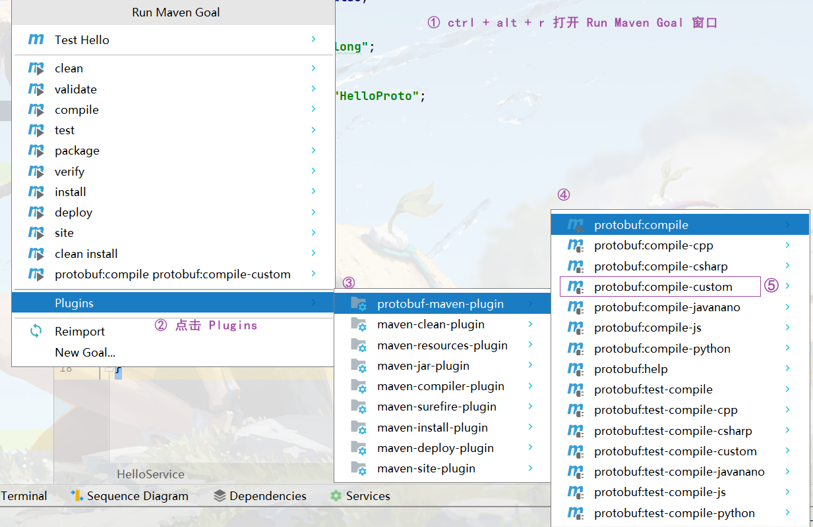
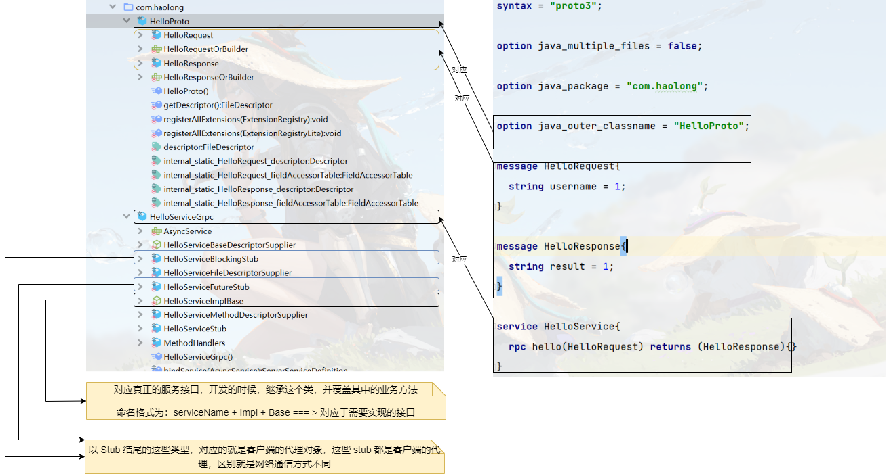
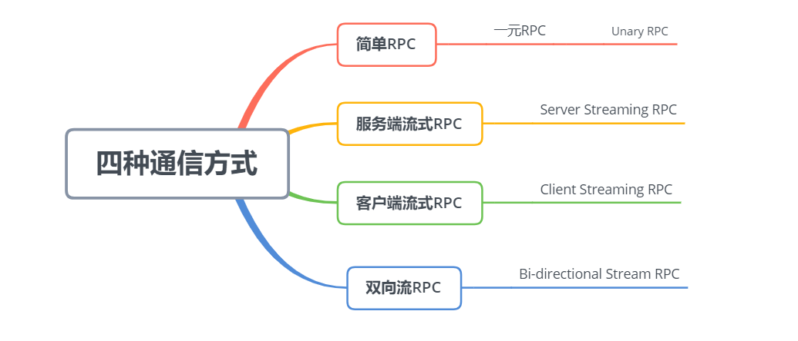
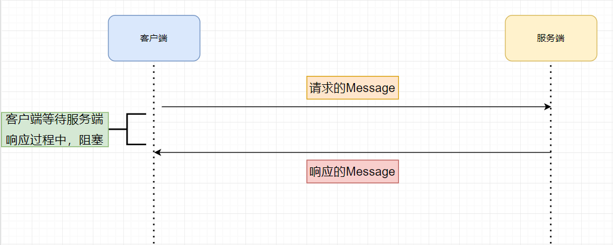
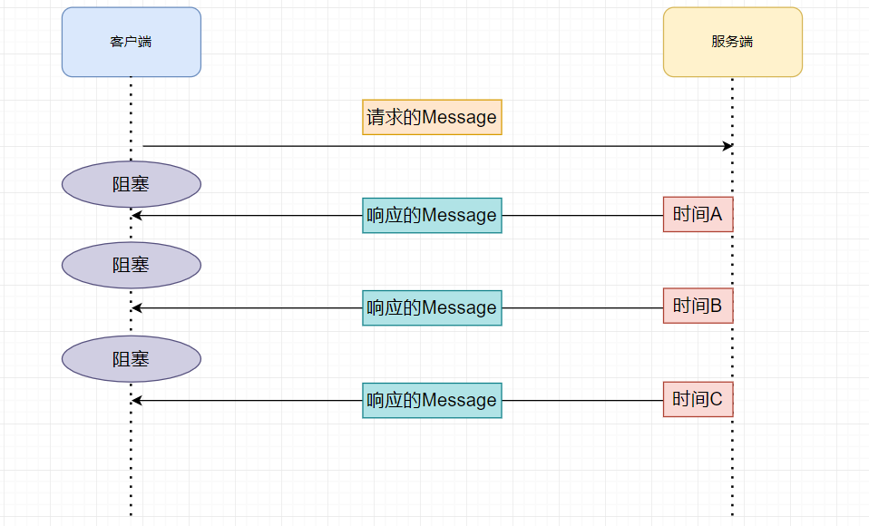

## 一、简介

gRpc 是有 google 开源的一个高性能的 RPC 框架。

1. 网络通信：gRPC自己封装了网络通信部分，提供多种语言的网络通信的封装
2. 协议：HTTP2 ，传输数据的时候，直接使用的是二进制数据。支持双向数据流
3. 序列化：使用二进制序列化方式，这种二进制方式叫做 protobuf，是google开源的一种序列化方式
    - 传输同样的数据的时候，使用protobuf ，在空间和时间效率是JSON的3到5倍
4. 代理的创建：让调用者向调用本地方法那样，去调用远端的服务方法

> <font style="color:black">gRPC 和 Thrift RPC 的区别</font>
>
> - 共性：两者都是支持异构语言的RPC框架
> - 区别
>     - 协议：Thrift RPC 使用 TCP；gRPC 使用 HTTP2
>     - 性能：Thrift RPC 效率是高于 gRPC

gRPC 的好处

- 高效的进行进程间的通信
- 支持多种语言，原生支持C,Go，Java实现
- 支持多平台运行，如 Linux，Android，IOS，MacOS，Windows
- 序列化方式使用 protobuf，效率更高 
- 使用HTPP2.0 协议

## 二、HTTP 2.0 协议

对于 HTTP 1.0 协议，采用请求响应的模式，是一个短连接协议，也可以称之为无状态协议，只能是单工通信，无法实现服务器的推送（这种有一个变现实现推送 ==> 客户端轮训的方式）

> <font style="color:black">TCP 是一个长连接协议，为什么 HTTP 是一个短连接协议呢？</font>
>
> 解答：HTTP 主动去断开的

对于 HTTP 1.1 协议，采用请求响应的模式，能够实现有限的长连接。

- 衍生技术：WebSocket，可是实现双工通信，实现服务器向客户端推送信息

> <font style="color:black">如何实现有限的长连接</font>
>
> 解答：请求头之中的 `keep-alive`

对于 HTTP 1.x 系列的协议，共性

- 传输数据采用文本格式，虽然可读性好，但是效率较差
- 本质上无法实现双工通信
- 资源的请求，需要发送多个请求，建立多个连接才能够完成

对于 HTTP 2.0 协议，是一个二进制协议，效率高于 HTTP 1.X 协议，但是可读性差；支持双工通信；一个请求，一个连接可以请求多个数据，定义了一个“流”的概念，它是二进制帧的双向传输序列，同一个消息往返的帧会分配一个唯一的流 ID。你可以把它想象成是一个虚拟的“数据流”，在里面流动的是一串有先后顺序的数据帧，这些数据帧按照次序组装起来就是 HTTP/1 里的请求报文和响应报文。

数据流的优先级：为不同的 stream 设置权重，来限制不同流的传输顺序

流控：客户端发送的速度比较快，服务端处理不过来，通知客户端暂停数据的发送

## 三、Protocol Buffers

> 简称：protobuf

`protobuf`，是一种与语言无关，与平台无关，定义了中间语言，可以方便的在 客户端 和 服务端 之间进行RPC的数据传输

目前而言，protobuf 有两个版本，protobuf2 和 protobuf3，但是目前主流的版本是protobuf3

在使用过程之中，需要安装protobuf的编译器，编译器的目的，可以把protobuf 的IDL语言，转换成具体的某一种开发语言

### 3.1 编译器安装

```markdown
# GitHub 地址
https://github.com/protocolbuffers/protobuf/releases

# 对应版本的地址
https://github.com/protocolbuffers/protobuf/releases/tag/v3.19.6

# 直接解压缩即可

# 配置环境变量
配置到对应的bin目录之下

# 验证
protoc --version

# IDEA 插件安装
2021.2 版本之后的新版本，IDEA 内置了 Protobuf 插件
```

### 3.2 语法

在学习语法之前，首先进行环境的搭建，在上一小节之中，已经安装了对应的编译器，在IDEA之中，创建一个新的 Module，作为 学习工程。

- 文件格式：文件的后缀名

```markdown
.proto
```

- 版本设定：`.proto`文件的第一行

```markdown
syntax = "proto3";
```

在我们新建一个 Module 之后，建立一个文件夹用来存放所有的 protobuf 文件，并新建一个 `demo.proto`开始学习下面的语法

1）单行注释

```markdown
//
```

2）多行注释

```markdown
/* */
```

03）与 Java 语言相关的语法

```markdown
# 后续 protobuf 生成的 Java 代码，为一个源文件还是多个源文件,这个值是可选的
option java_multiple_files = true / false;

# 指定 protobuf 生成的类，放在那个一个包之中
option java_package = "";

# 指定 protobuf 生成的外部类的名称，用于管理内部类，内部类才是真正开发使用
option java_outer_classname = "";
```

04）逻辑包

- 对于 Java 工程师，这个用的少

```markdown
# 对于 protobuf 对于文件内容的管理
package xxx;
```

05）导入

```markdown
import "XXXX"
```

06） 基本类型

这里，可以去看看对应的官网

```markdown
https://protobuf.dev/programming-guides/proto3/
```

07）枚举

- 枚举的值，必须从 0 开始

```protobuf
enum SEASON = {
	SPRING = 0;
	SUMMER = 1;
}
```

08）Message

- 注意：这里的 1 表示 这个字段在里面的编号
- 编号从1开始，到 2^29 - 1结束，其中，19000 - 19999这个范围之中的编号不能够使用，由protobuf自己保留
- 关键字
    - `singular`：表示这个字段的值只能是 0 个或者 1个，默认关键字
    - `repeated`：表示这个字段的返回值是多个
    - `oneof`：表示只能使用里面的一个，后续如果使用name这个变量，只能是 `username` 和 `nickname` 其中的一个
- 可以定义多个消息
- 消息可以嵌套，如一个 消息里面定义了另一个 message ，比如示例三

```protobuf
message LoginRequest {
  string username = 1;
}
// 示例二
message UserInfo {
  oneof name {
    string username = 1;
    string nickname = 2;
  }
}
// 示例三
message User {
  message school {  
  }
}
```

09）服务

- 里面可以定义多个服务方法
- 定义多个服务接口

```protobuf
service HelloService {
	rpc hello(HelloRequest) returns(HelloResponse){};
}
```

## 四、第一个 gRPC 开发

### 4.1 准备

```markdown
protoc --java_out=/xxx/xxx

# 实战之中使用 Maven 插件 进行 protobuf IDL文件的编译，并将它放置到IDEA的具体位置之上

https://github.com/grpc/grpc-java
```

按照这个 github 中的步骤，我们需要在Maven配置文件之中，引入了依赖和对应的插件

1）添加依赖

```xml
<dependencies>
    <dependency>
        <groupId>io.grpc</groupId>
        <artifactId>grpc-netty-shaded</artifactId>
        <version>1.54.1</version>
        <scope>runtime</scope>
    </dependency>
    <dependency>
        <groupId>io.grpc</groupId>
        <artifactId>grpc-protobuf</artifactId>
        <version>1.54.1</version>
    </dependency>
    <dependency>
        <groupId>io.grpc</groupId>
        <artifactId>grpc-stub</artifactId>
        <version>1.54.1</version>
    </dependency>
    <dependency> <!-- necessary for Java 9+ -->
        <groupId>org.apache.tomcat</groupId>
        <artifactId>annotations-api</artifactId>
        <version>6.0.53</version>
        <scope>provided</scope>
    </dependency>
</dependencies>
```

2）Maven 添加插件信息

```xml
<build>
    <extensions>
        <extension>
            <groupId>kr.motd.maven</groupId>
            <artifactId>os-maven-plugin</artifactId>
            <version>1.7.1</version>
        </extension>
    </extensions>
    <plugins>
        <plugin>
            <groupId>org.xolstice.maven.plugins</groupId>
            <artifactId>protobuf-maven-plugin</artifactId>
            <version>0.6.1</version>
            <configuration>
                <!--
                  1. ${os.detected.classifier} 获取操作系统的类型
                  2. com.google.protobuf:protoc 生成Message
                  3. io.grpc:protoc-gen-grpc-java 生成服务接口
                -->
                <protocArtifact>
                    com.google.protobuf:protoc:3.21.7:exe:${os.detected.classifier}
                </protocArtifact>
                <pluginId>
                    grpc-java
                </pluginId>
                <pluginArtifact>
                    io.grpc:protoc-gen-grpc-java:1.54.1:exe:${os.detected.classifier}
                </pluginArtifact>
            </configuration>
            <executions>
                <execution>
                    <goals>
                        <!--
                           1. compile 用于生成Message的命令
                           2. compile-custom 用于生成服务接口的命令
                         -->
                        <goal>compile</goal>
                        <goal>compile-custom</goal>
                    </goals>
                </execution>
            </executions>
        </plugin>
    </plugins>
</build>
```

在完成了上面的准备工作之中，我们首先来搭建项目的结构，和 `Thrift RPC` 开发过程之中的一样，我们需要api模块，server模块，client模块。按照正常的开发顺序，我们首先来开发 api 模块

### 4.2 Api 模块

在这个模块之中，我们首先来编写我们的 proto 文件。我们这里将 proto 文件统一放在 `src/main/proto`目录之下。

建立 Hello.proto 文件，在文件中编写如下内容：

```proto
syntax = "proto3";

option java_multiple_files = false;

option java_package = "com.haolong";

option java_outer_classname = "HelloProto";

message HelloRequest{
  string username = 1;
}

message HelloResponse{
  string result = 1;
}

service HelloService{
  rpc hello(HelloRequest) returns (HelloResponse){}
}
```

编写完成，我们需要将这个文件中编写的内容，按照如下的步骤，将 IDL 语言进行转化



不过这里发现，通过上面的步骤，执行完成之后，编译之后的文件是放在 target 目录之下的，在后续的步骤之中，我们还需要将生成的文件复制放在 java 目录之下，为了方便操作，我们对Maven 配置文件做一下修改，调整文件的生成位置

```xml
<build>
    <extensions>
        <extension>
            <groupId>kr.motd.maven</groupId>
            <artifactId>os-maven-plugin</artifactId>
            <version>1.7.1</version>
        </extension>
    </extensions>
    <plugins>
        <plugin>
            <groupId>org.xolstice.maven.plugins</groupId>
            <artifactId>protobuf-maven-plugin</artifactId>
            <version>0.6.1</version>
            <configuration>
                <!--
                  1. ${os.detected.classifier} 获取操作系统的类型
                  2. com.google.protobuf:protoc 生成Message
                  3. io.grpc:protoc-gen-grpc-java 生成服务接口
                -->
                <protocArtifact>
                    com.google.protobuf:protoc:3.21.7:exe:${os.detected.classifier}
                </protocArtifact>
                <pluginId>
                    grpc-java
                </pluginId>
                <pluginArtifact>
                    io.grpc:protoc-gen-grpc-java:1.54.1:exe:${os.detected.classifier}
                </pluginArtifact>
                <outputDirectory>
                    ${basedir}/src/main/java
                </outputDirectory>
                <clearOutputDirectory>
                    false
                </clearOutputDirectory>
            </configuration>
            <executions>
                <execution>
                    <goals>
                        <!--
                          1. compile 用于生成Message的命令
                          2. compile-custom 用于生成服务接口的命令
                        -->
                        <goal>compile</goal>
                        <goal>compile-custom</goal>
                    </goals>
                </execution>
            </executions>
        </plugin>
    </plugins>
</build>
```

到这里为止，api 模块生成的文件已经生成完成了。接下来就来看一下生成好的文件之中包含哪些内容，如下图所示：



### 4.3 Server 模块

1）引入依赖：首先需要引入api模块

```xml
<dependencies>
    <dependency>
        <groupId>com.haolong</groupId>
        <artifactId>rpc-grpc-api</artifactId>
        <version>1.0-SNAPSHOT</version>
    </dependency>
</dependencies>
```

2）创建具体的实现类

```java
public class HelloServiceImpl extends HelloServiceGrpc.HelloServiceImplBase {
    @Override
    public void hello(HelloProto.HelloRequest request, StreamObserver<HelloProto.HelloResponse> responseObserver) 	  {

    }
}
```

> <font style="color:black">通过实现上述我们所说的 `HelloServiceImplBase` 之后，实现了对应的方法，但是我们发现这个方法居然没有返回值，并且我们在 proto文件之中定义了一个方法参数，但是这里有两个？</font>
>
> 解答：真正进行 GRPC实现的过程之中，业务方法的返回值在参数之中进行处理，通过观察者设计模式来设计

我们完善一下里面的方法内容

- 对于 Message 之中，属性的获取，gRPC 为我们提供了`getXXX()` 方法
- 对于`4.2`中的代码，如果不写，客户端程序即时发送完成了，也会一直等待

```java
@Override
public void hello(HelloProto.HelloRequest request, StreamObserver<HelloProto.HelloResponse> responseObserver) {
    // 1. 接受客户端的请求参数
    String username = request.getUsername();
    // 2. 业务处理
    System.out.println("username = " + username);
    // 3. 封装响应
    // 3.1 创建响应对象的构造者
    HelloProto.HelloResponse.Builder builder = HelloProto.HelloResponse.newBuilder();
    // 3.2 填充数据
    builder.setResult("method invoke success");
    // 3.3 封装响应对象
    HelloProto.HelloResponse response = builder.build();
    // 4. 结果返回
    // 4.1 处理后的响应的消息，通过网络回传客户端
    responseObserver.onNext(response);
    // 4.2 通知客户端，响应已经结束了
    responseObserver.onCompleted();
}
```

3）开启服务端

```java
public class GrpcServerMain {
    public static void main(String[] args) throws IOException, InterruptedException {
        // 1. 绑定端口
        ServerBuilder serverBuilder = ServerBuilder.forPort(9000);
        // 2. 发布服务
        serverBuilder.addService(new HelloServiceImpl());
        // 3. 创建服务对象
        Server server = serverBuilder.build();
        // 4. 开启服务
        server.start();
        server.awaitTermination();
    }
}
```

### 4.4 Client 模块

```java
public class ClientMain {
    public static void main(String[] args) {
        // 1. 创建通信的管道
        ManagedChannel managedChannel = ManagedChannelBuilder.forAddress("localhost",9000).usePlaintext().build();
        // 2. 获得代理对象
        try {
            HelloServiceGrpc.HelloServiceBlockingStub helloService = HelloServiceGrpc.newBlockingStub(managedChannel);
            // 3. 完成 RPC 调用
            // 3.1 准备参数
            HelloProto.HelloRequest.Builder builder = HelloProto.HelloRequest.newBuilder();
            builder.setUsername("haolong");
            HelloProto.HelloRequest request = builder.build();
            HelloProto.HelloResponse response = helloService.hello(request);
            System.out.println("response = " + response);
        } catch (Exception e) {
            e.printStackTrace();
        } finally {
            // 4. 关闭连接
            managedChannel.shutdown();
        }
    }
}
```

到这里为止，我们的第一个 gRPC 流程开发就完成了！

## 五、gRPC 的四种通信方式



### 5.1 简单RPC



### 5.2 服务端流式RPC

> 一个请求对象，服务端可以回传多个结果对象




语法

```protobuf
service HelloService{
  rpc hello(HelloRequest) returns (stream HelloResponse){}
}
```

### 5.3 客户端流式RPC