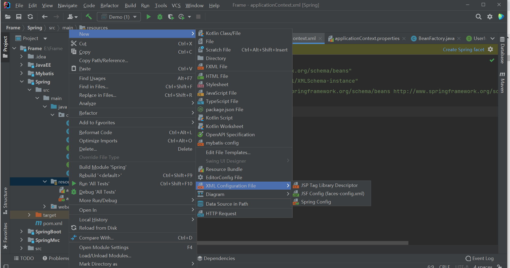
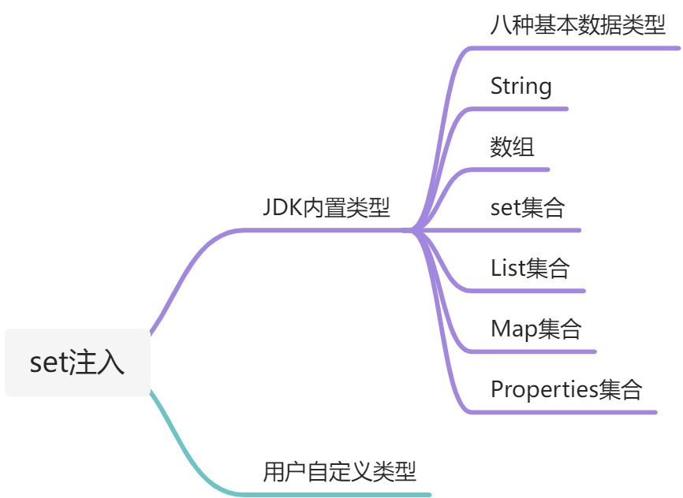

## 一、 概述

### 1.1 基本信息
Spring 解决企业开发的难度，减轻对项目模块之间的管理，类和类之间的管理，帮助开发人员创建对象，管理对象之间的关系。

**Spring 是一个轻量级的，非侵入式的控制反转和面向切面AOP的框架**

### 1.2 优点

1）`轻量`：Spring框架使用的jar都比较小，运行占用的资源少，运行效率高，不依赖其他的jar

2）`针对接口编程，解耦合 `

- Spring提供了 Ioc 控制反转，由容器管理对象，对象之间的依赖关系
- 原来在程序代码中的对象创建方式，现在由容器完成，对象之间的依赖解耦合

3）`Aop编程的支持 `

- 通过Spring提供的AOP功能，方便进行面向切面的的编程，许多不容易用传统OOP实现的功能通过AOP轻松应对

4）`方便集成各种优秀的框架`

### 1.3 工厂设计模式
#### 01 原编码方式
1）UserDao

```java
public interface UserDao {
    public void register(User user);
    public void login(User user);
}

```
2）接口实现类：UserDaoImpl

```java
public class UserDaoImpl implements UserDao{
    @Override
    public void register(User user) {
        System.out.println("注册 " + user);
    }

    @Override
    public void login(User user) {
        System.out.println("登录 " + user);

    }
}

```
3）UserService

```java
public interface UserService {
    public void register(User user);
    public void login(User user);
}

```
4）接口实现类：UserServiceImpl

```java
public class UserServiceImpl implements UserService{
    private UserDao userDao = new UserDaoImpl();
    @Override
    public void register(User user) {
        userDao.register(user);
    }

    @Override
    public void login(User user) {
        userDao.login(user);
    }
}

```
5）调用

```java
public class Demo {
    @Test
    public void test1(){
        UserService userService = new UserServiceImpl();
        User user = new User("freedom","123456");
        userService.login(user);
        userService.register(user);
    }
}

```
以上就是在JavaWeb阶段，我们所使用的开发方式，但是会出现下面的这些问题：

- 代码之间的耦合度比较高，一方发生改变，另外一方就要发生改变；如果说之后我不想要这个实现类了，会直接修改代码
- 简单来讲，就是把接口的实现类，硬编码到程序中，如果说 我之后给`UserService` 这个接口，换一个实现类，会直接修改Demo这个类的代码，不符合对拓展开放，对修改关闭的设计原则

#### 02 反射工厂

>‘’‘
>
>​	反射工厂：创建一个工厂，我们需要什么对象，从工厂中拿就行了
>
>’‘’

这样的好处就是：如果说我们以后不想要现在的这个接口实现类的时候，我们只需要在配置文件中进行修改实现类名称即可

步骤一：创建一个配置文件 `application.properties`

```properties
userService = com.spring.basic.UserServiceImpl
userDao = com.spring.basic.UserDaoImpl
```
步骤二：创建工厂

- 将 接口的实现类名称 放在配置文件中，通过 **反射** 进行创建对象
```java
public class BeanFactory {
    private BeanFactory(){}
    public static Properties properties = new Properties();
    static{
        //从配置文件中读取信息
        try {
            properties = new Properties();
            //从配置文件中读取信息
            InputStream resourceAsStream =
                BeanFactory.class.getClassLoader().getResourceAsStream("/applicationContext.properties");
            properties.load(resourceAsStream);
        } catch (FileNotFoundException e) {
            e.printStackTrace();
        } catch (IOException e) {
            e.printStackTrace();
        }
    }
    public static Object getBean(String className) throws ClassNotFoundException, InstantiationException, IllegalAccessException {
        Class c = Class.forName(properties.getProperty(className));
        Object res = c.newInstance();
        return res;
    }
}
```

步骤三：调用
```java
UserService userService =(UserService) BeanFactory.getBean("userService");
User user = new User("freedom","123456");
userService.login(user);
userService.register(user);
```
### 1.4 总结
在工厂设计模式中，我们需要自己去创建`这个工厂`完成解耦合，现在，Spring框架为我们提供了这个工厂 （ApplicatonContext）

- 这里的`ApplicationContext` ，就相当于我们在工厂模式之下的`BeanFactory`
- 工厂模式之下的配置文件就是这里的`applicationContext.properties`
- 我们通过这个名字来进行对象的获取
## 二、 第一个Spring程序
### 2.1 环境搭建
1）maven中加入Spring的依赖

```xml
<dependency>
  <groupId>org.springframework</groupId>
  <artifactId>spring-context</artifactId>
  <version>5.3.5</version>
</dependency>
```
2）创建 Spring 的配置文件


```xml
<?xml version="1.0" encoding="UTF-8"?>
<beans xmlns="http://www.springframework.org/schema/beans"
       xmlns:xsi="http://www.w3.org/2001/XMLSchema-instance"
       xsi:schemaLocation="http://www.springframework.org/schema/beans 
                           http://www.springframework.org/schema/beans/spring-beans.xsd">

</beans>
```
### 2.2 ApplicatonContext
Spring提供`ApplicationContext`这个工厂，用于对象的创建 ，所带来的好处就是解耦合，但是这个工厂就是一个接口，主要的原因就是用来屏蔽实现的差异，在不同的环境之下，有不同的实现：

- 非Web环境：`ClassPathXMlApplicationContext`
- web环境：`XmlWebApplicationContext`

这个工厂是一个重量级资源  

> **BeanFactory**

- `BeanFactory`是类的通用工厂，可以创建并管理各种类的对象。提供了一个抽象的配置和对象的管理机制
- `ApplicatonContext `是`BeanFactory`的 子接口，简化了AOP的整合，消息机制，时间机制，以及对Web环境的扩展，BeanFactory是没有这些扩展的。
> **主要看占用内存的情况**

- `ApplicationContext`  工厂的对象占用大量的内存，所以说不会频繁的创建对象，一个应用只会创建一个工厂对象
- `ApplicationContext`工厂一定是线程安全的，也就是说 支持多线程 并发访问
> **BeanFactory 和 ApplicationContext的区别**

- `BeanFactory`是类的通用工厂，可以创建并管理各种类的对象。提供了一个抽象的配置和对象的管理机制，`ApplicatonContext `是`BeanFactory`的 子接口，简化了AOP的整合，消息机制，时间机制，以及对Web环境的扩展，BeanFactory是没有这些扩展的。
> **IOC 容器的定义**

- 通用职责
- 依赖处理
   - 依赖查找
   - 依赖注入
- 生命周期管理
   - 容器
   - 托管资源，JaveBeans
- 配置
   - 容器
   - 外部化配置
   - 托管资源
### 2.3 程序开发
创建类型

```java
@Data
@AllArgsConstructor
@NoArgsConstructor
public class User {
    private String username;
    private String password;
}
```
配置文件的配置

```xml
<?xml version="1.0" encoding="UTF-8"?>
<beans xmlns="http://www.springframework.org/schema/beans"
       xmlns:xsi="http://www.w3.org/2001/XMLSchema-instance"
       xsi:schemaLocation="http://www.springframework.org/schema/beans http://www.springframework.org/schema/beans/spring-beans.xsd">
    <bean id="user" class="com.spring.basic.User"></bean>
</beans>
```

`beans`是根标签 

声明`bean`，就是告诉Spring要创建某个类的对象 
- id：对象的自定义名称，唯一值
- class：类的全限定名称

> 注意这里的全限定名称不能是接口，因为Spring是反射机制创建对象，所以说必须使用具体的类

**Spring就是把创建好的对象放到**`map`**中，Spring框架有一个map存放对象 **

当扫描这个配置文件的时候，如果说遇见了 bean 标签，就意味着调用这个类的构造方法 

03 通过工厂获取对象

通过getBean方法进行获取对象的方式，就是依赖查找
```java
1. 创建工厂
String config = "/applicationContext.xml";
ApplicationContext ac = new ClassPathXmlApplicationContext(config);

2. 通过工厂获取对象
User user = (User) ac.getBean("user");
```
### 2.4 细节分析
> Spring 工厂所创建的对象，叫做 `bean`或者是组件 `component`

01 相关方法

- **获取工厂信息**
```java
1. 获取工厂中定义的对象的数量: int nums  = ac.getBeanDefinitionCount(); 

2. 获取工厂中定义的对象的ID:   String[] str = ac.getBeanDefinitionNames();

3. 获取工厂中指定类型的对象的ID: String[] res = ac.getBeanNamesForType(User.class);

4. 用于判断 是否存在指定id值的bean: ac.containsBeanDefinition("user")
    
5. 用于判断是否存在指定id值的bean，也可以判断name值: ac.containsBean("user")
```

- **getBean的重载**
```markdown
方式一:  User user_1 = (User) ac.getBean("user");

方式二:  User user_2 = ac.getBean(User.class);

方式三:  User user_3 = ac.getBean("user",User.class)
```

- 如果说一个类忘记了，没有注入到Spring容器中，但是获取的时候 又想获取到
```java
ApplicationContext ac = new ClassPathXmlApplicationContext("applicationContext.xml");
ObjectProvider<A> objectProvider = ac.getBeanProvider(A.class);
A a = objectProvider.getIfAvailable(A::new);
```
4.2 配置文件

1. 如果说我们在创建Bean的时候，  不给定  id  值，  Spring会自动创建一个`全限定名#0`
- 如果说这个 bean  只需要使用一次，  那么就可以省略
- 如果说这个  bean  会使用多次，或者是被其他bean引用的时候，就需要设置id值
2.  **name属性 **
- 作用：用于在Spring的配置文件中，  **为bean对象定义别名**，  ID是唯一标识 
- 与  id  的区别 
   - 别名可以定义多个，  但是  id  属性只能有一个值 
   - XML的 id  属性值，  命名要求： 必须以字母开头，不能以特殊字符开头 ；到目前为止，没有限制
   - XML的 name 属性，命名没有要求 
   - 代码区别 
```java
  用于判断 是否存在指定id值得到bean，不能判断name值
  ac.containsBeanDefinition("user")
      
  用于判断是否存在指定id值得到bean，也可以判断name值
  ac.containsBean("user")
```
### 2.5 Spring工厂底层实现原理

1. 通过  `ClassPathXmlApplicationContext`  工厂读取配置文件 `applicatonContext.xml`
2. 获取 `bean标签`  的相关信息
3. 通过反射创建对象， **底层会调用构造方法**， 也就是说， 这里 **等效于new创建对象**
   1. 即使构造方法是私有的，  Spring工厂还是会调用
4. 通过 `getBean()方法`获取对象，返回给使用者
### 2.6 思考

1. 理论上说，所有的对象，都会交给Spring工厂来创建
2. 但是，实体对象，是不会交给Spring容器进行创建，他是交给持久层框架进行创建
## 三、日志框架进行整合
> 整合之后，可以在控制台，看到Spring中的一些重要信息，方便我们了解Spring框架的运行过程，便于程序的调试

### 3.1 添加依赖

- Spring5.x 默认整合的日志框架：`logback`  `log4j2`
- 这里引入log4j
```xml
<dependency>
  <groupId>log4j</groupId>
  <artifactId>log4j</artifactId>
  <version>1.2.17</version>
</dependency>
<!--让Spring框架支持log4j，屏蔽默认的日志框架-->
<dependency>
  <groupId>org.slf4j</groupId>
  <artifactId>slf4j-log4j12</artifactId>
  <version>2.0.0-alpha5</version>
  <scope>test</scope>
</dependency>
```
#### 3.2 添加 log4j 的依赖文件
> 必须放在   resources  下

```properties
log4j.rootLogger=debug,console
log4j.appender.console=org.apache.log4j.ConsoleAppender
log4j.appender.console.Target=System.out
log4j.appender.console.layout=org.apache.log4j.PatternLayout
log4j.appender.console.layout.ConversionPattern=%d{yyyy-MM-dd HH:mm:ss} %-5p %c{1}:%L-%m%n
```
## 四、依赖注入

1）什么是注入

- **通过Spring工厂以及配置文件，为所创建的对象的成员变量赋值**

2）为什么需要注入

- 通过编码的方式，为成员变量进行赋值，存在耦合

3）注入方式

- set注入
- 构造注入
## 五、set 注入
### 5.1 概述

实质上调用的是**set方法，**必须有set方法，没有是错误的，只要set方法在就行了，也就说这个属性不一定要存在

**针对不同类型的成员变量，在**`<property>`**标签之中，嵌套其他类型的标签**


### 5.2 JDK内置类型
#### 01 基本数据类型 和 String

- 对于基本数据类型和String，都使用`**value标签**`进行标签进行赋值
- 这里的 name就是对象的属性名
```xml
<bean id="user" class="com.spring.model.User">
    <property name="username">
        <value>编程小菜鸡</value>
    </property>
</bean>
```

#### 02  数组类型

- 对于数组类型，使用`list标签`进行注入，然后在list标签中，对数组元素进行注入，因为这里是基本类型，这里使用value标签

```xml
<bean id="user" class="com.spring.model.User">
    <property name="arr">
        <list>
            <value>1</value>
            <value>2</value>
            <value>3</value>
        </list>
    </property>
</bean>
```

#### 03 set集合

- 对set集合进行注入，使用set标签，针对Set集合的泛型，使用不同的标签进行注入
```xml
<bean id="user" class="com.spring.model.User">
    <property name="set">
        <set>
            <value>111</value>
        </set>
    </property>
</bean>
```

#### 04 list集合

- 对于`List集合`，使用`list标签`进行注入
- 针对 `List`集合的泛型，选择不同的标签对集合中的元素进行注入
```xml
<bean id="user" class="com.spring.model.User">
    <property name="list">
        <list>
            <value>111</value>
        </list>
    </property>
</bean>
```

#### 05 Map集合

- 对于Map集合，使用`map标签`进行注入。
- 对于每一个键值对，使用`entry标签`，进行注入
- 在entry标签之中，使用`key标签`对键进行注入
```xml
<bean id="user" class="com.spring.model.User">
    <property name="map">
        <map>
            <entry>
                <key>
                    <value>1</value>
                </key>
                <value>1</value>
            </entry>
        </map>
    </property>
</bean>
```

#### 06 Properties集合
> Properties 类型，是特殊的Map集合，有因为键和值都是String类型

```xml
<bean id="user" class="com.spring.model.User">
    <property name="properties">
        <props>
            <prop key="key1">佩奇</prop>
            <prop key="key2">乔治</prop>
        </props>
    </property>
</bean>
```
### 5.3  用户自定义类型
对于用户自定义类型，首先可以通过在 property 之中，直接添加对应的 `bean` 标签实现对应的属性注入

```xml
<bean id="user" class="com.spring.model.User">
    <property name="address">
        <bean class="com.spring.model.Address">
            <property name="address">
                <value>甘肃省兰州市</value>
            </property>
        </bean>
    </property>
</bean>
```

但是如果说后续有别的对象，仍然想使用这个Address对象，通过这种方式，就会显得冗余，则可以通过下面的这种方式，在对应的`property`标签之中，添加`ref`属性来进行实现：

```xml
<bean id="student" class="com.hl.spring.Student">   
    <property name="school" ref="school"/>
</bean>

<bean id="school" class="com.hl.spring.School">   
    <property name="name" value="佩奇"></property>    
</bean>
```
通过上面的方式，能够实现对应的属性注入，但是，都是通过我们手动编写对应的代码来实现的注入。在`Spring`之中根据某些规则可以给引用类型赋值，使用的规则最常用的就是`byName`、`byType`。接下来，也将对这两种方式，进行说明

1）byName

- Java类中引用类型的属性名和Spring容器中(配置文件)bean的id名称一样，且数据类型是一致的，这样的容器中的bean，Spring能够赋值给引用类型
- 实现方式就是在bean中加入`autowire = "byName"`
- **代码说明**
```xml
<bean id="student" class="com.hl.spring.Student" autowire="byName">
    <property name="id"        value="1"></property>
    <property name="name"      value="张三"></property>
    <property name="sex"       value="男"></property>
    <property name="password"  value="123456"></property>
</bean>
<bean id="school" class="com.hl.spring.School">
    <property name="name" value="XXX大学"></property>
</bean>
```
2）byType

- 按照类型注入，Java类中引用类型的数据类型和spring容器中（配置文件）的class属性是同源关系的，这样的bean能够赋值给引用类型
- 在bean中加入`autowire = "byType"`
- 同源
    - Java类中引用类型的数据类型和bean的class的值是一样的 
    - Java类中引用类型的数据类型和bean的class的值是父子关系 
    - Java类中应用类型的数据类型和bean的class的值接口和实现类关系 
- 注意事项
    - 在xml配置文件中声明bean只能有一个符合条件的 
    - 多于一个是错误的 
- 代码说明

```xml
<bean id="student" class="com.hl.spring.Student" autowire="byType">
    <property name="id"       value="1"></property>
    <property name="name"     value="张三"></property>
    <property name="sex"      value="男"></property>
    <property name="password" value="123456"></property>
</bean>
<bean id="school" class="com.hl.spring.School">
    <property name="name" value="兰州理工大学"></property>
</bean>
```

### 5.4 简化书写
```xml
<bean id="user" class="com.spring.model.User" p:name="佩奇" p:address-ref="address"></bean>
<bean id="address" class="com.spring.model.Address" p:address="甘肃兰州"></bean>
```

### 5.5 使用多配置文件
当项目规模比较大的时候，使用多个配置文件，这样做会带来如下的好处：

- 每个文件的大小比一个文件小很多
- 效率高
- 避免多人竞争带来的冲突
- 如果说你的项目有多个模块，一个模块设置一个配置文件

多文件的分配方式

- 按功能模块：一个模块一个配置文件
- 按照类的功能：数据库相关的配置一个文件配置文件，做事务的功能一个配置文件，做service功能的一个配置文件等

**语法**

- `resource`是指其他配置文件的路径
- `classpath`表示类路径（class文件所在的目录），告诉Spring去哪里加载
- 在包含关系的配置文件中，可以使用通配符(*)表示任意字符---注意：这些文件都必须放在同一个目录中
```xml
<import resource="classpath:配置文件名称"></import>
```
## 六、构造注入
spring调用有参数的构造函数
```java
public Student(int id, String name, String sex, School school, String password) {
    this.id = id;       
    this.school = school;
}
```

### 6.1 通过 index 属性

构造方法中的形参，从左向右依次进行排序，从0开始。这里的index是可以省略的

```xml
<bean id="student" class="com.hl.spring.Student">
    
    <constructor-arg index="0" value="1"></constructor-arg>
    
    <constructor-arg index="1" ref="school"></constructor-arg>
</bean>

<bean id="school" class="com.hl.spring.School">

    <property name="name" value="兰州理工大学"></property>

</bean>
```
### 6.2 通过name属性

- name值构造方法中的形参值
- value是赋值
```xml
<bean id="student" class="com.hl.spring.Student">
    
    <constructor-arg name="id"  value="1"></constructor-arg>
    
    <constructor-arg name="school"  ref="school"></constructor-arg>
    
</bean>

<bean id="school" class="com.hl.spring.School">

    <property name="name" value="兰州理工大学"></property>

</bean>
```
## 七、Spring工厂创建复杂对象
### 7.1 简单对象 和 复杂对象

1）**简单对象**

- 指的就是直接通过new构造方法创建对象

2）**复杂对象**

- 指的是不能直接通过new构造方法创建对象
- 比如说：连接对象，`Mybatis中的 SqlSessionFactory`对象
### 7.2 创建复杂对象的方式
#### 01 FactoryBean接口
#### a. 开发
步骤一：创建类实现接口
```java
@Data
public class ConnectionFactoryBean implements FactoryBean<Connection> {
    // 需要指定泛型 表明我们需要创建什么对象
    private String driverClassName;
    private String url;
    private String user;
    private String password;
    @Override
    public Connection getObject() throws Exception {
        // 用来书写创建复杂对象的代码， 并将复杂对象作为方法的返回值进行返回
        Class.forName(driverClassName);
        Connection conn = DriverManager.getConnection(url,user,password);
        return conn;
    }

    @Override
    public Class<?> getObjectType() {
        // 返回所创建对象的Class对象
        return Connection.class;
    }

    @Override
    public boolean isSingleton() {
        // 控制 复杂对象的创建次数
        // 如果说返回false，则每次都会创建新的复杂对象；反之，只会创建一次
        return false;
    }
}
```
步骤二：Spring配置文件的配置

- 通过这个方式获得的**不是  **`ConnectionFactoryBean对象`，而是获得的是里面创建的`复杂对象`
```xml
<bean id="conn" class="com.spring.factoryBeam.ConnectionFactoryBean">
    <property name="driverClassName">
        <value>com.mysql.cj.jdbc.Driver</value>
    </property>
    <property name="url">
        <value>jdbc:mysql://localhost:3306/chat?serverTimezone=UTC</value>
    </property>
    <property name="user">
        <value>root</value>
    </property>
    <property name="password">
        <value>123456</value>
    </property>
</bean>
```

#### b. 细节分析

1. 如果说就想获得`FactoryBean`对象，可以在获取的时候使用`ac.getBean("&conn")`
2. `isSingleton`方法 
- 如果说返回true：只会创建一个复杂对象
- 如果说返回false：每一次都会创建一个新的对象
- 要根据这个对象的特点，决定最终是返回true还是false,如果说是连接对象，不能被共用，返回false
#### c.  运行流程

1. 当我们调Spring会获取bean标签的相关信息，并判断是否是`FactoryBean`的子类，如果说返回false，就使用new直接创建
2. 通过getObject方法中的逻辑创建对象
3. 返回对象
### 02 实例工厂
使用原因

1. 避免Spring框架的侵入
2. 整合遗留系统

遗留系统提供的连接
```java
public class ConnectionFactory {
    public Connection getConnection() throws ClassNotFoundException, SQLException {
        Class.forName("com.mysql.cj.jdbc.Driver");
        Connection conn = DriverManager.getConnection(
                "jdbc:mysql://localhost:3306/chat?serverTimezone=UTC",
                "root",
                "123456"
        );
        return conn;
    }
}
```
交给Spring进行整合
```xml
<bean name="connectionFactory" class="com.spring.factoryBeam.ConnectionFactory"></bean>
<bean id="conn" factory-bean="connectionFactory" factory-method="getConnection"></bean>
```
### 03 静态工厂
遗留系统
```java
public class ConnectionFactory {
    public static Connection getConnection() throws Exception {
        Class.forName("com.mysql.cj.jdbc.Driver");
        Connection conn = DriverManager.getConnection(
                "jdbc:mysql://localhost:3306/chat?serverTimezone=UTC",
                "root",
                "123456"
        );
        return conn;
    }
}
```

交给Spring进行整合
```xml
<bean id="conn" 
      class="com.spring.factoryBeam.ConnectionFactory" 
      factory-method="getConnection">
</bean>
```

## 八、 控制创建对象的次数
### 8.1 控制简单对象的创建次数

好处：节省不必要的内存浪费

通过添加`scope`属性：

- 如果说指定为  `singleton` ,  就只会创建一次；这个值就是默认值
- 如果说指定为 `prototype`,  就会创建多次
```xml
<bean id="account" scope="prototype" class="com.spring.model.Account"></bean>
```
### 8.2  控制复杂对象的创建次数
```markdown
1. 实现FactoryBean  
	在isSingleton，方法中，返回true，就只会创建一次，如果说返回false，就会创建多次

2. 如果说没有上述方法，还是通过scope属性，对此进行控制
```
## 九、对象的生命周期
### 9.1 什么是对象的生命周期
定义：对象从创建，存活，消亡的一个完整的过程
好处：有利于我们使用好Spring为我们创建的对象
### 9.2 生命周期的阶段

#### 01 创建阶段
> 何时创建对象

1. `scope="singleton"`
- Spring 工厂在创建的同时，完成对象的创建
- 如果说希望在获取对象在进行创建，在配置文件中加上 `lazy-init = "true"`
2. `scope="prototype"`
- Spring工厂在获取对象的时候，创建对象
#### 02 初始化阶段
> Spring 工厂在创建完对象之后，  调用对象的初始化方法， 完成对应的初始化方法
> 初始化方法是 程序员根据需求，  提供初始化方法，  最终完成初始化操作，  但是初始化方法是由Spring工厂进行调用

#### a. 初始化操作

- 方式一 ：实现接口`InitializingBean`
```java
public class Product implements InitializingBean {
    public Product(){
        System.out.println("Product.product");
    }

    @Override
    public void afterPropertiesSet() throws Exception {
        // 自定义需求
        System.out.println("Product.afterPropertiesSet");
    }
}
```

- 方式二：对象自定义方法，使用指定的bean中加入 `init-method = "方法名"`进行配置
```java
public class Product  {
    public Product(){
        System.out.println("Product.product");
    }
    public void init(){
        System.out.println("Product.init");
    }
}
```

```xml
<bean id="product"  scope="singleton" class="com.spring.life.Product" init-method="init">
  
</bean>
```
#### b. 细节分析

1. 如果说同时提供两种方式，  先执行接口提供的方法，  然后执行自定义初始化方法
2. 注入发生在初始化操作之前
3. 初始化一般用于资源的初始化：数据库， IO  ， 网络
#### 03 销毁阶段

- Spring销毁对象之前，会调用对象的销毁方法，完成销毁操作
- Spring在 工厂关闭的时候， 销毁所创建的对象
- 销毁方法：程序员根据自己的需求定义销毁方法，  完成销毁操作
- 调用:Spring工厂进行调用
#### a. 销毁操作

- 方式一 ：实现`DisposableBean接口`
```java
package com.spring.model;

import org.springframework.beans.factory.DisposableBean;

public class Account implements DisposableBean{
    @Override
    public void destroy() throws Exception {
        System.out.println("进行销毁");
    }
}
```

```java
@Test
public void test3(){
    ClassPathXmlApplicationContext ac = new ClassPathXmlApplicationContext("applicationContext.xml");
    ac.close();
}
```

- 方式二 ： 自定义方法，在指定bean中加入`destroy-method="自定义方法名"` 属性
```java
package com.spring.model;
public class Account {

    public void destroy(){
        System.out.println("销毁");
    }
}
```

```xml
<bean id="account" scope="singleton" class="com.spring.model.Account" destroy-method="destroy"></bean>
```
#### b. 细节分析

- 销毁方法的操作**只适用于** `scope=“singleton”`
- 主要是根据自己的需求，进行资源的释放
### 9.3 总结

1. 创建Spring工厂
2. 调用对象的构造方法
   1. scope="singleton" : 创建Spring工厂的时候，进行创建
   2. scope="prototype" : 获取对象的时候，进行创建
3. 依赖注入
4. 执行初始化操作
5. 执行销毁操作
## 十、 配置文件参数化
把Spring配置文件中需要**经常进行修改**的字符串信息，转移到 一个更小的配置文件中

以 `FactoryBean` 接口创建数据库连接对象举例

- 提供一个小的配置文件`db.properties`
- 注意：这里的配置文件中的key尽量不要使用username，在Spring的配置文件出现错误
```properties
driverName = com.mysql.cj.jdbc.Driver
url = jdbc:mysql://localhost:3306/frame?serverTimezone=UTC
name = root
password = 123456
```

- Spring 配置文件 与 小配置文件进行整合
   - 在Spring的主配置文件中加入这一行代码
```xml
 <context:property-placeholder location="db.properties" />
```

- 在Spring配置文件中进行取值
```xml
<bean id="conn" class="com.spring.factorybean.ConnectionFactoryBean">
      <property name="driverClassName" value="${driverName}"/>
      <property name="url" value="${url}"></property>
      <property name="name" value="${name}"></property>
      <property name="password" value="${password}"></property>
</bean>
```
## 十一、 自定义类型转换器

- 类型转化器
> 作用：Spring通过类型转换器把配置文件中字符串类型的数据，转换成为对象中成员变量对应类型的数据，从而完成注入

- 自定义类型转化器
> 当Spring内部没有提供特定类型转换器的时候，而程序员在应用的过程中还需要使用，那么就需要程序员自定义类型转换器

### 11.1 编写类型转换器
```java
@Data
public class MyConverter implements Converter<String, Date> {
    private String pattern;
    /*
    * 将字符串类型转为 Date类型
    * */
    @Override
    public Date convert(String source) {
        System.out.println("MyConverter.convert");
        SimpleDateFormat simpleDateFormat = new SimpleDateFormat(pattern);
        Date date = null;
        try {
            date = simpleDateFormat.parse(source);
        } catch (ParseException e) {
            e.printStackTrace();
        }
        return date;
    }
}
```
### 11.2 在Spring的配置文件中进行配置

- 注意：这里的 `conversionService` 不能随便写
- Spring 框架内部已经内置了日期类型格式，支持的日期类型是`2021/09/25` ，不支持我们所需要的格式
```xml
<!--创建自定义的类型转换器-->
  <bean id="dataConverter" class="com.spring.converter.MyConverter">
      <property name="pattern">
          <value>yyyy-MM-dd</value>
      </property>
  </bean>
<!--用于注册类型转换器， 告知Spring框架，我们所开发的类是一个类型转换器-->
<bean id=id="conversionService" class="org.springframework.context.support.ConversionServiceFactoryBean">
  <property name="converters">
    <set>
      <ref bean="dataConverter"></ref>
    </set>
  </property>
</bean>
```
## 十二、后置处理Bean
### 12.1 基础信息
```markdown
1. 全称 : BeanPostProcessor

2. 作用 : 对Spring工厂所创建的对象，进行在加工

3. 会对 Spring 工厂中的所有对象进行加工
```
### 12.2 运行原理
**两个参数**

- `Object bean` ：刚刚创建好的对象
- `String beanName` ： 对象的 `id` 值

**返回值**

- 加工好的对象

**方法一**

- 作用：Spring创建完成对象之后，进行注入之后，可以运行  **Before方法  **进行加工
```java
 Object postProcessBeforeInitialization(Object bean, String beanName)
```
**方法二**

- 作用：Spring执行完对象的初始化操作，可以运行  **After方法  **进行加工
```java
 Object postProcessAfterInitialization(Object bean, String beanName)
```
### 12.3 开发步骤
### 01 实现BeanPostProcessor
```java
public class MyBeanPostProcessor implements BeanPostProcessor {
    @Override
    public Object postProcessBeforeInitialization(Object bean, String beanName) throws BeansException {
        System.out.println("---------加工-------------");
        if(bean instanceof com.spring.model.User){
            User user = (User) bean;
            user.setAddress(new Address("甘肃省张掖市"));
            user.setName("佩奇");
        }
        System.out.println("---------加工完成----------------");
        return bean;
    }

    @Override
    public Object postProcessAfterInitialization(Object bean, String beanName) throws BeansException {
        return BeanPostProcessor.super.postProcessAfterInitialization(bean, beanName);
    }
}
```

### 02 在Spring的配置文件中进行配置
```xml
<bean id="myBeanPostProcessor" class="com.spring.test.MyBeanPostProcessor">
</bean>
```
## 十三、注解编程
注解编程，指的是在类或者方法上面加上特定的注解，完成特定功能的开发。使用注解开发方便，代码简洁，开发速度大大提供。
### 13.1 注解扫描
> 在Spring的配置文件，加入组件扫描器的标签，说明注解在项目中的位置，让Spring扫描这些包，让他们生效

1）`Spring`的配置文件，会扫描当前包及其子包

```xml
<context:component-scan base-package="包名"></context:component-scan>
```
2）扫描多个包的方式

- 使用多次组件扫描器，指定不同的包
- 使用分割符`;`   或者是 `,`分割多个包名
- 指定父包

3） 排除方式

> 排除策略可以叠加使用

```xml
<context:component-scan base-package="包名">
  
	<context:exclude-filter type="类型" expression="表达式"/>
  
</context:component-scan>
```

- `annotation`：排除特定的注解
   - `org.springframework.stereotype.注解名`：Service，Component等等
- `**aspectj**`：切入点表达式，仅支持包切入点和类切入点
- `assignable`：排除特定的类型
- `**regex**`：正则表达式
- `**custom**`：自定义排除策略，框架底层开发

4） 包含方式

```xml
<!-- use-default-filters="false"  :  让Spring默认的注解扫描方式失效 -->
<context:component-scan base-package="包名" use-default-filters="false">
<!--指定扫描哪一个注解-->
	<context:include-filter type="" expression="包名"/>
</context:component-scan>
```
### 13.2 创建对象
> @Component 

- 作用：替换原来的Spring配置文件中的`<bean>` 标签
   - `id属性`：在`@Component` 标签中提供了默认的设置方式， 首字母小写
   - `class属性`：通过反射获得`class`的内容
- 属性value就是对象的名称，相当于bean标签的id，value值是唯一的；如果说，不指定value属性，id值就是单词首字母小写，是由Spring提供的
- Spring配置文件覆盖注解配置内容，注解和配置文件中，id值和class值要设置保持一致
- 创建的对象在整个spring容器中只有一个
- 当一个类不确定是什么功能的时候，使用`Component`注解
> 衍生注解

本质上这些衍生注解就是`@Component`，作用，细节，用法都是一致的，其目的主要是为了更准确的表示功能，主要有以下几个：

- `@Repository`：持久层注解，但是Spring整合Mybatis的过程中，不会使用这个注解或者`@Component`
- `@Service`：用在业务层类上面
- `@Controller`：控制层注解
### 13.3 控制创建次数 

@Scope  

1. 控制简单对象的创建次数
2. 如果说指定为  `singleton`，就只会创建一次；这个值就是默认值
3. 如果说指定为  `prototype`，就会创建多次
4. XML中
```xml
<bean 
  id="userService" 
  class="com.spring.proxy.UserServiceImpl" 
  scope="singleton | prototype">
</bean>
```

5. 注解
```java
@Service
@Scope(value = "singleton")
public class UserServiceImpl implements UserService{}
```
### 13.4 延迟创建 

@Lazy  

1. 作用：用来延迟创建单实例对象 
- 位置在类上面，前提是有`@Component`注解
2. 一般来说，Spring会在创建工厂的时候，创建所有单实例对象
3. 注意 
- 一旦使用了@Lazy注解之后，Spring会在使用这个对象的时候，进行对象的创建
4. XML
```xml
<bean id="userService" class="com.spring.proxy.UserServiceImpl" lazy-init="true"></bean>
```

5. 注解
```java
@Service
@Lazy
public class UserServiceImpl implements UserService{}
```
### 13.5 生命周期相关的注解
:::danger
这两个注解并不是Spring提供的，是JSR520（JavaEE规范）提供的
:::
初始化方法：`@PostConstruct`
```java
@PostConstruct
public void init(){
    System.out.println("User.init");
}
```
销毁方法：`@PreDestroy`
```java
@PreDestroy
public void destroy(){
    System.out.println("User.destroy");
}
```
注意事项

- 并不是Spring提供的注解，是JSR520提供的（JavaEE规范）
### 13.6 注入相关的注解
#### 01 JDK 类型
`@Value`
:::info
用于JDK基本类型的赋值
:::
```markdown
1. 设置 xxx.properties，配置相应的键的值

2. Spring的工厂读取这个配置文件  <context:property-placeholder location="配置文件的位置"/>

3. 属性赋值  @Value("${key}")
```
:::success

- 不能应用于静态成员变量上，如果使用，获取的值为null
- 不能注入集合类型，Spring有提供了新的配置形式。比如说YAML，YML
:::
`@PropertySource`
:::info
用于替换配置文件中的`<context:property-placeholder location="配置文件的位置"/>`标签
:::
```markdown
1. 设置 xxx.properties

2. 在实体类上应用 @PropertySource("classpath:/xxx.properties")

3. 属性赋值 @Value("${key}")
```
#### 02 用户自定义类型
`**@Autowired**`

1. 用于引用类型的赋值，使用的是自动注入原理，支持`byName`和`byType`
2. **默认使用的是byType自动注入，注入对象的类型，必须与目标成员变量类型相同或者是其子类（实现类）**
3. 如果说要使用`byName`的方式
-  在属性上面加入`@Autowired` 
-  在属性上面加入`@Qualifier(value="bean的id")`：表示使用指定名称的bean完成赋值 
4. 属性required
- 是一个boolean类型的，默认就是true,表示引用赋值失败，程序报错，并终止执行
- 如果是false，说如果引用类型赋值失败，程序正常执行，引用类型是null
- 一般情况下使用true，能够尽早的排查程序中的错误
5. 可以放置在对应成员变量的set方法之上，也可以直接将这个注解放置在成员变量之上
6. 当放置在成员变量之上，通过反射直接对变量进行赋值，不会调用Set方法，这种方式比较推荐
7. 当放置在set方法之上，会执行set方法
8. 注入的原理逻辑：先拿属性对应的类型，去IOC容器中去找Bean，如果找到了，直接放回；如果找到了多个类型有一样的Bean，把属性名那个过去，和那些Bean的id逐个对比，如果 有一个相同，直接放回，如果说没有任何一个相同的id与要注入的属性名相同，就会抛出异常。

`**@Resource**`

1. 来自JDK的注解，Spring中提供了对这个注解的支持
2. `@Resouce(name="")` **基于名字进行注入**，  等价于`@Autowired` 与 `@Qualifier` 联合实现的效果
3. 先使用`byName`自动注入，如果说byName赋值失败，就会使用`byType`

`@Inject`
```xml
<dependency>
    <groupId>javax.inject</groupId>
    <artifactId>javax.inject</artifactId>
    <version>1</version>
</dependency>
```

1. 是JSR规范提出的，使用的是按照类型注入
### 13.7 对于注解开发的思考

1. Spring注解配置 和 配置文件配置是互通的
2. 在程序员开发的类型上，可以加入对应的注解，进行对象的创建
3. 应用其他程序员开发的类型时，还是需要使用配置文件进行配置
## 十四、高级注解

以下注解，适用于Spring 3.0 及以上

### 14.1 @Configuration
- 用于替换XML配置文件
- `@Configuration`：类上加入这个注解，就成为了配置Bean；同样是`@Component`的衍生注解
- 可以应用`<context:component-scan>`进行扫描，但是不推荐使用
- 原有XML中的内容都可以通过配置Bean进行解决
- 使用这个注解后，使用`AnnotationConfigApplicationContext` ，创建工厂，如果先让这个工厂读取xml配置文件，就在配置类上添加`@ImportResource("配置文件的位置")`注解
```markdown
# 方式一: 指定配置bean的Class,可以指定多个工厂
ApplicationContext ac = new AnnotationConfigApplicationContext(AppConfig.class,AppConfig1.class);

# 方式二: 指定配置bean所在的路径，工厂会扫描这个包，查找具有@Configuration注解的类型
ApplicationContext ac = new AnnotationConfigApplicationContext("所在的包的路径");
```
### 14.2 logback日志的整合

基于注解开发的时候，不能够集成Log4j

1）引入依赖  

```xml
<dependency>
    <groupId>org.slf4j</groupId>
    <artifactId>slf4j-api</artifactId>
    <version>1.7.25</version>
</dependency>

<dependency>
    <groupId>org.slf4j</groupId>
    <artifactId>jcl-over-slf4j</artifactId>
    <version>1.7.25</version>
    <exclusions>
        <exclusion>
            <groupId>org.slf4j</groupId>
            <artifactId>slf4j-log4j12</artifactId>
        </exclusion>
    </exclusions>
</dependency>

<dependency>
    <groupId>ch.qos.logback</groupId>
    <artifactId>logback-classic</artifactId>
    <version>1.2.3</version>
</dependency>

<dependency>
    <groupId>ch.qos.logback</groupId>
    <artifactId>logback-core</artifactId>
    <version>1.2.3</version>
</dependency>

<dependency>
    <groupId>org.logback-extensions</groupId>
    <artifactId>logback-ext-spring</artifactId>
    <version>0.1.4</version>
</dependency>

<dependency>
    <groupId>org.slf4j</groupId>
    <artifactId>jcl-over-slf4j</artifactId>
    <version>1.7.5</version>
</dependency>
```
2）引入logback的配置文件  

```xml
<?xml version="1.0" encoding="UTF-8" ?>
<configuration>
    <appender name="STDOUT" class="ch.qos.logback.core.ConsoleAppender">
        <encoder>
            <pattern>%d{yyyy-MM-dd HH:mm:ss.SSS} [%thread] %-5level %logger{35} - %msg %n</pattern>
        </encoder>
    </appender>

    <root level="DEBUG">
        <appender-ref ref="STDOUT" />
    </root>
</configuration>
```
### 14.3 @Bean  
> `@Bean` 注解在配置bean中进行使用，等同于Xml配置文件中的 标签

```markdown
@Bean("id值") -------如果说不指定这个id值，方法名就是id值
```

1）简单对象

```java
@Bean
public 创建对象的类型 原来bean中的id值(){
    // 方法体：创建对象
     return 创建好的对象;
}
```
```java
@Configuration
public class MyApp {
    @Bean
    public User user(){
        return new User();
    }
}
```

2）复杂对象

```java
@Bean
@Scope("singleton")//控制对象的创建次数
public Connection conn() {
    Connection conn = null;
    try {
        Class.forName("com.mysql.cj.jdbc.Driver");
        conn = DriverManager.getConnection(
            "jdbc:mysql://localhost:3306/chat?serverTimezone=UTC",
            "root",
            "123456");
    } catch (ClassNotFoundException | SQLException e) {
        e.printStackTrace();
    }
    return  conn;
}
```
### 14.3 JDK类型注入

```java
@Configuration
@PropertySource("classpath:/init.properties")
public class AppConfig {
    @Value("${id}")
    private String id;
    @Value("${name}")
    private String name;
    @Bean
    public User user(){
        User user = new User();
        user.setId(id);
        user.setName(name);
        return user;
    }
}
```
### 14.4  @ComponentScan  
#### 01 基础使用

- 在配置bean中进行使用，等同于在XML配置文件中的`<context:component-scan base-package="">`标签
- 目的：能够进行相关注解的扫描
#### 02 排除策略的使用

- 注解方式：
- 排除特定的注解：`type = FilterType.ANNOTATION, value={}`
- 排除特定的类型：`type = FilterType.ASSIGNABLE_TYPE , value={}`
- 切入点表达式：`type = FilterType.ASPECTJ, pattern=""`
- 正则表达式：`type = FilterType.REGEX, pattern=""`
- 自定义排除策略：`type = FilterType.CUSTOM, value=""`
```java
@Configuration
@ComponentScan(basePackages = "com.study",
        excludeFilters = {@ComponentScan.Filter(type = FilterType.ANNOTATION,value = {Service.class})}
)
public class AppConfig {
}
```
#### 03 包含策略的使用
```java
@ComponentScan(basePackages = "com.frame",
                useDefaultFilters = false,
                includeFilters = {
                    @ComponentScan.Filter(type = FilterType.ANNOTATION,value = {Service.class})
                }               
)  
```
## 十五、创建对象的多种配置方式
### 01 多种创建对象的方式
**方式一：@Component  **

- 主要用于程序员自己开发的类型

**方式二：@Bean  **

- 框架提供的类型，别的程序员提供的类型

**方式三：xml配置文件**

- 与遗留系统整合的时候，在纯注解的开发过程中，基本不会使用

**方式四：@Import  **

- 创建单个对象，会在Spring框架底层进行使用
### 02 多种创建对象的优先级

1. `@Component  及其衍生注解`  <  `@Bean`  < `XML配置 `
2. 优先级高的配置，会覆盖优先级低的注解；前提是id值相同
3. 通过配置优先级，可以解决基于注解进行配置的耦合问题，如果说对一个类不满意，可以使用优先级高的进行覆盖
## 十六、整合多个配置信息
### 01 为什么会有多个配置信息

拆分多个配置bean的开发，是一种模块化开发的形式，也体现了面向对象各司其职的设计思想

### 02 多配置信息整合的方式

多个配置Bean

- 基于`basePackages`包扫描的方式
```java
ApplicationContext ac = new AnnotationConfigApplicationContext("包名");
```

- `@Import`在一个配置Bean中引入另一个配置Bean,相当于`<import resource=""/>`
```java
// 选择AppConfig1 作为主配置文件
@Configuration
@Import(AppConfig.class)
public class AppConfig1 {
    @Bean
    public Student student(){
        return new Student();
    }
}
// 创建工厂
ApplicationContext ac = new AnnotationConfigApplicationContext(AppConfig1.class);
```

- 在工厂创建的时候，指定多个配置Bean的class对象
```java
ApplicationContext ac = new AnnotationConfigApplicationContext(AppConfig1.class,AppConfig2.class);
```
跨配置进行注入：通过提供成员变量并且使用`@Autowired`进行注入
> 在应用配置Bean的过程中，不管使用哪种方式进行配置信息的汇总，其操作方式都是通过成员变量加上`@Autowired`注解完成的

```java
@Configuration
@Import(AppConfig2.class)
public class AppConfig1 {
    @Autowired
    private UserMapper userMapper;
    @Bean
    public UserService userService(){
        UserServiceImpl  userService = new UserServiceImpl();
        userService.setUserMapper(userMapper);
        return userService;
    }
}


@Configuration
public class AppConfig2 {
    @Bean
    public UserMapper userMapper(){
        return new UserMapperImpl();
    }
}
```
:::success
配置Bean与@Component相关注解的整合
:::
```java
@Component
public class UserMapperImpl implements UserMapper{}


@Configuration
@Import(AppConfig2.class)
@ComponentScan("注解扫描的包")
public class AppConfig1 {}
```
:::success
配置Bean与Spring的XML配置文件的整合

   - 遗留系统的整合
   - 配置覆盖
:::
```java
public class UserDAOImpl implements UserDAO{
}
<bean id="userDAO" class="com.baizhiedu.injection.UserDAOImpl"/>

@Configuration
@ImportResource("applicationContext.xml")
public class AppConfig4 {
  
    @Autowired
    private UserDAO userDAO;

    @Bean
    public UserService userService() {
        UserServiceImpl userService = new UserServiceImpl();
        userService.setUserDAO(userDAO);
        return userService;
    }
}

ApplicationContext ctx = new AnnotationConfigApplicationContext(AppConfig1.class);

```
### 03 配置Bean的底层实现原理
> Spring 在配置Bean中加入`@Configuration`注解之后，底层就会通过`Cglib`的代理方式，来进行对象相关的配置处理


