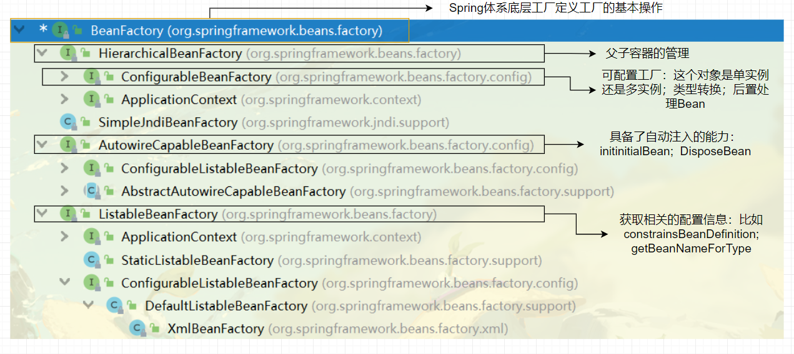

## 一、前言

Spring 中非常核心的一个点就是工厂，他不仅仅是将对象创建出来，还需要将对象存储起来（类似于容器，能够进行存储）。在学习基础的时候，对于一个对象，实际上是有两种，一种类型的对象是单实例对象，另一种就是多实例对象，而在Spring之中只存放单实例对象。

> 那么在Spring之中，如何去存储这个单实例对象集合呢？

这里我们可以想一下，哪一种容器能够存放多个对象，并且取起来比较方便呢，答案肯定是Map。

对于如何创建对象？如何进行对象的存储，通过源码的阅读，都将会明白！:sunny:

## 二、Spring 中的工厂

首先，来看看Spring中都有哪些工厂&#x1F604;,并且从这里开启Spring的源码阅读之路

刚开始学习Spring的时候，我们使用的是`ApplicationContext`这个工厂，并且通过这个工厂完成对象获取工作，但是`ApplicationContext`实际上是一个高级工厂。使用`ApplicationContext`工厂获取对象的代码如下：

```java
ApplicationContext ac = new ClassPathXmlApplicationContext("/applicationContext.xml");

ac.getBean("user");
```

之所以说它高级，是因为他为我们集成了一些底层工厂的功能，并且简化了我们创建工厂的步骤，通过这种方式获取对象非常的简单，这也是Spring不断完善的过程。在Spring中，最为底层的工厂叫做：`BeanFactory`。在这个类的源码之上，有一行注释：

```markdown
The root interface for accessing a Spring bean container.
```

他是作为 Spring 的根工厂的，我们首先来看一下，这个BeanFactory 的继承体系



既然这些工厂都具有各自的能力，那么那些工厂是集这些工厂的能力于一身？实际上是有两个：

- `ApplicationContext`
- `DefaultListableBeanFactory`

对于`DefaultListableBeanFactory`，他还有一个子类`XmlBeanFactory`，能够使用基于Xml配置的信息，完成对象的创建，而他能够完成这样的工作，主要依赖于`XMlBeanDefinitionReader`完成工作。

这里我们通过`XmlBeanFactory`这个工厂来改造一下上面通过高级工厂获取对象的代码，代码如下：

```java
// 1. 读取配置文件，将XML配置文件封装为对象
BeanFactory beanFactory = new XmlBeanFactory(new ClassPathResource("/applicationContext.xml"));

// 2. 获取对象
User user = (User) beanFactory.getBean("user");
```

><font style="color:black">在使用Spring工厂之后，可以思考一下下面几个问题：</font>
>
>1）怎么读取配置文件
>
>2）读取完配置文件之后，配置文件之中的信息在Spring之中又是如何进行体现的
>
>3）如何根据配置信息，创建对象
>
>4）所创建对象的生命周期
>
><font style="color:black">这四个问题其实也是IOC之中的核心，在后面的源码解析过程之中，也会慢慢进行解决！</font>

回归正题，继续来看我们所编写的代码，相比于ApplicationContext，这里传入配置的文件的方式有所不同，XMLBeanFactory是通过传入一个ClassPathResource，而高级工厂是直接传入配置文件的路径名即可。那么，ClassPathResource 是什么？起到了什么作用？

在 Java 之中，将不同源的资源抽象为 URL，通过注册不同的 handler 来处理不同来源的资源的读取逻辑，一般 handler 的类型使用不同的前缀来识别，比如说："file:"、"http:"等，然后URL没有默认定义相对 classpath 或者 servletContext 等资源的 handler，虽然可以自己注册 URLStreamHandler 来解析特定的URL前缀，然而这需要料及URL的实现机制，所以 Spring 对其内部使用的资源实现了自己的抽象接口，Resource 接口来封装底层资源。这里，我们首先查看继承关系：


对于不同来源·的资源文件都有对应的 Resource 实现，有了这个接口，便可以对所有资源文件进行统一处理。


我们最终是将一个 `Resource` 对象传入了 `XMLBeanFactory`。我们可以看看XMLBeanFactory中如何使用的？这里给出对应的源码

```java
public class XmlBeanFactory extends DefaultListableBeanFactory {
    private final XmlBeanDefinitionReader reader = new XmlBeanDefinitionReader(this);

    public XmlBeanFactory(Resource resource) throws BeansException {
        this(resource, (BeanFactory)null);
    }

    public XmlBeanFactory(Resource resource, BeanFactory parentBeanFactory) throws BeansException {
		super(parentBeanFactory);
		this.reader.loadBeanDefinitions(resource);
	}
}
```

> <font style="color:black">补充内容:</font>
>
> Idea 在写这个类的时候，说明这个类已经过时了，目前推荐的使用方式为：`DefaultListableBeanFactory + XmlBeanDefinitionReader` 的形式
>
> ```java
> DefaultListableBeanFactory factory = new DefaultListableBeanFactory();
> Resource resource = new ClassPathResource("/application.xml");
> XmlBeanDefinitionReader xmlBeanDefinitionReader = new XmlBeanDefinitionReader(factory);
> xmlBeanDefinitionReader.loadBeanDefinitions(resource);
> User user = (User) factory.getBean("user");
> ```
>
> 我们接下来继续进行分析内容

在构造方法之中，又会调用本类的另外一个构造方法，而这个构造方法的第一行，又会去调用父类的构造方法。作为Spring来讲，是允许一个工程之中，有多个Spring工厂同时出现，最为典型的场景就是 Spring MVC 中的父子容器。而下面这一行，才是解析资源的真正实现：

```java
this.reader.loadBeanDefinitions(resource);
```

>也能够看出`XmlBeanDefinitionReader`这个类才是解析XML，封装对象的核心。而这个对象在构造的时候，传入的是一个工厂！这个时候我们来写一段代码测试一下：
>
>```java
>DefaultListableBeanFactory factory = new DefaultListableBeanFactory();
>
>XmlBeanDefinitionReader xmlBeanDefinitionReader = new XmlBeanDefinitionReader(factory);
>
>Resource resource = new ClassPathResource("/application.xml");
>
>xmlBeanDefinitionReader.loadBeanDefinitions(resource);
>
>User user = (User) factory.getBean("user");
>```
>
>通过这段代码，也同样能够获取到对象！

接下来我们分析一下`loadBeanDefinitions`这个方法中的核心过程：


> Document 对象 和Spring 没有关系，他是XML解析所封装的对象，然后再把 Document 对象转为 我们所需要的类型

而这个`registerBeanDefinitions`方法，才是解析BeanDefinition对象的核心，而这个方法也是从属于：`XMLPathDefinitionReader`

```java
public int registerBeanDefinitions(Document doc, Resource resource) throws BeanDefinitionStoreException {
    BeanDefinitionDocumentReader documentReader = createBeanDefinitionDocumentReader();
    // 1. 目前这个注册器注册了多少个
    int countBefore = getRegistry().getBeanDefinitionCount();
    // 2. 解析核心
    documentReader.registerBeanDefinitions(doc, createReaderContext(resource));
    return getRegistry().getBeanDefinitionCount() - countBefore;
}
```

最为核心的代码是`registerBeanDefinitions`，最下面就是这个方法

```java
// 这个 root 就是根标签 beans
protected void doRegisterBeanDefinitions(Element root) {
    BeanDefinitionParserDelegate parent = this.delegate;
    this.delegate = createDelegate(getReaderContext(), root, parent);
    if (this.delegate.isDefaultNamespace(root)) {
        // 1. PROFILE_ATTRIBUTE : profile，这个标签完成不同环境的切换
        String profileSpec = root.getAttribute(PROFILE_ATTRIBUTE);
        if (StringUtils.hasText(profileSpec)) {
            String[] specifiedProfiles = StringUtils.tokenizeToStringArray(
						profileSpec, BeanDefinitionParserDelegate.MULTI_VALUE_ATTRIBUTE_DELIMITERS);
				// We cannot use Profiles.of(...) since profile expressions are not supported
				// in XML config. See SPR-12458 for details.
				if (!getReaderContext().getEnvironment().acceptsProfiles(specifiedProfiles)) {
					if (logger.isDebugEnabled()) {
						logger.debug("Skipped XML bean definition file due to specified profiles [" + profileSpec +
								"] not matching: " + getReaderContext().getResource());
					}
					return;
				}
        }
    }
    // 空实现
    preProcessXml(root);
    // 2. 传递根标签 和 注册器
    parseBeanDefinitions(root, this.delegate);
    // 空实现
    postProcessXml(root);
    this.delegate = parent;
}
```

1）首先开始对 `PROFILE_ATTRIBUTE`属性进行解析，而这个属性是为了完成不同环境的切换

>1）配置文件之中
>
>```xml
><?xml version="1.0" encoding="UTF-8"?>
><beans profile="dev" xmlns="http://www.springframework.org/schema/beans"
>       xmlns:xsi="http://www.w3.org/2001/XMLSchema-instance"
>       xsi:schemaLocation="http://www.springframework.org/schema/beans http://www.springframework.org/schema/beans/spring-beans.xsd">
>
>    <bean id="user" class="com.haolong.spring.entity.User">
>        <property name="username">
>            <value>haoolong</value>
>        </property>
>        <property name="password">
>            <value>123</value>
>        </property>
>    </bean>
></beans>
>```
>
>2）在 web.xml 之中做配置
>
>```xml
><?xml version="1.0" encoding="UTF-8"?>
><web-app xmlns="http://xmlns.jcp.org/xml/ns/javaee"
>         xmlns:xsi="http://www.w3.org/2001/XMLSchema-instance"
>         xsi:schemaLocation="http://xmlns.jcp.org/xml/ns/javaee http://xmlns.jcp.org/xml/ns/javaee/web-app_4_0.xsd"
>         version="4.0">
>    <context-param>
>        <param-name>Spring.profiles.active</param-name>
>        <param-value>dev</param-value>
>    </context-param>
></web-app>
>```
>
>

2）对于`prePorcessXMl`和`processProcessXml`来说，都是空实现，这两个方法是为了子类而设计的，这两个方法都是属于`DefaultBeanDefinitionDocumentReader`，如果说子类需要在Bean解析前或者后做一些事的时候，只需要重写这两个方法就行了，这也是**模板方法模式**的体现。

3）处理完成了profile属性之后，就开始了进行了BeanDefinition对象的解析工作，与之对应的就是上述代码中的：`parseBeanDefinitions(root, this.delegate);`方法，在这个方法之中，核心有两个分支，一类就是解析基本标签，另一种就是解析自定义标签

> 基本标签：<bean id="" class="" parent="">XXX</bean>
>
> 自定义标签：新的命名空间标签，如<context:xxxx />

```java
// 所属的类：DefaultBeanDefinitionDocumentReader
protected void parseBeanDefinitions(Element root, BeanDefinitionParserDelegate delegate) {
    if (delegate.isDefaultNamespace(root)) {
        NodeList nl = root.getChildNodes();
        for (int i = 0; i < nl.getLength(); i++) {
            Node node = nl.item(i);
            if (node instanceof Element) {
                Element ele = (Element) node;
                if (delegate.isDefaultNamespace(ele)){
                    // 解析基本标签,就是bean标签
                    parseDefaultElement(ele, delegate);
                } else {            
                    // 解析自定义标签，比如说 context:commponent-scan
                    delegate.parseCustomElement(ele);
                }
            }
        }
    }
    else {
        delegate.parseCustomElement(root);
    }
}
```

这里我们首先来看一下解析默认标签

## 三、解析默认标签

在开始具体分析标签的解析之前，首先透露一下，在Spring 之中，会把配置文件之中的每一个 `bean` 解析为 `BeanDefinition` 对象

```java
// 所属于的类：DefaultBeanDefinitionDocumentReader
private void parseDefaultElement(Element ele, BeanDefinitionParserDelegate delegate) {
    // 1. 对 import 标签做处理，用来引入其他的配置文件
    if (delegate.nodeNameEquals(ele, IMPORT_ELEMENT)) {
        importBeanDefinitionResource(ele);
    }
    // 2. 对 alias 标签做处理,别名
    else if (delegate.nodeNameEquals(ele, ALIAS_ELEMENT)) {
        processAliasRegistration(ele);
    }
    // 3. 对 bean 标签做处理
    else if (delegate.nodeNameEquals(ele, BEAN_ELEMENT)) {
        processBeanDefinition(ele, delegate);
    }
    // 4. 对 beans 标签做处理
    else if (delegate.nodeNameEquals(ele, NESTED_BEANS_ELEMENT)) {
        // recurse
        doRegisterBeanDefinitions(ele);
    }
}
```

在标签的解析中，对于`bean`标签是最为复杂且重要的，所以我们首先来看一下这个方法的实现

```java
protected void processBeanDefinition(Element ele, BeanDefinitionParserDelegate delegate) {
    // 1. 解析，BeanDefinationHolder 实际上是 BeanDefination 的封装
    BeanDefinitionHolder bdHolder = delegate.parseBeanDefinitionElement(ele);
    if (bdHolder != null) {
        // 2. 如果说Bean标签中，有自定义标签
        bdHolder = delegate.decorateBeanDefinitionIfRequired(ele, bdHolder);
        try {
            // 3. BeanDefinition 的注册
            BeanDefinitionReaderUtils.registerBeanDefinition(bdHolder, getReaderContext().getRegistry());
        }
        catch (BeanDefinitionStoreException ex) {
            getReaderContext().error("Failed to register bean definition with name '" +
                                     bdHolder.getBeanName() + "'", ele, ex);
        }
        // 4. 发送 BeanDefination 注册完成的事件，这里其实是一个可扩展的点，这个方法最后调用的是一个空方法
        getReaderContext().fireComponentRegistered(new BeanComponentDefinition(bdHolder));
    }
}
```

首先给出了各个方法的大体含义，接下来，我们逐步进行分析：

**1）第一步：获取 `BeanDefinitionHolder`**

会把Bean标签所涉及的标签都解析出来

```java
@Nullable
	public BeanDefinitionHolder parseBeanDefinitionElement(Element ele, @Nullable BeanDefinition containingBean) {
        // 1. 获取 ID 属性
		String id = ele.getAttribute(ID_ATTRIBUTE);
        // 2. 获取 name 属性
		String nameAttr = ele.getAttribute(NAME_ATTRIBUTE);
		// 3. 如果说有 name 属性，就把这个 name 拆分成数组
		List<String> aliases = new ArrayList<>();
		if (StringUtils.hasLength(nameAttr)) {
			String[] nameArr = StringUtils.tokenizeToStringArray(nameAttr, MULTI_VALUE_ATTRIBUTE_DELIMITERS);
			aliases.addAll(Arrays.asList(nameArr));
		}
		// 4. 赋值
		String beanName = id;
        // 5. 如果说这个标签没有没有设置 id 属性，但是 设置了 name 属性，就将 name 属性之中的第一个值设置为 id 属性
		if (!StringUtils.hasText(beanName) && !aliases.isEmpty()) {
			beanName = aliases.remove(0);
			if (logger.isTraceEnabled()) {
				logger.trace("No XML 'id' specified - using '" + beanName +
						"' as bean name and " + aliases + " as aliases");
			}
		}
		// 6. 确保这个 beanName 是唯一的
		if (containingBean == null) {
			checkNameUniqueness(beanName, aliases, ele);
		}

        // 7. 解析bean 标签的其他属性，创建 GenericBeanDefinition 对象
		AbstractBeanDefinition beanDefinition = parseBeanDefinitionElement(ele, beanName, containingBean);
		if (beanDefinition != null) {
			if (!StringUtils.hasText(beanName)) {
				try {
					if (containingBean != null) {
						beanName = BeanDefinitionReaderUtils.generateBeanName(
								beanDefinition, this.readerContext.getRegistry(), true);
					}
					else {
						beanName = this.readerContext.generateBeanName(beanDefinition);
						// Register an alias for the plain bean class name, if still possible,
						// if the generator returned the class name plus a suffix.
						// This is expected for Spring 1.2/2.0 backwards compatibility.
						String beanClassName = beanDefinition.getBeanClassName();
						if (beanClassName != null &&
								beanName.startsWith(beanClassName) && beanName.length() > beanClassName.length() &&
								!this.readerContext.getRegistry().isBeanNameInUse(beanClassName)) {
							aliases.add(beanClassName);
						}
					}
					if (logger.isTraceEnabled()) {
						logger.trace("Neither XML 'id' nor 'name' specified - " +
								"using generated bean name [" + beanName + "]");
					}
				}
				catch (Exception ex) {
					error(ex.getMessage(), ele);
					return null;
				}
			}
			String[] aliasesArray = StringUtils.toStringArray(aliases);
			return new BeanDefinitionHolder(beanDefinition, beanName, aliasesArray);
		}

		return null;
	}
```

在分析这个过程之中，我们也获取了一个比较重要的信息：对于BeanDefinitionHolder 之中所包裹的 BeanDefintion 具体类型是 `GenericBeanDefinition`

> <font style="color:black">BeanDefinition 相关的概念</font>
>
> 这里首先可以来看看，这个对象的继承关系体系
>
> 
>
> 在我们使用的过程之中使用的是：`GenericBeanDefinition`，对于里面其他的，等我们实际用的时候，在进行补充

到这里为止，我们最终就获得了`BeanDefinition`，这就完成了第一步，解析XML 为BeanDefinition对象，

**2）第二步：如果说Bean标签中，有自定义标签**

对于这一步，几乎不会使用的到

**3）第三步：注册BeanDefinition**

在我们这篇文章开始的时候，我们就猜想Spring之中的对象，实际上是存放在 Map 之中的，接下来就来验证一下，我们的猜想！

```java
BeanDefinitionReaderUtils.registerBeanDefinition(bdHolder, getReaderContext().getRegistry());
```

我们来看一下这个方法之中，到底做了些什么？

> 对于这个方法的第一个参数：传入的 `BeanDefinitionHolder`，这就是我们需要注册的信息，而对于其中的第二个参数，实际上是：
>
> ```markdown
> AbstractBeanDefinitionReader 中的 BeanDefinitionRegistry
> ```
>
> 

```java
/**
* Register the given bean definition with the given bean factory.
* 中文：向给定的 bean 工厂注册给定的 bean 定义。
* @param definitionHolder the bean definition including name and aliases
* @param registry the bean factory to register with
* @throws BeanDefinitionStoreException if registration failed
*/
public static void registerBeanDefinition(BeanDefinitionHolder definitionHolder, BeanDefinitionRegistry registry)
    throws BeanDefinitionStoreException {

    // Register bean definition under primary name.
    String beanName = definitionHolder.getBeanName();
    registry.registerBeanDefinition(beanName, definitionHolder.getBeanDefinition());

    // Register aliases for bean name, if any.
    String[] aliases = definitionHolder.getAliases();
    if (aliases != null) {
        for (String alias : aliases) {
            registry.registerAlias(beanName, alias);
        }
    }
}
```

而这个里面最为核心的方法就是：`registerBeanDefinition`，通过Idea 不断往下面追，发现这个方法有3个子类之中都实现了


那我我们应该看哪一个呢？答案是：`DefaultListableBeanFactory`，这个才是 Spring 之中集大成的工厂

```java
// DefaultListableBeanFactory
@Override
public void registerBeanDefinition(String beanName, BeanDefinition beanDefinition)
    throws BeanDefinitionStoreException {

    Assert.hasText(beanName, "Bean name must not be empty");
    Assert.notNull(beanDefinition, "BeanDefinition must not be null");

    if (beanDefinition instanceof AbstractBeanDefinition) {
        try {
            ((AbstractBeanDefinition) beanDefinition).validate();
        }
        catch (BeanDefinitionValidationException ex) {
            throw new BeanDefinitionStoreException(beanDefinition.getResourceDescription(), beanName,
                                                   "Validation of bean definition failed", ex);
        }
    }
	// 1. 根据 beanName 来看一下，是否已经注册过了
   	/**
   	* private final Map<String, BeanDefinition> beanDefinitionMap = new ConcurrentHashMap<>(256);
   	*/
    BeanDefinition existingDefinition = this.beanDefinitionMap.get(beanName);
    if (existingDefinition != null) {
        if (!isAllowBeanDefinitionOverriding()) {
            throw new BeanDefinitionOverrideException(beanName, beanDefinition, existingDefinition);
        }
        else if (existingDefinition.getRole() < beanDefinition.getRole()) {
            // e.g. was ROLE_APPLICATION, now overriding with ROLE_SUPPORT or ROLE_INFRASTRUCTURE
            if (logger.isInfoEnabled()) {
                logger.info("Overriding user-defined bean definition for bean '" + beanName +
                            "' with a framework-generated bean definition: replacing [" +
                            existingDefinition + "] with [" + beanDefinition + "]");
            }
        }
        else if (!beanDefinition.equals(existingDefinition)) {
            if (logger.isDebugEnabled()) {
                logger.debug("Overriding bean definition for bean '" + beanName +
                             "' with a different definition: replacing [" + existingDefinition +
                             "] with [" + beanDefinition + "]");
            }
        }
        else {
            if (logger.isTraceEnabled()) {
                logger.trace("Overriding bean definition for bean '" + beanName +
                             "' with an equivalent definition: replacing [" + existingDefinition +
                             "] with [" + beanDefinition + "]");
            }
        }
        this.beanDefinitionMap.put(beanName, beanDefinition);
    }
    else {
        if (hasBeanCreationStarted()) {
            // Cannot modify startup-time collection elements anymore (for stable iteration)
            synchronized (this.beanDefinitionMap) {
                this.beanDefinitionMap.put(beanName, beanDefinition);
                List<String> updatedDefinitions = new ArrayList<>(this.beanDefinitionNames.size() + 1);
                updatedDefinitions.addAll(this.beanDefinitionNames);
                updatedDefinitions.add(beanName);
                this.beanDefinitionNames = updatedDefinitions;
                removeManualSingletonName(beanName);
            }
        }
        else {
            // Still in startup registration phase
            this.beanDefinitionMap.put(beanName, beanDefinition);
            this.beanDefinitionNames.add(beanName);
            removeManualSingletonName(beanName);
        }
        this.frozenBeanDefinitionNames = null;
    }

    if (existingDefinition != null || containsSingleton(beanName)) {
        resetBeanDefinition(beanName);
    }
    else if (isConfigurationFrozen()) {
        clearByTypeCache();
    }
}

```

到这里为止：我们已经分析完成了基本标签的解析，BeanDefinition 对象，存储注册好的对象存储

接下来，我们画一个流程图：


## 四、解析自定义标签

那么，Spring 中如何解析自定义标签的？其中最为常见的自定义标签就是SpringMVC中的标签

```xml
<?xml version="1.0" encoding="UTF-8"?>
<beans xmlns="http://www.springframework.org/schema/beans"
       xmlns:xsi="http://www.w3.org/2001/XMLSchema-instance"
       xmlns:mvc="http://www.springframework.org/schema/mvc"
       xsi:schemaLocation="http://www.springframework.org/schema/beans
            http://www.springframework.org/schema/beans/spring-beans.xsd
            http://www.springframework.org/schema/mvc
            https://www.springframework.org/schema/mvc/spring-mvc.xsd">
    <mvc:annotation-driven/>
</beans>
```

我们首先看看SpringMVC中是如何实现的，当我们实现引入了，`mvc:annotation-driven`之后，SpringMVC的核心功能就被我们所引入。那么这个标签到底做了什么事？

1）这个mvc实际上是一个命名空间，mvc是这个空间的小名，而后面这一长串是他的大名，对应于下面这一部分。

2）xsd文件，实际上就是规定这个标签中能够定义内容。


那么这个文件在哪里，就需要有一个映射关系，存放这个映射关系的文件就是`spring.schemas`

```
https\://www.springframework.org/schema/mvc/spring-mvc.xsd=org/springframework/web/servlet/config/spring-mvc.xsd
```

这个命名空间中可以有很多的标签，如何解析？我们首先找到了`spring.handlers`，这个文件

```xml
http\://www.springframework.org/schema/mvc=org.springframework.web.servlet.config.MvcNamespaceHandler
```

进去发现`MvcNamespaceHandler`，每个子标签的解析又会交给对应的Parser来完成


而在这类里面，对应于一个parse方法，返回值为`BeanDefinition`

**所以说对于自定义标签的解析，是通过 Handler 找对应的 parser，最终由Parser完成解析，转为BeanDefinition**

>  问题：如何自己实现一个自定义标签，标签如下：

```markdown
<haolong:user ....../>

// 下面所建立的文件都是在 resources 下面建立一个META-INF 文件夹，在该文件件下面进行建立
```

- 首先，想一下，这个标签中有什么内容？ 建立user.xsd文件

```xml
<?xml version="1.0" encoding="utf-8" ?>
<schema xmlns="http://www.w3.org/2001/XMLSchema"
        targetNamespace="http://www.haolong.com/schema/user"
        xmlns:tns="http://www.haolong.com/schema/user"
         elementFormDefault="qualified">
    <element name="user">
        <complexType>
            <attribute name="id" type="string"></attribute>
            <attribute name="username" type="string"></attribute>
            <attribute name="password" type="string"></attribute>
        </complexType>
    </element>
</schema>
```

- 我在xml中写了一长串如何对应于上述具体文件？建立spring.schema 文件

```xml
http\://www.haolong.com/schema/user.xsd=META-INF/user.xsd
```

- 标签如何被解析？被谁解析？首先是通过Handler 来找Parser解析，所以先需要一个Parser，继而需要一个Handler

```java
public class UserBeanDefinitionParser extends AbstractSingleBeanDefinitionParser {
    @Override
    protected Class<?> getBeanClass(Element element) {
        return User.class;
    }
    @Override
    protected void doParse(Element element, BeanDefinitionBuilder builder) {
        String username = element.getAttribute("username");
        String password = element.getAttribute("password");
        builder.addPropertyValue("username",username);
        builder.addPropertyValue("password",password);
    }
}
```

```java
public class MyNamespaceHandler extends NamespaceHandlerSupport {
    @Override
    public void init() {
        registerBeanDefinitionParser("user",new UserBeanDefinitionParser());
    }
}
```

这次，我们的自定义标签已经完成了，这个时候就来试一试

```java
<?xml version="1.0" encoding="UTF-8"?>
<beans xmlns="http://www.springframework.org/schema/beans"
       xmlns:xsi="http://www.w3.org/2001/XMLSchema-instance"
       xmlns:haolong="http://www.haolong.com/schema/user"
       xsi:schemaLocation="http://www.springframework.org/schema/beans
            http://www.springframework.org/schema/beans/spring-beans.xsd
            http://www.haolong.com/schema/user
            http://www.haolong.com/schema/user.xsd
            ">
    <haolong:user id="u" password="123" username="haolong"></haolong:user>
</beans>
```

通过配置文件获取，成功！

> Spring 中是如何完成的？

这里直接列举出最为底层的方法，方法如下：

```java
// 所属于的类：BeanDefinitionParserDelegate

@Nullable
public BeanDefinition parseCustomElement(Element ele, @Nullable BeanDefinition containingBd) {
    // 1. 这个URI就是我们所说的命名空间的大名
    String namespaceUri = getNamespaceURI(ele);
    if (namespaceUri == null) {
        return null;
    }
    // 2. 读取Spring.handers 文件，然后根据URI，找到对应的 Handler
    NamespaceHandler handler = this.readerContext.getNamespaceHandlerResolver().resolve(namespaceUri);
    if (handler == null) {
        error("Unable to locate Spring NamespaceHandler for XML schema namespace [" + namespaceUri + "]", ele);
        return null;
    }
    // 3. 根据hander中的init方法，找到对应的Parse解析
    return handler.parse(ele, new ParserContext(this.readerContext, this, containingBd));
}
```

到这里位置，配置文件的解析阶段就已经全部完成了，这个时候将我们的图进行更新一下


至此，Spring的配置文件的解析阶段已经完成，最终得到了一个个BeanDefinition对象。这个时候仅是将XML解析出来，得到了一个个的BeanDefinition对象。


