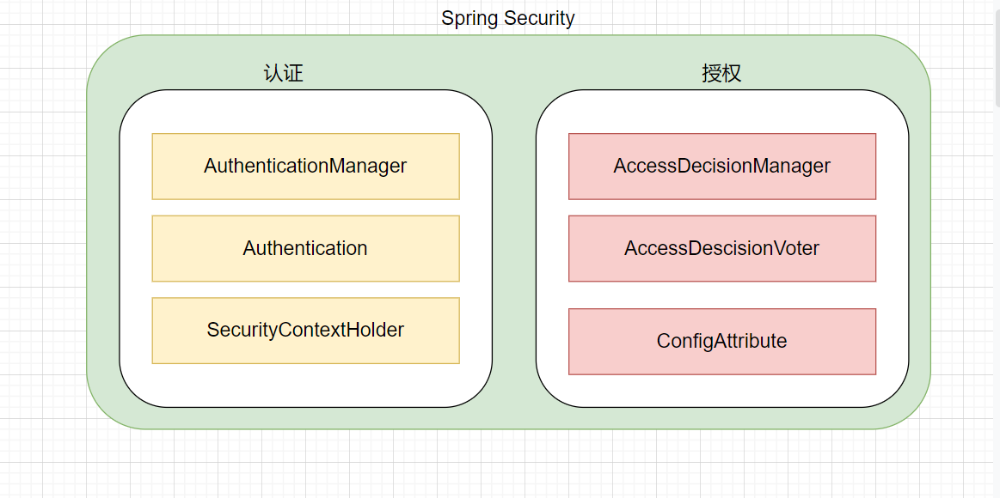

## 一、基本信息

### 1.1 权限管理
权限管理实现对用户访问系统的控制，按照安全规则或者安全策略，控制用户可以访问而且只能访问自己的被授权的资源。权限管理包括用户身份认证和授权两个部分，简称认证授权。
### 1.2 简介
Spring Security 是一个面向Java应用程序提供的身份验证和安全性的框架。与所有Spring项目一样，真正威力在于它可以轻松扩展以满足定制需求。
### 1.3 整体架构
在Spring Security 的架构设计中，认证`Authentication` 和 授权`Authorization`是分开的，无论使用什么样的认证方式，都不会影响授权，这是两个独立的存在，这种独立带来的好处之一，就是非常方便的整合一些外部的设计方案。

在Spring Security 中，认证是通过`AuthenticationManager`接口来进行负责的

- 如果说返回`Authentication`，表示认证成功；在他里面保存了认证以及认证成功的信息
- 如果说抛出 `AuthenticationException`异常，就表示认证失败
```java
public interface AuthenticationManager {
    Authentication authenticate(Authentication authentication) throws AuthenticationException;
}
```
### 1.4 环境搭建
我们首先新建一个Spring Boot 的项目。
1）编写一个简单的Controller
```java
@RestController
public class HelloController {
    @GetMapping("/hello")
    public String hello() {
        return "hello";
    }
}
```
2）启动项目，访问接口，能够在页面上打印出来hello即可
3）接下来，我们引入Spring Security的依赖
```xml
<dependency>
  <groupId>org.springframework.boot</groupId>
  <artifactId>spring-boot-starter-security</artifactId>
</dependency>
```
4）再次访问这个接口，这个时候我们发现页面编了，多出了一个登录界面


> 默认的账号是：user，密码为控制台打印出来的信息

5）输入完成之后，再次访问 接口，就能够拿到正常的访问结果

这个时候，可能就会有以下疑问了：

- 为什么引入了 Spring Security 之后，没有做任何的配置，所有的请求都要认证呢？
- 项目中明明没有登录界面，登录界面从哪里来的？
- 为什么 使用 user 和 控制台打印的密码就能够登录，登录的时候，验证数据源存放在哪里？

## 二、实现原理

其实对于认证，如果让我们去实现的话，我们会将这一部分东西，写在Filter之中，在用户发起请求的时候，首先进行拦截，拦截完成之后，验证通过之后，再进行后续的访问。而SpringSecurity 其实也是利用了Filter来完成这部分功能的！

```markdown
https://docs.spring.io/spring-security/reference/servlet/architecture.html
```

这个官网为我们提供的图：


对于过滤器这个概念是Java Web 阶段学到的，是Servlet 中的，而SpringSecurity中，提供了自己的Filter，但是他要想把自己是实现的这一套，加入到 Servlet 中的 Filter 链路之中，就需要通过 `DelegatingFilterProxy`来完成，并且不可能仅仅提供一个Filter，而是多个，这就需要`SecurityFilterChain` 来管理一组`Filter`，并且这样的 `SecurityFilterChain`会提供多个，所以就形成了这样的体系：


分析完成，这样的结构之后，我们再来看一下之前提到的问题：

1）为什么引入了 Spring Security 之后，没有做任何的配置，所有的请求都要认证呢？

```markdown
https://docs.spring.io/spring-security/reference/servlet/getting-started.html
```

在 `Spring  Security` 提供了 30多个过滤器，默认情况之下 Spring Boot 在对 Spring Security 进行自动化配置的时候，会创建一个名为 `SecurityFilterChain`的过滤器，并注入到Spring容器之中

```java
@Configuration(proxyBeanMethods = false)
@ConditionalOnDefaultWebSecurity
@ConditionalOnWebApplication(type = Type.SERVLET)
class SpringBootWebSecurityConfiguration {

	@Bean
	@Order(SecurityProperties.BASIC_AUTH_ORDER)
	SecurityFilterChain defaultSecurityFilterChain(HttpSecurity http) throws Exception {
		http.authorizeRequests().anyRequest().authenticated().and().formLogin().and().httpBasic();
		return http.build();
	}
}
```

- 项目中明明没有登录界面，登录界面从哪里来的？


- 为什么 使用 user 和 控制台打印的密码就能够登录，登录的时候，验证数据源存放在哪里？

## 三、自定义认证规则

### 3.1 自定义资源权限规则

比如说我有两个 Controller

```java
@RestController
@Slf4j
public class HelloController {
    @RequestMapping("/hello")
    public String hello() {
        return "hello";
    }
    @RequestMapping("/index")
    public String index() {
        return "index";
    }
}
```

- `/index`：作为公共资源，谁都能够访问
- `/hello`：作为私有思源，需要通过认证之后，才能够进行访问 

我们通过如下方式进行解决：

```java
@Component
public class WebConfiguration extends WebSecurityConfigurerAdapter {
    @Override
    protected void configure(HttpSecurity http) throws Exception {
        http.authorizeHttpRequests()
                .mvcMatchers("/index").permitAll() // 表示放行该资源，无需认证和授权可以直接访问
                .anyRequest().authenticated() // 代表所有资源，必须认证之后才能够访问
                .and()
                .formLogin(); // 表示开启表单认证
    }
}
```

注意：放行资源必须放在所有认证请求之前

### 3.2 自定义登录界面


```java
@Component
public class WebConfiguration extends WebSecurityConfigurerAdapter {
    @Override
    protected void configure(HttpSecurity http) throws Exception {
        http.authorizeHttpRequests()
                .mvcMatchers("/login.html").permitAll()
                .anyRequest()
                .authenticated()
                .and()
                .formLogin()
                .loginPage("/login.html")
                .loginProcessingUrl("/doLogin") // 如果自定了默认登录界面，必须指定登录的URL
                .and().csrf().disable()
               ;
    }
}
```


