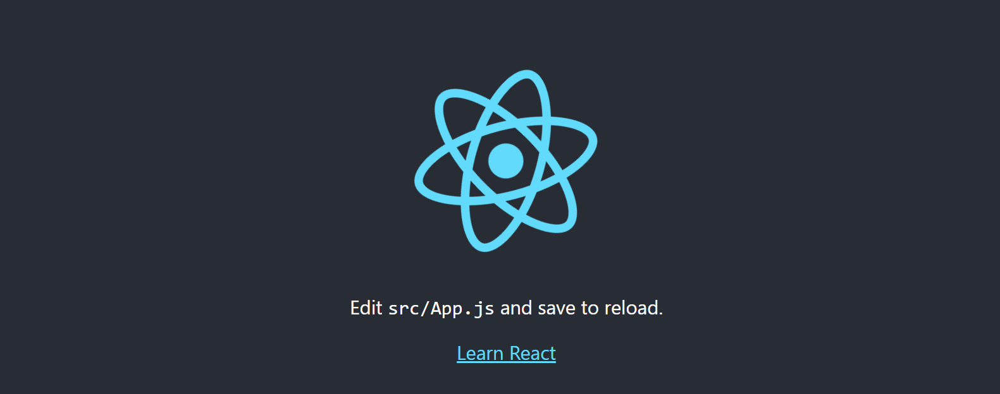

## 一、简介

React 是一个将数据渲染为 HTML 视图的开源 JavaScript 库

## 二、环境初始化

1）打开命令行窗口

2） 项目初始化

- 前面为固定写法，react-basic 为 项目的名称

```markdown
npx create-react-app react-basic
```

3）启动项目（用编辑器打开，开始之前什么都不要改，先执行）

```markdown
npm start
```

4）出现下面这样的就是，创建成功了



5）入口文件(index.js)，这里的文件进行了修改

```js
import React from 'react';
import ReactDOM from 'react-dom/client';
import './index.css';
// 引入 根组件APP
import App from './App';
import reportWebVitals from './reportWebVitals';
// 获取 ID 为 root 的 dom 节点
const root = ReactDOM.createRoot(document.getElementById('root'));
// 将 App 组件 渲染到root节点上去
root.render(
    <APP/>
);
```
